# Лабораторная работа 1
01-vm-settings:
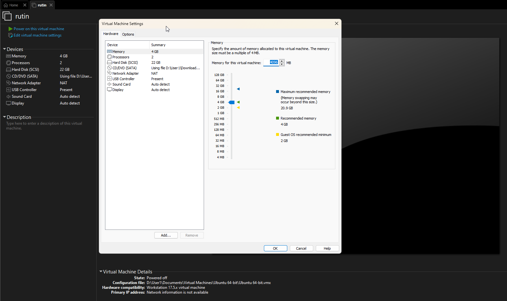

02-vm-console:
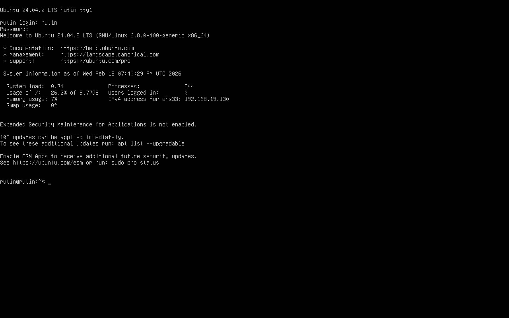

03-system-info:
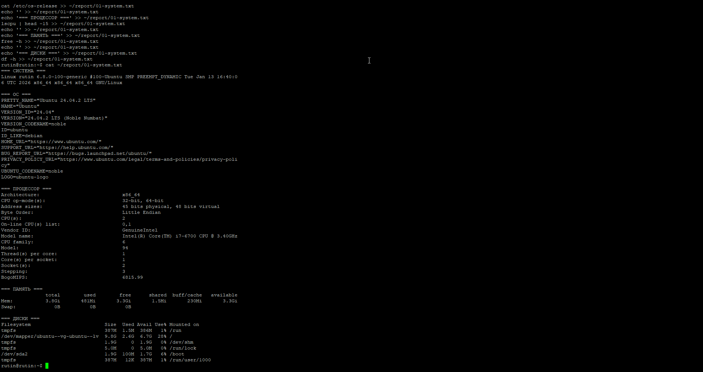

04-ip-addr:
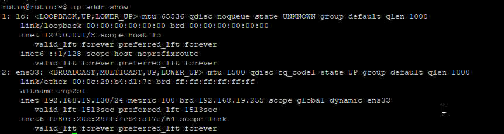

05-ports:
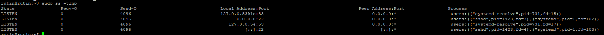

06-ssh-status:
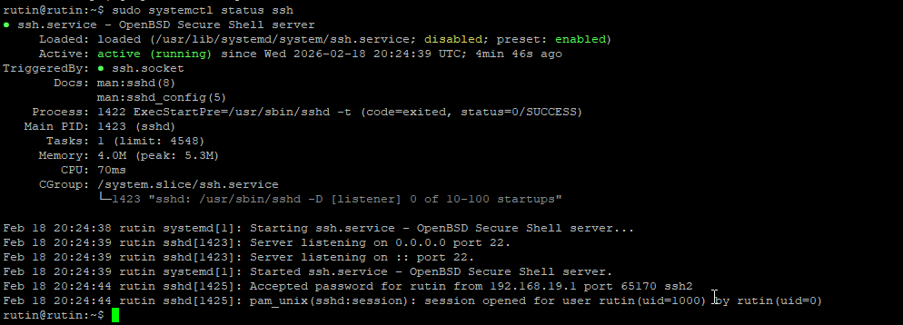

07-ssh-port:
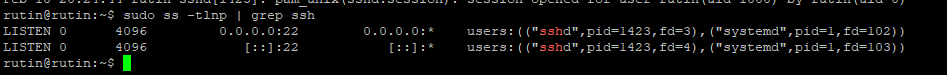

08-users:
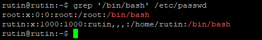

09-new-user:
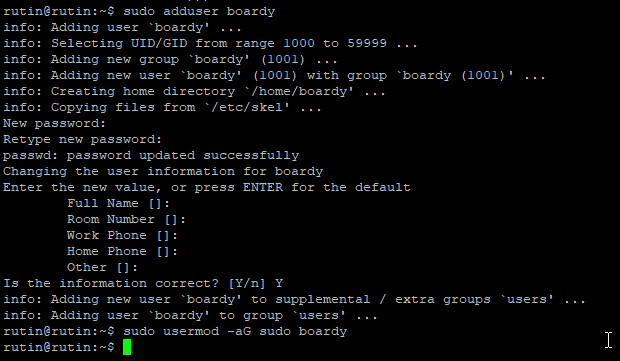

10-user-check:
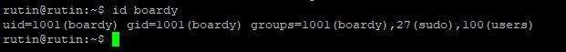

11-root-tree:
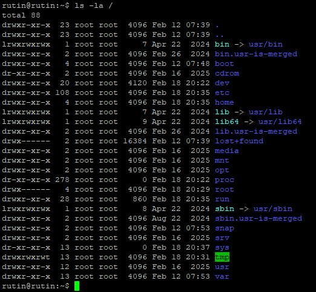

12-home-tree:
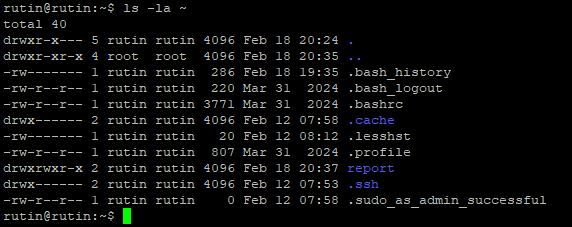

13-permissions:
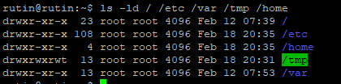

14-chmod:
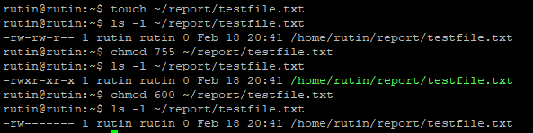

15-packages:
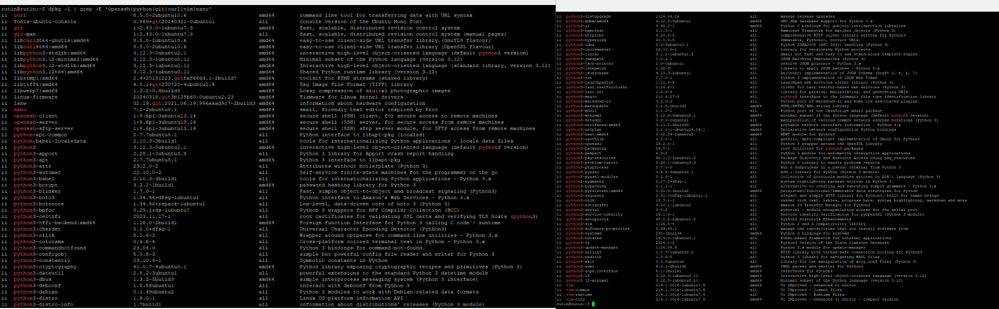

16-services:
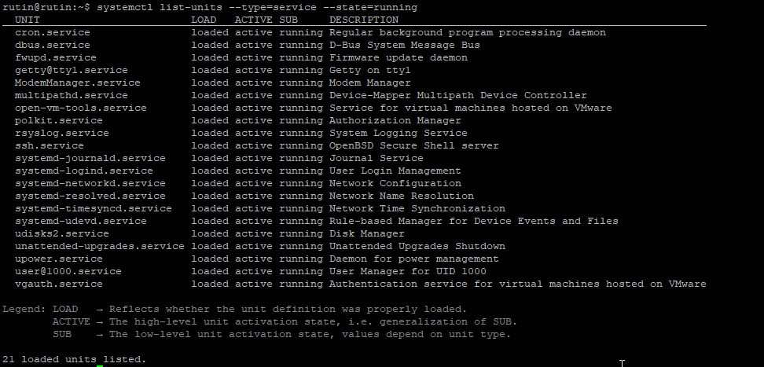

17-top-processes:
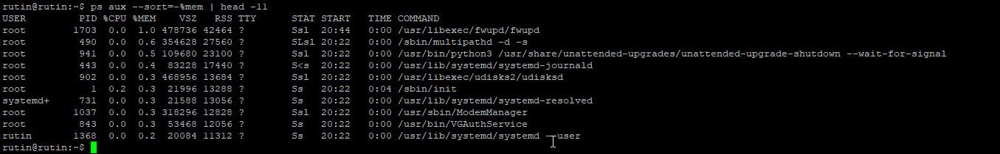

18-process-count:
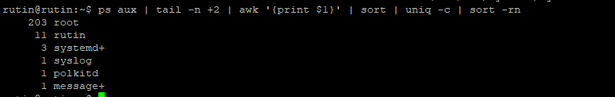

19-big-files:
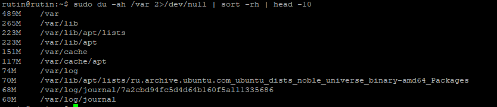

20-report-files:
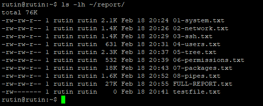

Конец
