01-describe.png:
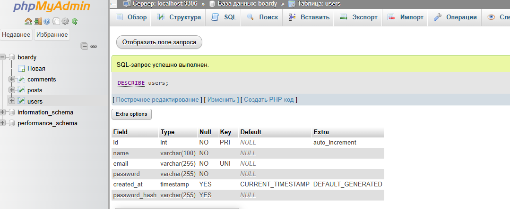

- Мы используем varchar 255, так как нужен запас под современные алгоритмы шифрования. bcrypt = 60 символов, но стандарты меняются

02-nav-guest.png:
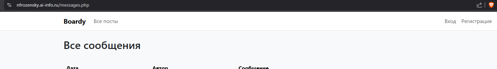

03-nav-logged.png:
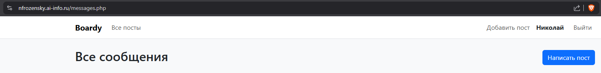
- Хэдер в отдельном файле для соблюдения DRY. если хотим добавить новую ссылку - добавляем только туда, и она появляется на всех страницах, где есть header

04-register-layout.png:
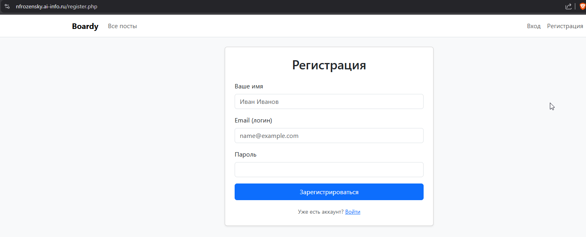

05-login-layout.png:
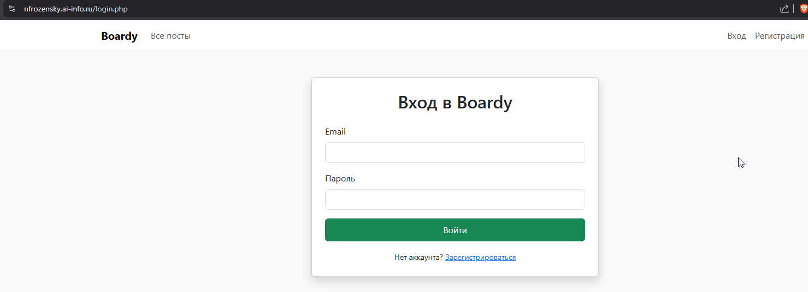

06-register-done.png:


07-hash.png:
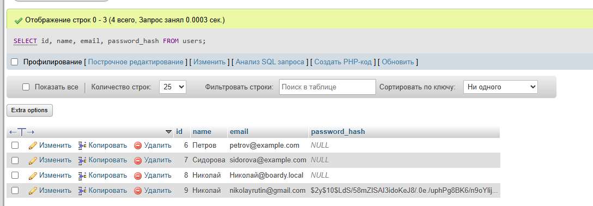
- `$2y$` - id алгоритма(bcrypt), `10$` - ~~цена моих штанов~~ cost factor, далее 22 символа - соль, и оставшаяся часть - сам хэш
- увеличив cost factor, стоимость вычисления экспоненциально вырастет на 2^5 раз, но и взлом хэша будет в столько же раз сложнее.

08-email-taken.png:
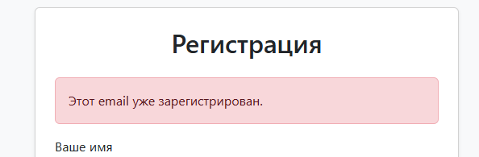
- без проверки перед insert, если закинем, будут дубликаты пользователей и всё поломается. например, если начисляем таксу за использование сервиса, один человек купил у нас бургер, а второй за него расплачивается - бред, поэтому должны быть уникальные идентификаторы пользователей. в нашем случае - email


09-login-done.png:
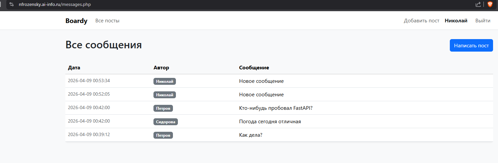

10-wrong-password.png:
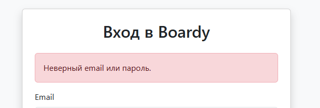
- сообщение для ошибочного пароля и почты одинаковое, чтобы злоумышленник не понял, что у него неправильное было при вводе

11-cookie.png:
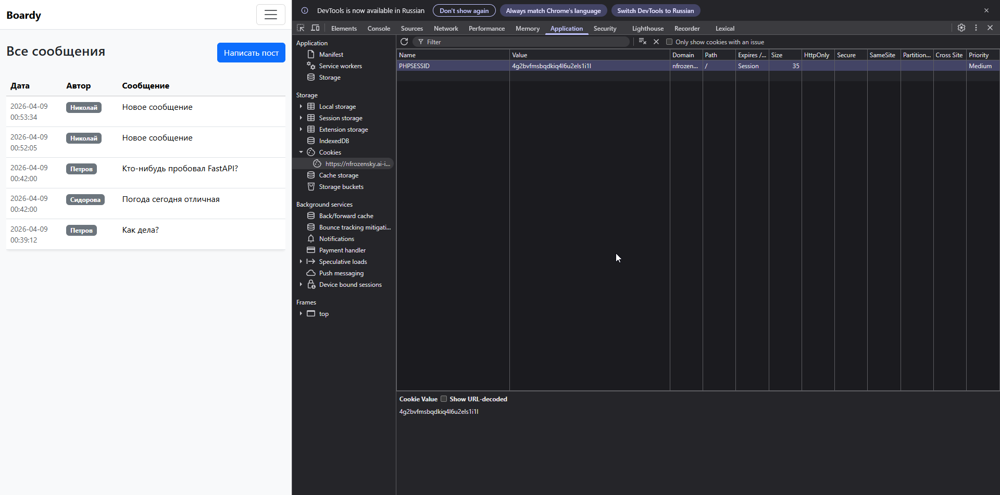
- здесь хранится уникальный случайный идентификатор сессии. значение генерируется автоматически при вызове в пхп "session_start()"

12-cookie-attrs.png:
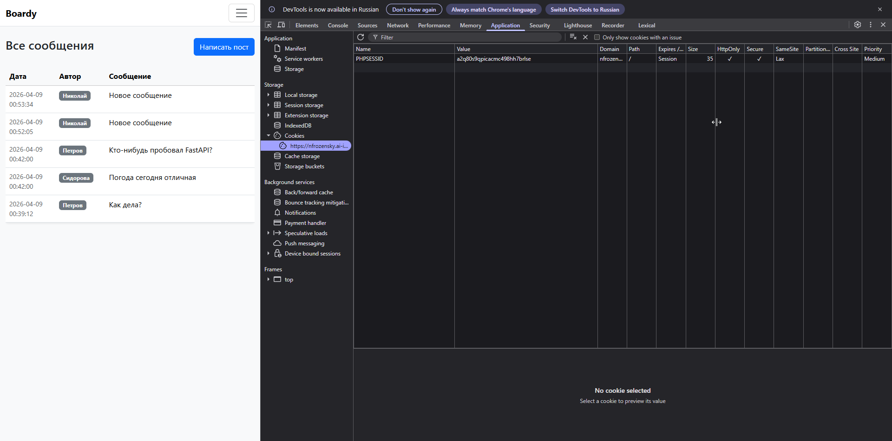

13-httponly-check.png:
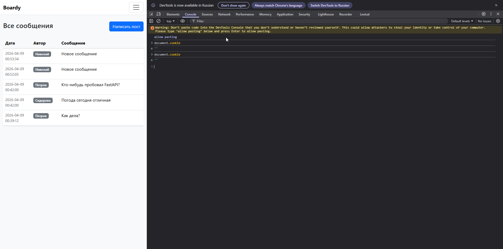
- куки не видно т.к. мы поставили httpOnly

14-session-file.png:
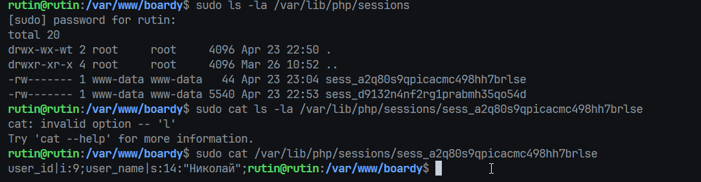

- на клиенте хранится id сессии, а на сервере - имя пользователя и тд. их нельзя хранить на клиенте из соображений оптимизации и безопасности

15-redirect.png:
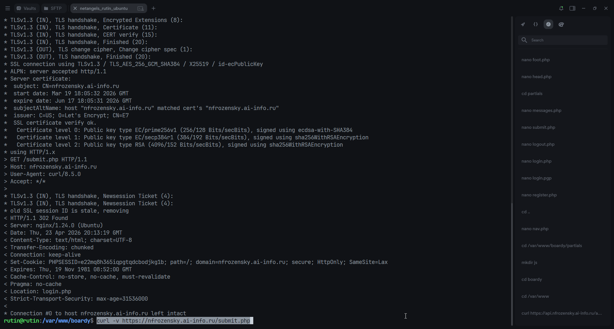

16-posts-authors.png:
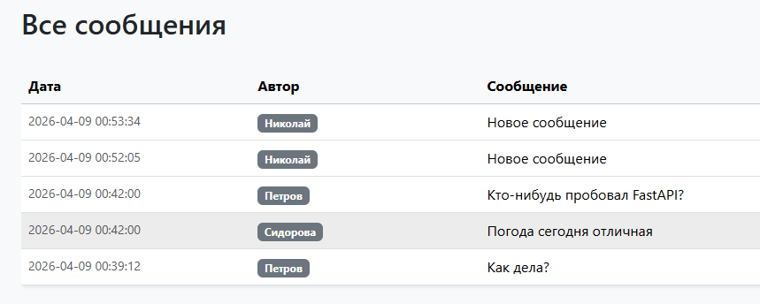

```sql
SELECT posts.body, users.name, posts.created_at
FROM posts JOIN users ON posts.author_id = users.id
```
- join для чистоты кода, а так же таблицы у нас связаны - пользуемся этой связью

17-submit-layout.png:
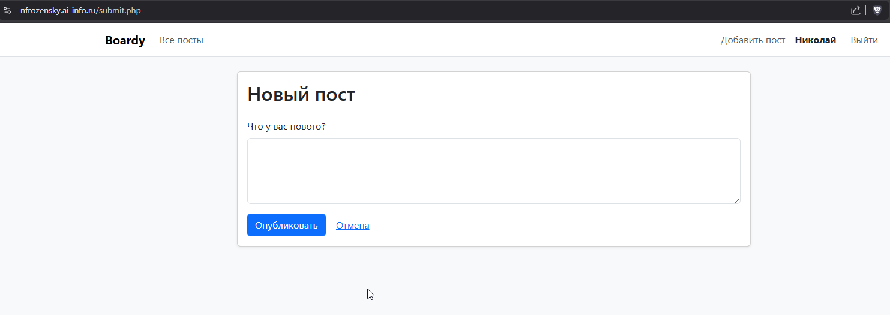

18-after-logout.png:
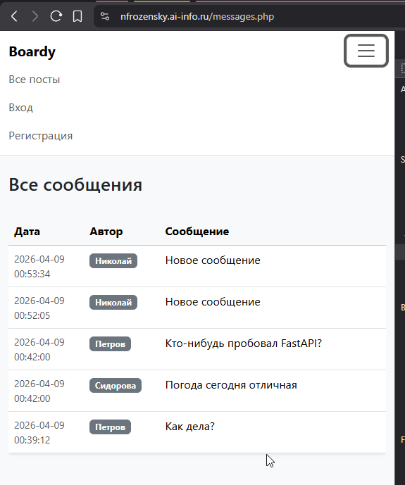

19-cookie-gone.png:
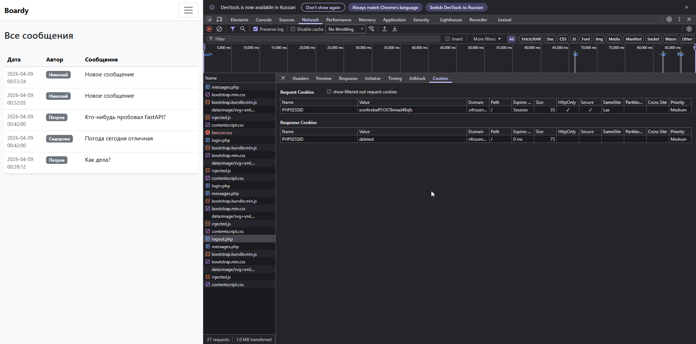
- session_destroy() удаляет файл сессии на сервере - сервер забывает данные
  setcookie() с прошедшей датой говорит браузеру удалить куку - браузер перестаёт её отправлять
  Если только session_destroy() - кука останется в браузере, при следующем запросе браузер отправит старый PHPSESSID, сервер не найдёт файл и создаст новую пустую сессию. Работает, но кука висит до закрытия браузера
  Если только setcookie() - браузер удалит куку, но файл сессии останется на сервере и будет висеть до автоочистки PHP (по умолчанию 24 минуты)

20-expired.png:
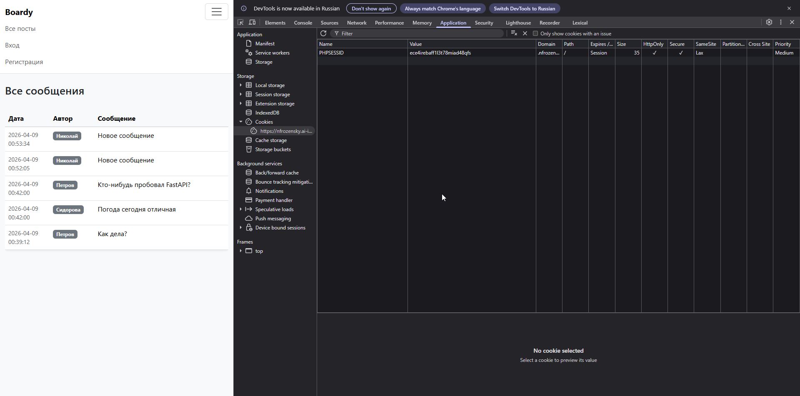

- мы удалили куку, теперь php не знает взаимоотношений между нашей сессией и пользователем на сервере. поэтому редирект обратно


