01-no-token.png:
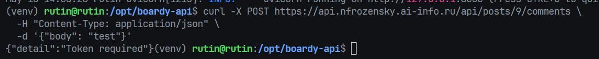

- Bearer — это схема аутентификации. Заголовок Authorization в HTTP поддерживает разные схемы: Basic, Digest, Bearer и другие. Слово перед токеном говорит серверу как именно интерпретировать то, что идёт после.
  Bearer буквально означает "предъявитель" - тот кто предъявляет токен, тот и получает доступ. Сервер не проверяет личность, он проверяет токен.

02-me-php.png:
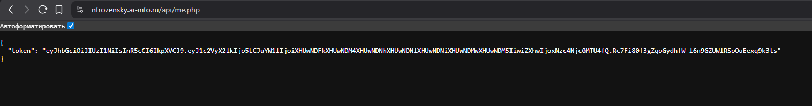

- пользователь уже прошёл аутентификацию раньше - в login.php он ввёл логин и пароль, PHP проверил их и создал сессию. me.php - это не новый вход, это получение токена для уже залогиненного пользователя. Проверять пароль повторно не нужно и небезопасно - гонять пароль лишний раз по сети без необходимости. Поэтому используем session_start()
- PHPSESSID - это идентификатор сессии. Браузер автоматически отправляет её с каждым запросом к тому же домену. session_start() в me.php читает эту куку, находит на сервере соответствующую сессию и восстанавливает `$_SESSION` - в том числе `$_SESSION['user_id']`. Таким образом PHP понимает кто делает запрос без повторного ввода пароля. Именно поэтому в fetch написано `credentials: 'include'` - чтобы браузер не забыл приложить куку к запросу

03-console-jwt.png:
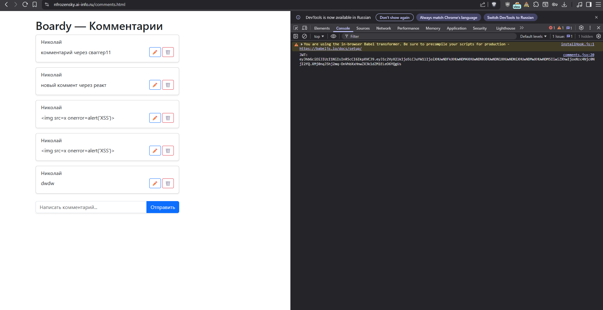

04-bearer-header.png:
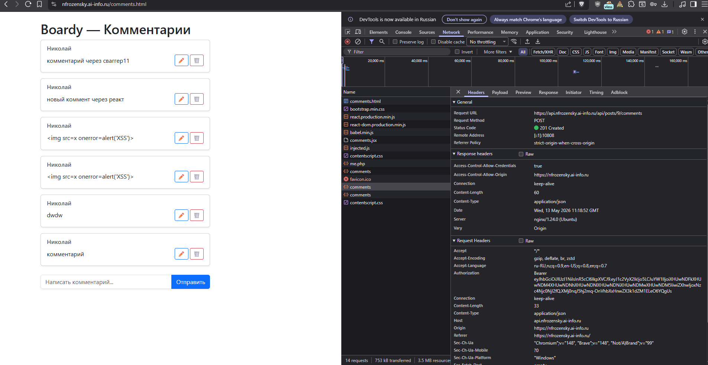

05-comment-created.png:
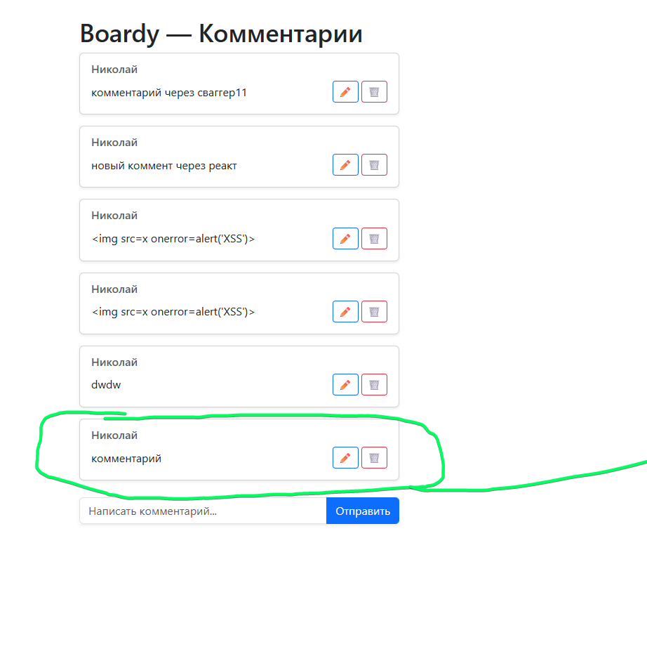

06-jwt-io.png:
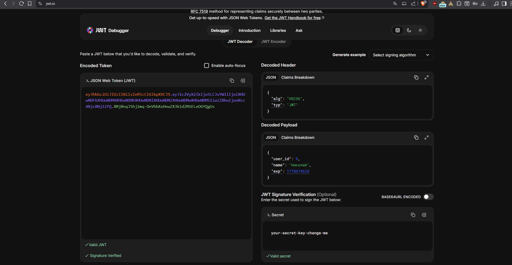

- Payload зашифрован, а не закодирован - любой желающий, ровно как и я на jwt io, может раскодировать и увидеть имя пользователя, время истечения токена и user id. Это не проблема, потому что jwt io защищает не от чтения, а от подделки - злоумышленник может поменять user id, тогда подпись станет некорректной, Fastapi отклонит запрос. без знания secret key пересчитать правильную подпись невозможно. поэтому в JWT никогда не кладут секретные данные

07-expired.png:
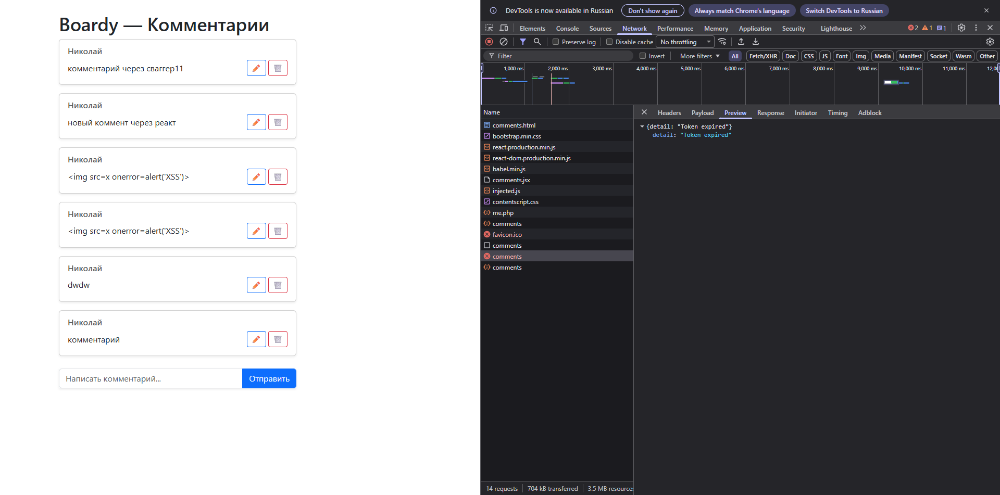

---

09-github-app.png:
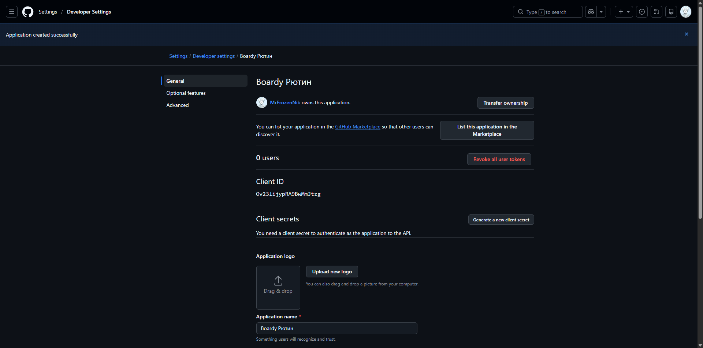

10-describe.png:
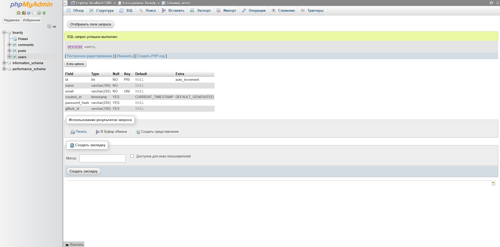

11-login-button.png:
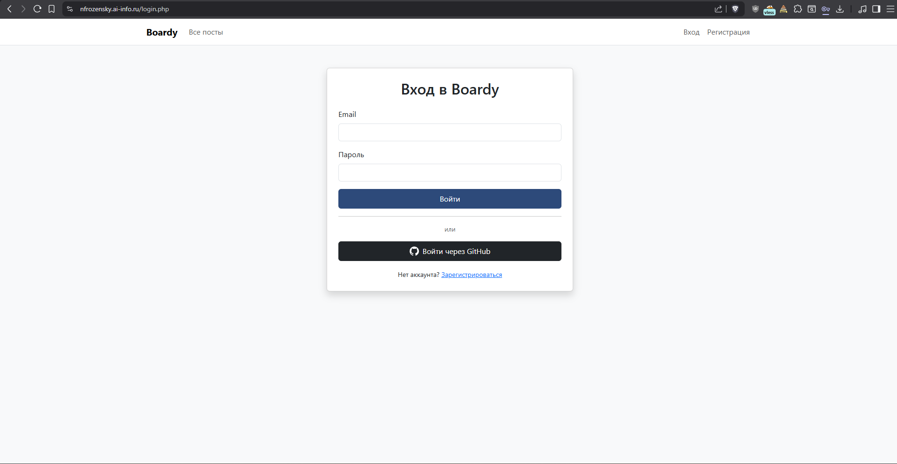

12-github-authorize.png:
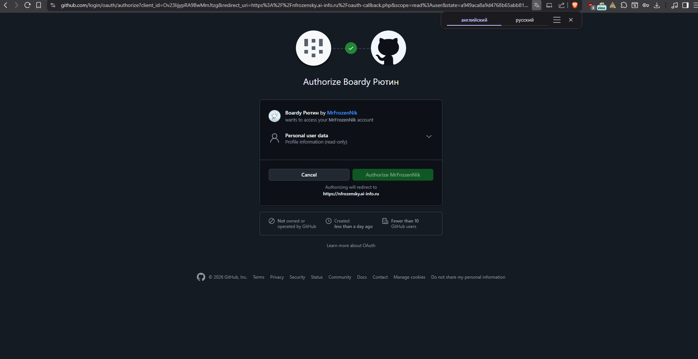

13-oauth-logged.png:
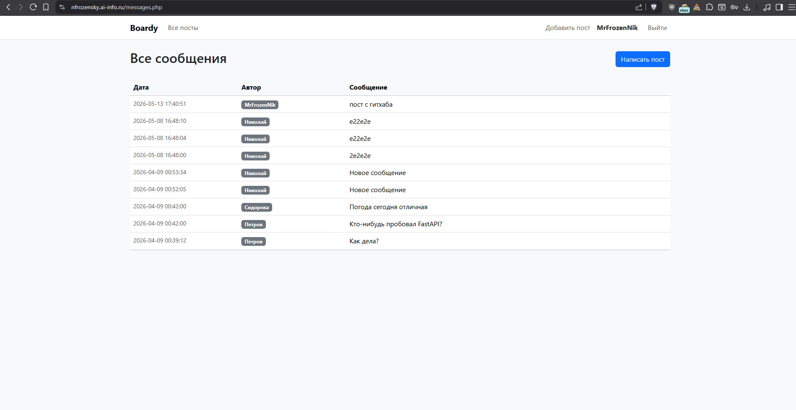

14-github-user.png :
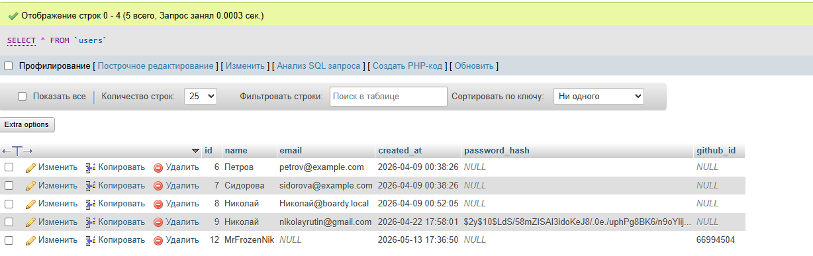

- Ищем по гитхаб-айди, потому что email ненадёжен как идентификатор в контексте OAuth. Во-первых, пользователь может не давать GitHub доступ к своему email - он будет null. Во-вторых, пользователь может сменить email на GitHub. В-третьих, один и тот же email может быть зарегистрирован в твоей базе через обычную форму - и тогда поиск по email случайно залогинит GitHub-пользователя под чужим аккаунтом.

15-oauth-comment.png:
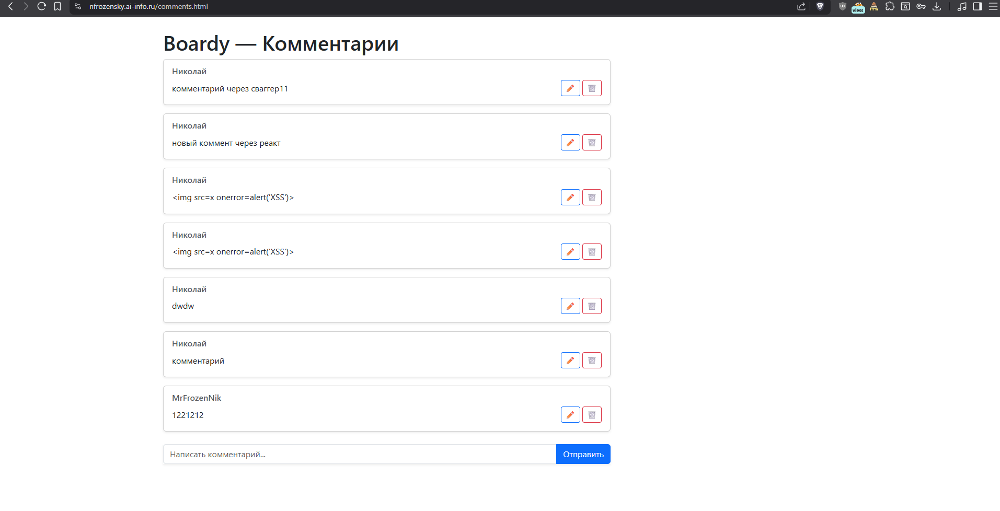

- Пользователь нажал "Войти через GitHub" → oauth-github.php генерирует state, сохраняет в `$_SESSION`,
  редиректит на github.com/login/oauth/authorize -> GitHub показывает "Authorize Boardy"
  Пользователь нажимает Authorize -> GitHub редиректит на oauth-callback.php?code=XXX&state=YYY ->  PHP (сервер→сервер) меняет code на access_token у GitHub -> PHP с access_token идёт на api.github.com/user → получает профиль -> SELECT WHERE github_id = profile.id → нашёл/создал юзера в БД -> $_SESSION['user_id'] = user.id → redirect на messages.php -> Пользователь открывает comments.html, React → GET /api/me.php + Cookie: PHPSESSID -> me.php читает $_SESSION['user_id'] → генерирует JWT → {"token": "eyJ..."} -> React сохраняет JWT в state -> Пользователь пишет комментарий → Отправить -> React → POST api.nfrozensky.ai-info.ru/api/posts/9/comments + Authorization: Bearer eyJ... -> FastAPI (auth.py) проверяет подпись → достаёт user_id из токена -> INSERT INTO comments (body, post_id, author_id=user_id) → комментарий создан с автором из GitHub

## Задание 14. Параметр state
### В отчёте: что такое state в OAuth? Опишите сценарий CSRF-атаки без state (минимум 5 шагов).

1. Атакующий начинает OAuth flow на сайте — получает URL вида oauth-callback.php?code=ATTACKERS_CODE, но не проходит по нему дальше
2. Атакующий любым способом заставляет жертву перейти по этой ссылке — например через картинку в письме или iframe
3. Браузер жертвы открывает oauth-callback.php?code=ATTACKERS_CODE — жертва уже залогинена на твоём сайте, кука сессии улетает автоматически
4. oauth-callback.php обменивает code на access_token — но это токен аккаунта атакующего на GitHub
5. PHP создаёт сессию и логинит жертву под аккаунтом атакующего — теперь жертва думает что вошла в свой аккаунт, а на самом деле работает в аккаунте атакующего и все её действия видит атакующий

- С state: на шаге 3 callback сравнивает `$_GET['state']` с `$_SESSION['oauth_state']` — они не совпадут потому что сессия жертвы содержит свой state, а не атакующего. Запрос отклоняется.

16-three-users.png:
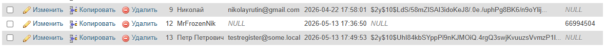

## Задание 16. Сравнение механизмов

| Вопрос                     | Куки+сессии                            | JWT                                 | OAuth                                       |
|----------------------------|----------------------------------------|-------------------------------------|---------------------------------------------|
| Где хранятся данные?       | На сервере (файл/БД), в куке только ID | В самом токене (у клиента)          | На сервере провайдера (GitHub)              |
| Кто прикрепляет к запросу? | Браузер автоматически (кука)           | Код вручную (Authorization: Bearer) | Браузер автоматически (кука после callback) |
| Для какого типа клиентов?  | Браузер, один домен                    | API, мобильные, кросс-доменные      | Браузер, вход через сторонний сервис        |
| Можно ли отозвать?         | Да, удалить сессию на сервере          | Нет, до истечения exp               | Да, отозвать access_token на GitHub         |
| Кросс-доменно работает?    | Нет, куки не летят на другой домен     | Да, заголовок работает везде        | Да, redirect между доменами                 |

## Задание 17. Баги и пакеты 

1. Токен может истечь. Нет refresh. Опасен тем, что, например, пользователь ввёл данные, при этом у него истёк токен, но страница не обновилась - затем данные отослал, ему пришёл ответ "401 not authorized" и его данные потеряны. Решает пакет Laravel Passport
2. Один секрет на всех. И в php, и в fastapi один и тот же секрет. Утёк у программиста - скомпрометированы все сервисы. Решается пакетом Laravel Passport 
3. Нет отзыва токенов. заблокировали пользователя - токен действует ещё час, и пользователь волен делать всё, что душе заблагорассудится. решается пакетом Laravel Passport
