01-composer-php.png:
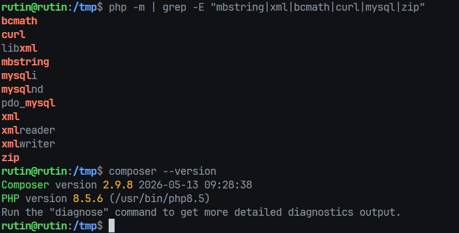

02-folders.png:
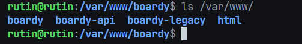

03-laravel-version.png:
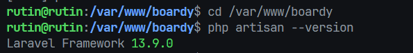

#### 3. Структура Laravel

- app/ - код приложения
- routes / - маршруты
- resources/views/ - Blade шаблоны
- database/ — миграции (структура таблиц), сидеры (тестовые данные) и фабрики (генерация фейковых записей)
- public/ - document_root nginx
-
Если указать root на /var/www/boardy/, nginx будет отдавать все файлы проекта напрямую — включая .env с паролями и секретами, vendor/ с исходниками пакетов, config/ с настройками. Папка public/ специально изолирует всё это от внешнего доступа — снаружи виден только index.php и статика

04-nginx-config.png:
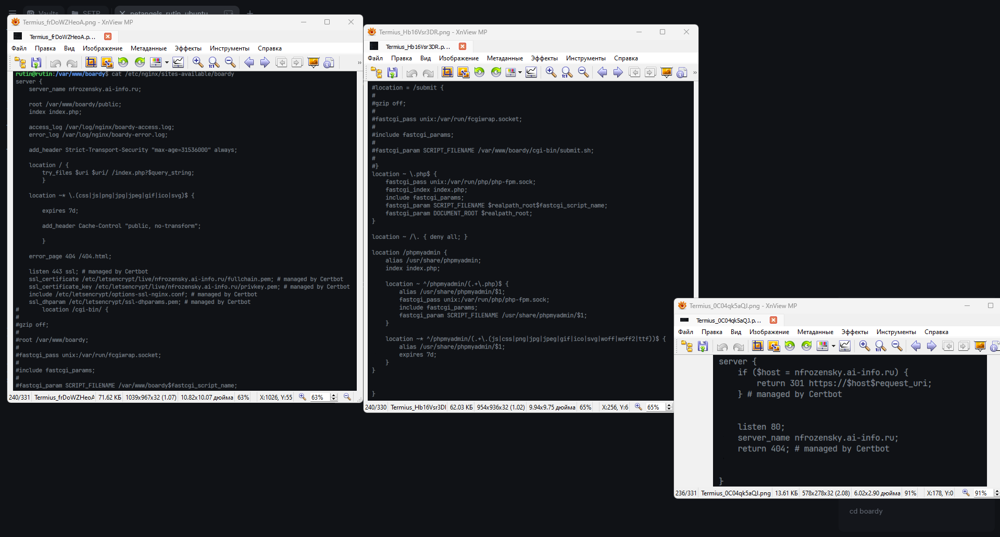

05-laravel-welcome.png:
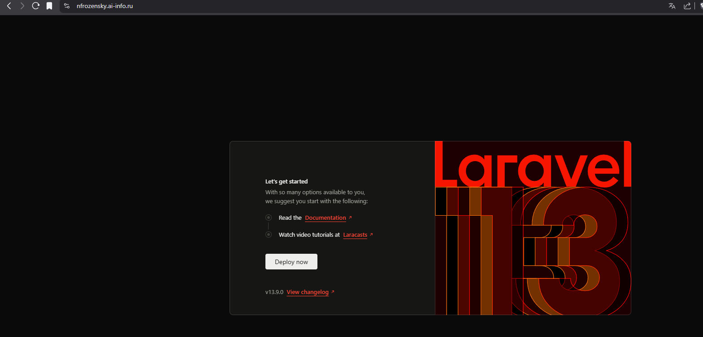

#### что делает try_files `$uri $uri/ /index.php?$query_string`? Что произойдёт без этой строки при заходе на `/posts/3`?

- `$uri` — ищет файл по URL. Если /css/style.css реально существует — отдаёт его, `$uri/` — ищет папку. Если существует — отдаёт index в ней, /index.php?$query_string — если ни файла ни папки нет — передаёт запрос в index.php, Laravel сам разбирается с маршрутом. Без этой строки при заходе на /posts/3 nginx будет искать файл /var/www/boardy/public/posts/3 — его не существует, вернёт 404. Laravel вообще не узнает о запросе.

06-databases.png :
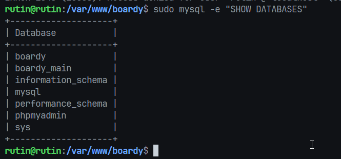

#### Защитный вопрос: зачем мы создаём новую БД, а не подгоняем старую под Laravel? Что в схеме старой БД мешает?
- У старой boardy схема под чистый PHP: password_hash вместо password, может быть username вместо name. Подгонять под Laravel-конвенции дороже, чем создать с нуля.

07-tinker-pdo.png:
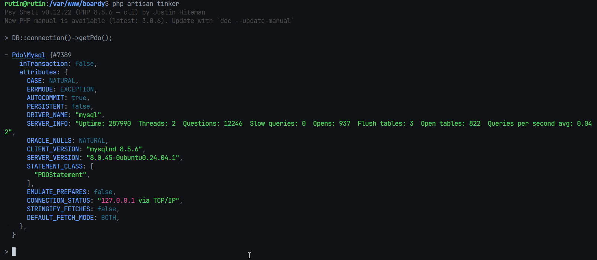

08-migrate-status.png:
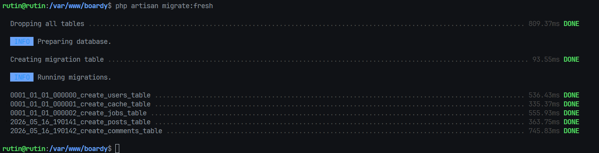

09-show-tables.png:
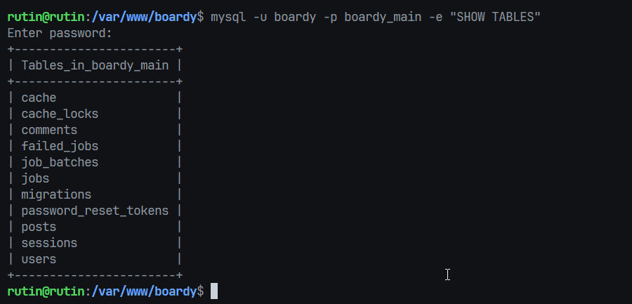

10-model-relations.png:
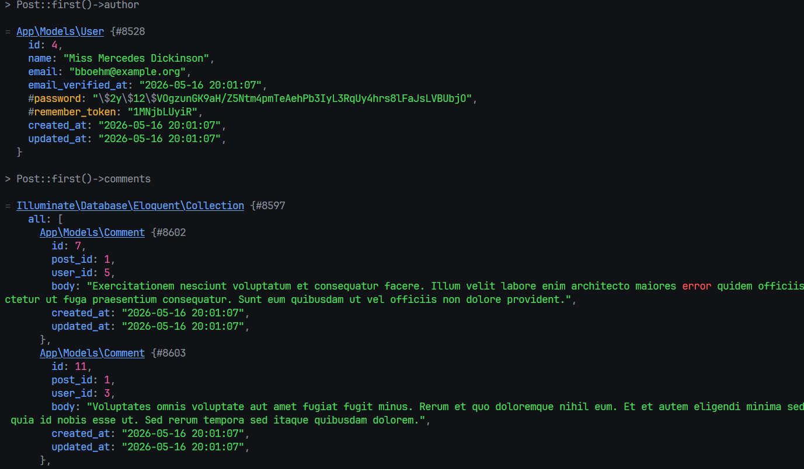

11-seed-counts.png:
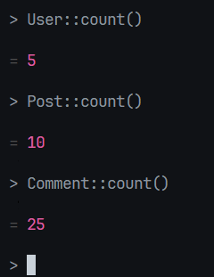

12-route-list.png:
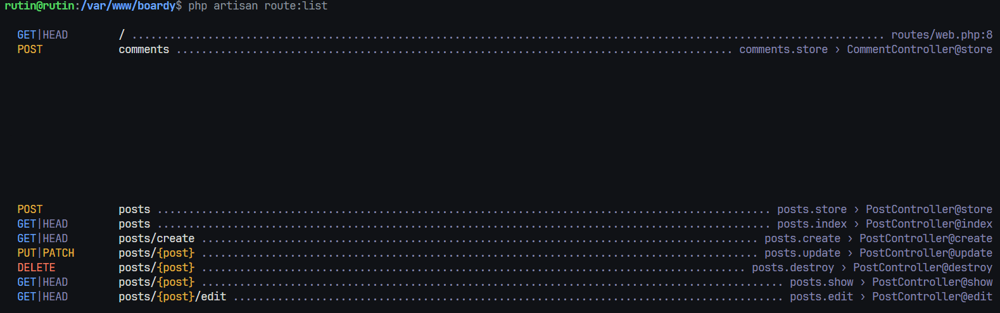

13-posts-index.png:
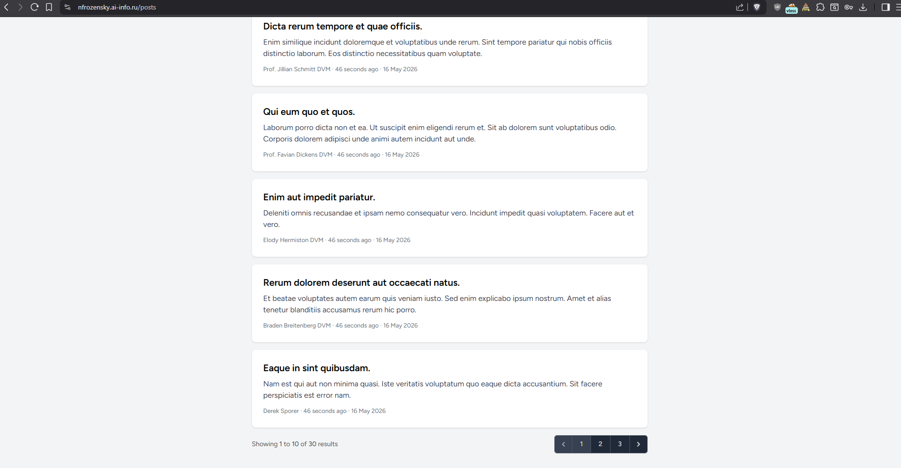

14-post-show.png:
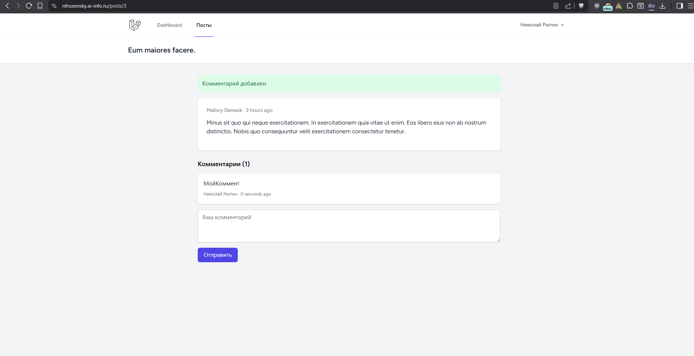

15-post-create.png:
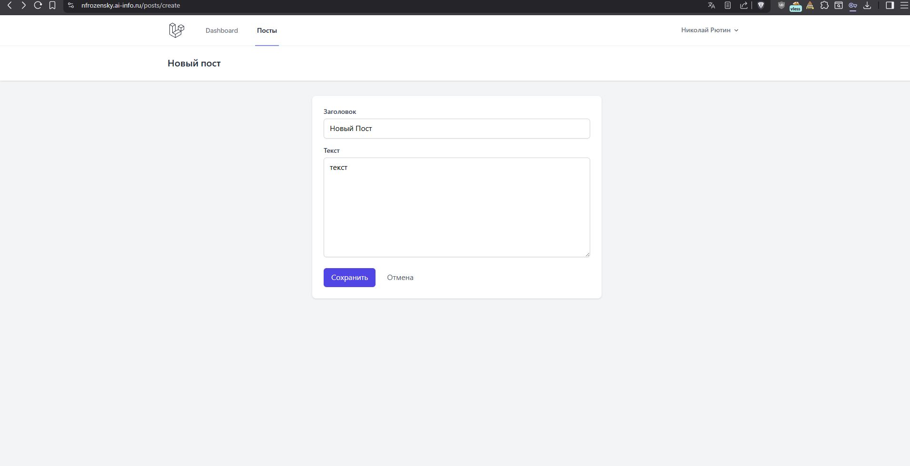

16-post-after-create.png:
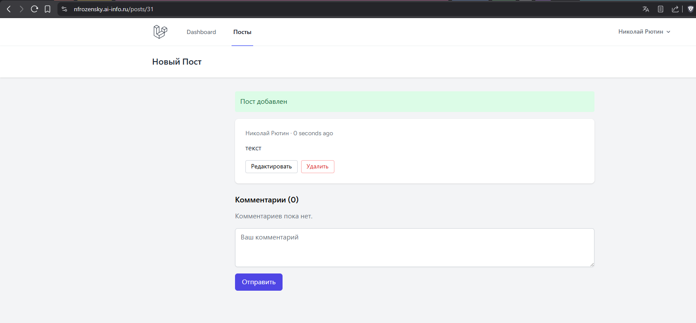

17-edit-own.png:
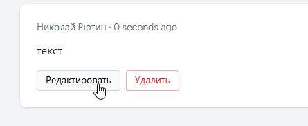

18-edit-foreign-403.png:
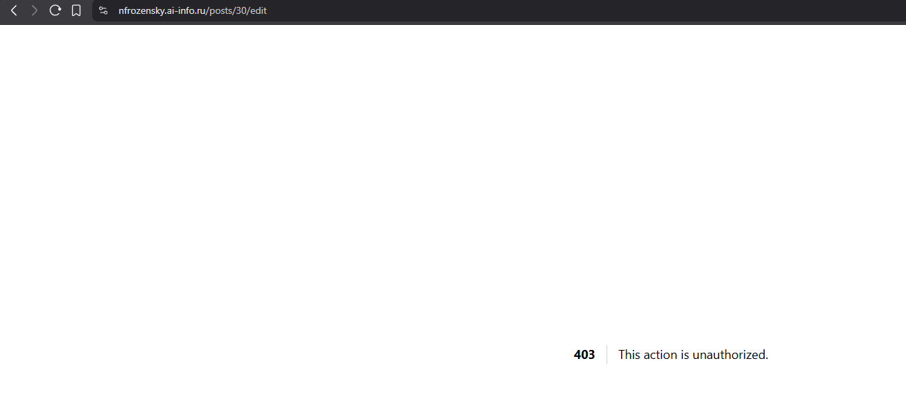

#### Защитный вопрос: сравните Policy с тем, как авторизация была реализована в Lab10–11 (на чистом PHP). Сколько строк кода ушло на тот же эффект?
- в старом варианте авторизации по владельцу поста не было, проверки "только автор может редактировать свой пост" тоже не было - потому что не было редактирования и удаления постов. если раньше авторизацию приходилось писать через `<?php if (isset($_SESSION['user_id'])): ?>`, то теперь у нас есть `@auth, @endauth, @can, @endcan`, что сокращает код до двух строчек в шаблонах. так же проверка сессии сократилось до одной строчки - middleware(auth). итого на эффект проверки авторизации для рендера кнопки - 2 строчки, для защиты маршрута - 1 строчка
- с учётом Socialite, сейчас - два метода в контроллере и `Socialite::driver('github')->user()`. Десять строк.

19-post-deleted.png :
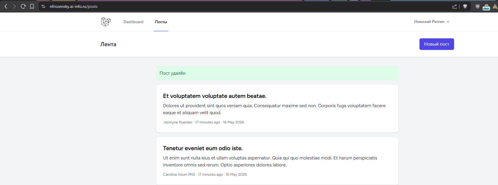

20-comment-created.png:
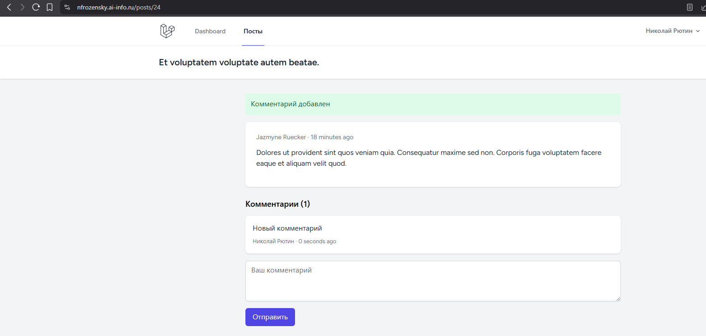

21-register.png:
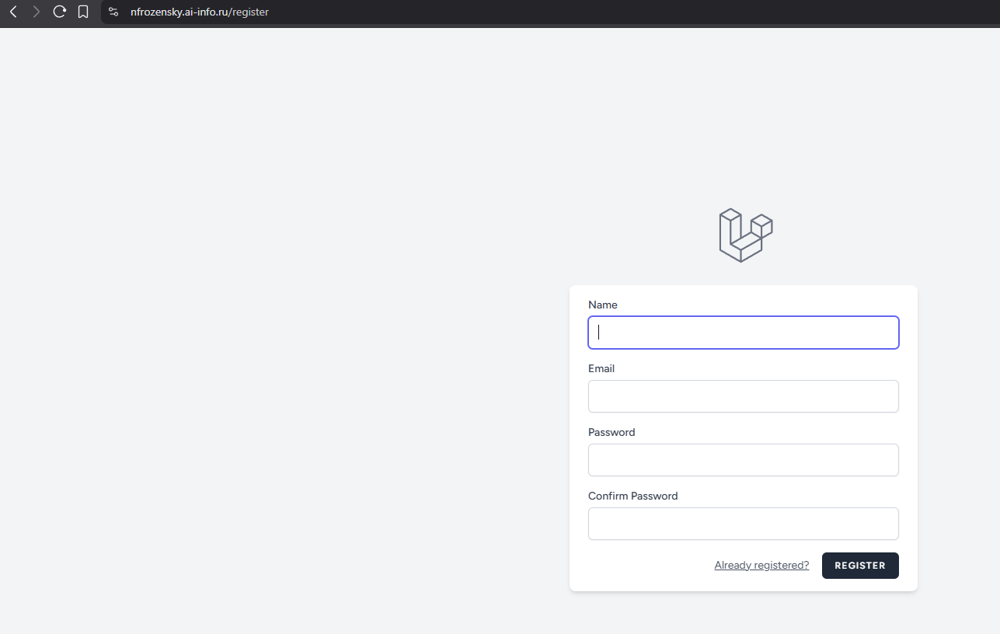

22-login.png:
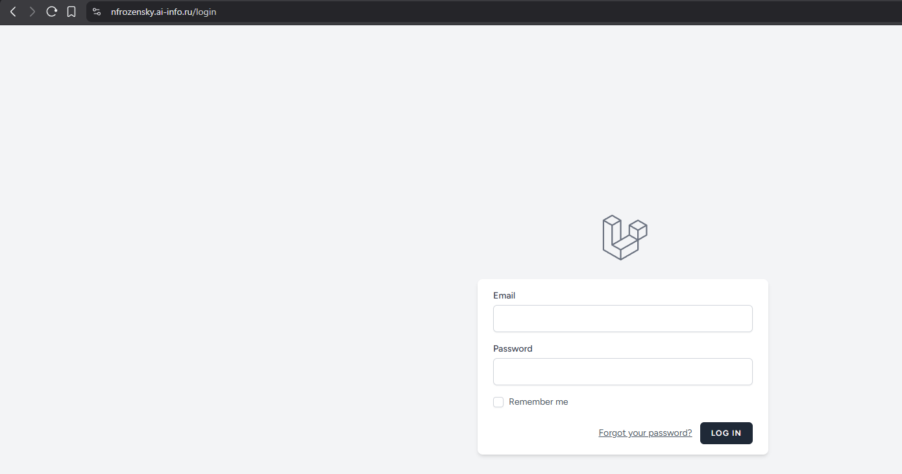

23-after-register.png:
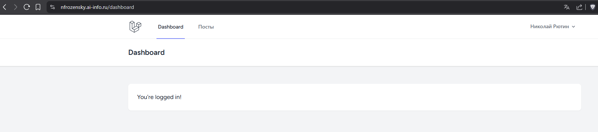

24-github-app.png:
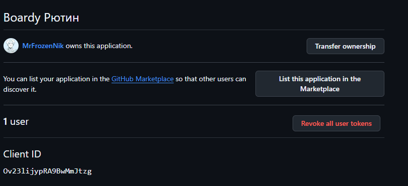

25-login-with-github.png:
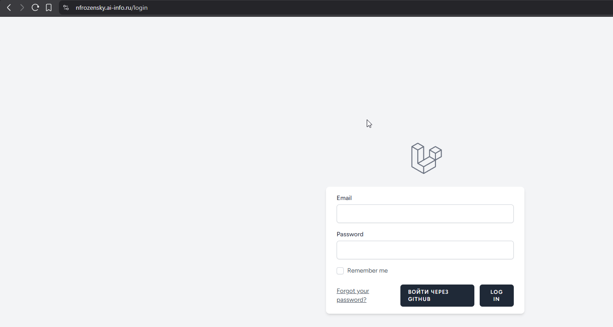

26-github-authorize.png :
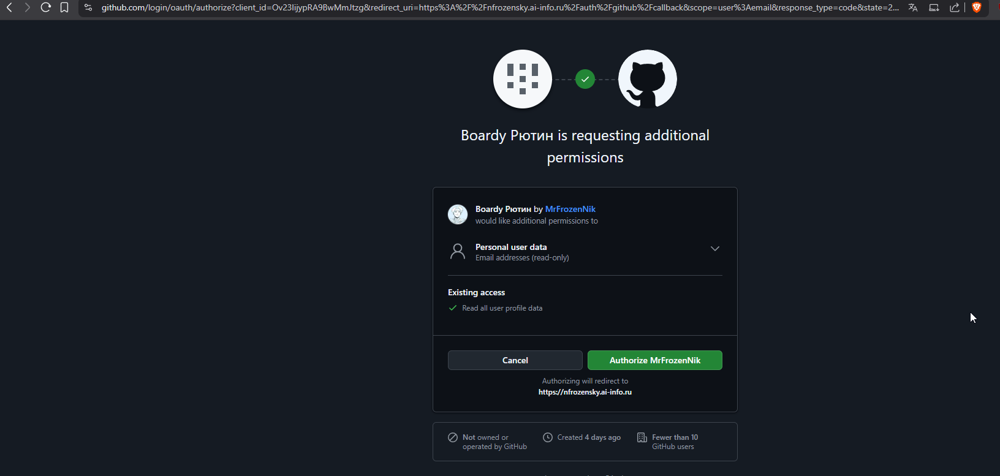

27-after-github-login.png :
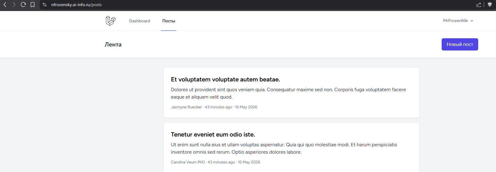

28-mysql-github-id.png:
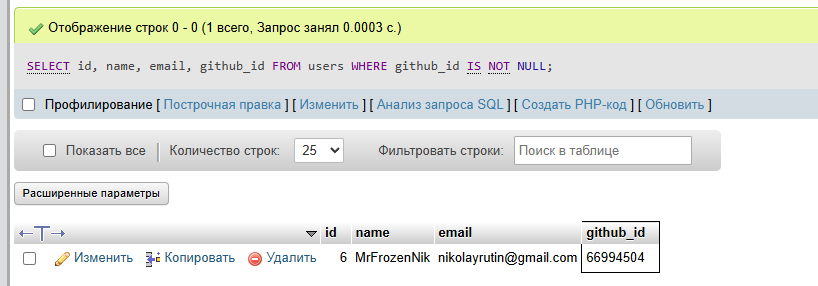
#### Защитный вопрос: сравните количество строк кода Lab11 (ручной OAuth на чистом PHP) и Lab12 (Socialite). Что сократилось и за счёт чего?
- Lab11 — 50+ строк ручного кода: формирование redirect-URL, обмен code → token через curl, fetch профиля, ручная работа с БД.
- Lab12 — два метода в контроллере и Socialite::driver('github')->user(). Десять строк.

---

## 22. Что осталось от прошлых практик

На VPS параллельно с новым Laravel-проектом продолжают существовать два артефакта прошлых лаб: папка /var/www/boardy-legacy/ со старым PHP-кодом (Lab4–11) и отдельная БД boardy со схемой под чистый PHP (author_id
вместо user_id, password_hash вместо password и т.д.). Новый Laravel-проект живёт в /var/www/boardy/ и использует другую БД — boardy_main, схема которой подогнана под конвенции Eloquent.

Не удалили мы их по двум причинам:

Во-первых, страховка. Если в новой Laravel-версии всплывёт критический баг, который не получится починить быстро, можно за пару минут вернуть nginx-конфиг на старый boardy-legacy/ и поднять PHP-версию обратно как
«холодный резерв». Удалив legacy сразу, такой возможности мы бы себя лишили.

Во-вторых, FastAPI из Lab9–11 продолжает работать на поддомене api.nfrozensky.ai-info.ru и использует именно legacy-БД boardy. Удалив её, мы сломали бы JWT-логин, ленту через JSON-API и React-комментарии, которые
остались с прошлых лаб. Lab12 не трогает FastAPI — он живёт сам по себе на старых данных. До Lab13, где мы будем переезжать на Passport и единый OAuth-сервер, эта legacy-связка должна оставаться рабочей.

Что произойдёт при открытии ``https://nfrozensky.ai-info.ru/login.php`` - будет пустая страница, так как в nginx мы указали директорию public Для Laravel-проекта, а старые файлы переместили в папку boardy-legacy
## 23. FastAPI и React

FastAPI продолжает крутиться на api.nfrozensky.ai-info.ru и использует legacy-БД boardy. React-файлы из Lab9–11 лежат там же, где и были, — в /var/www/boardy-legacy/js/comments.jsx и подключённой странице. Но в
Laravel-проекте мы к ним не обращаемся — ни ленту, ни комментарии через FastAPI не получаем, и React-компоненты не подключаем в Blade-шаблоны.

Что мешает интегрировать сейчас. Принципиальная проблема — авторизация. Laravel-проект из коробки умеет аутентифицировать пользователя через сессию (Breeze) и проверять права через Policy. FastAPI же ожидает
Bearer-токен в заголовке Authorization (так было сделано в Lab10–11). Сейчас этих токенов некому выдавать: Laravel не является OAuth-сервером, а старый JWT-механизм из FastAPI работает на legacy-БД, где другая
структура users. Если бы мы прямо сейчас попробовали из Blade-шаблона дёрнуть React-компонент, который ходит на FastAPI за комментариями, — он не смог бы доказать FastAPI, что юзер залогинен. Сессионная cookie от
Laravel для FastAPI ничего не значит, а Bearer-токена у нас нет.

Вторая проблема - расхождение схем БД, fastapi читает БД в старом формате
Где они пригодятся в Lab13. Именно для устранения первой проблемы. В Lab13:

- В Laravel ставится Laravel Passport — это превращает Laravel в полноценный OAuth Authorization Server, который умеет выдавать access-токены (RS256-подписанные JWT).
- FastAPI переписывается под BFF (Backend for Frontend): он принимает Bearer-токен от React, проверяет его публичным ключом Passport (валидация подписи без обращения к Laravel), и проксирует запросы в Laravel или
  работает с данными напрямую.
- React возвращается на страницу поста — комментарии снова рендерятся реактивно, но теперь токен на запросы в FastAPI выдаёт Passport, а данные приходят из единой БД boardy_main.

## 24. Реалтайм

Чтобы один пользователь видел новый комментарий другого без перезагрузки, нам нужны два сервера - WebSocket на FastAPI, Redis — pub/sub-брокер. Когда Laravel создаёт комментарий, он не общается напрямую с WebSocket-клиентами. Вместо этого он публикует сообщение в Redis-канал — например, posts.42.comments. Redis выступает шиной
сообщений между «короткоживущим» PHP-процессом и «долгоживущим» WebSocket-сервером. А вебсокеты на laravel написать не получится - php-fpm так не работает, это пул короткоживущих процессов, каждый умирает после ответа на запрос. Реалтайм требует долгоживущего event-loop процесса - это предоставит нам FastApi

