01-ws-connected.png:
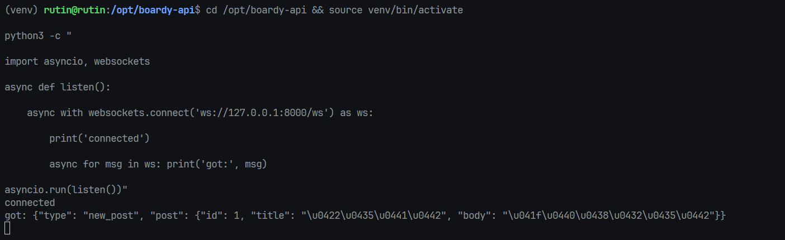

- Почему self.active — список в памяти, а не в БД? WebSocket — это живое TCP-соединение. Объект соединения существует только в памяти процесса: у него есть сокет, буферы, состояние. В базу данных нельзя сохранить сам объект соединения — только метаданные о нём. Для broadcast нужен именно объект, чтобы вызвать ws.send_text().
- Что произойдёт если Uvicorn перезапустится? Все активные WebSocket-соединения будут разорваны (клиенты получат событие onclose). Список self.active очищается — он не персистентен. Браузеры должны переподключиться самостоятельно (что и реализуется в задании 9 через setTimeout(connect, 3000))

02-broadcast.png:

- Почему /internal/broadcast не требует JWT? Этот эндпоинт вызывается не пользователем из браузера, а сервером Laravel — то есть из внутренней сети. JWT — механизм для идентификации внешних клиентов (людей). Между доверенными серверами внутри инфраструктуры JWT избыточен.
- Какой риск остаётся и как его закрывает Nginx? Если /internal/broadcast доступен снаружи — любой желающий может рассылать произвольные события всем подключённым браузерам (подделка постов, XSS-фреймы). Nginx закрывает это директивами allow 127.0.0.1; deny all; — запросы снаружи получат 403, а Laravel на том же сервере проходит как 127.0.0.1

03-two-clients.png:
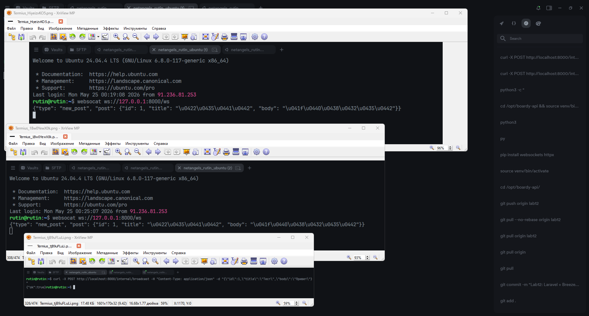

- Что произойдёт если один клиент отключился, а broadcast уже начался? Вызов ws.send_text() бросит исключение (например WebSocketDisconnect или ConnectionClosedError). 
- Где обрабатывается: в методе broadcast() класса ConnectionManager — обёртка try/except ловит ошибку, добавляет «мёртвый» сокет в список dead, и после прохода по всем клиентам удаляет их из self.active. Остальные клиенты получают сообщение без прерывания.

04-laravel-log.png:
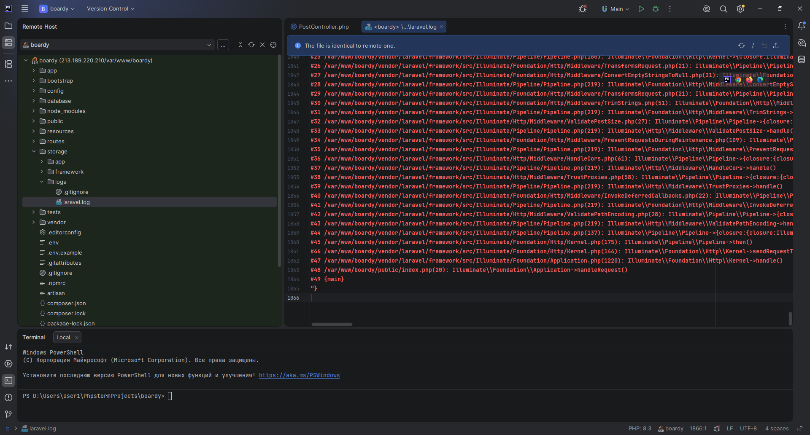

- Зачем timeout(2)? Что случится без него? Если FastAPI недоступен (упал, перегружен), Laravel будет ждать ответа неограниченное время (по умолчанию 30+ секунд). Пользователь, создавший пост, будет смотреть на зависший браузер. С timeout(2) — через 2 секунды бросается исключение, оно ловится в catch, в лог пишется предупреждение, а пользователь получает redirect как обычно. Пост сохранён, только реалтайм-рассылка не прошла.

05-callback.png:
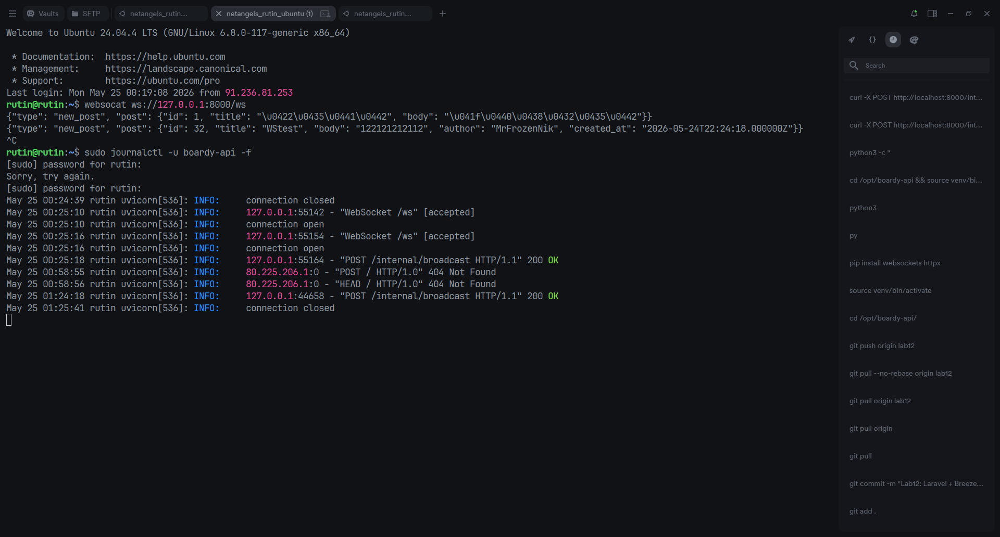

- Проблемы HTTP-callback как "костыля":

1) Синхронность. Laravel ждёт ответа FastAPI перед тем как сделать redirect. Если FastAPI тормозит — тормозит вся форма создания поста. Пользователь ждёт, хотя пост уже сохранён в БД.
2) Жёсткая связанность сервисов. Laravel знает адрес FastAPI напрямую (localhost:8000). При изменении порта, переезде сервиса или горизонтальном масштабировании нужно менять конфиг Laravel. Это нарушает принцип независимости сервисов.
3) Не работает при нескольких воркерах. Если Uvicorn запущен с несколькими воркерами (--workers 4), каждый воркер имеет свой экземпляр ConnectionManager со своим списком клиентов. HTTP-запрос попадёт только в один воркер — остальные клиенты не получат событие.

06-devtools-ws.png:
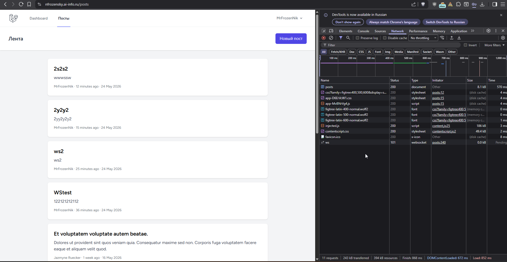

- Почему на локалке ws://, а на проде wss://? wss:// — это WebSocket поверх TLS (аналог https://). На локальной машине TLS-сертификата нет, поэтому используется нешифрованный ws://. На проде браузер работает через https://, и политика безопасности браузера запрещает устанавливать незащищённые ws:// соединения со страниц, загруженных по https:// (Mixed Content). 
- Что будет если использовать wss:// без TLS? Браузер попытается установить TLS-рукопожатие, сервер ответит обычным HTTP — получим ERR_SSL_PROTOCOL_ERROR, соединение не установится.

07-two-browsers.png:
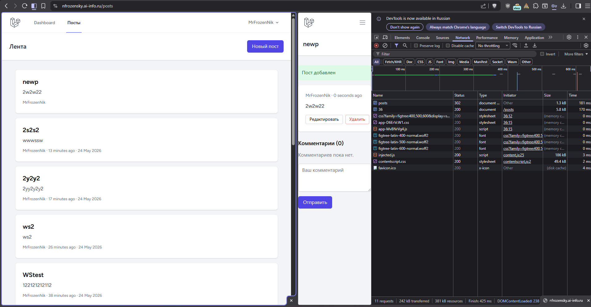

08-devtools-frame.png:
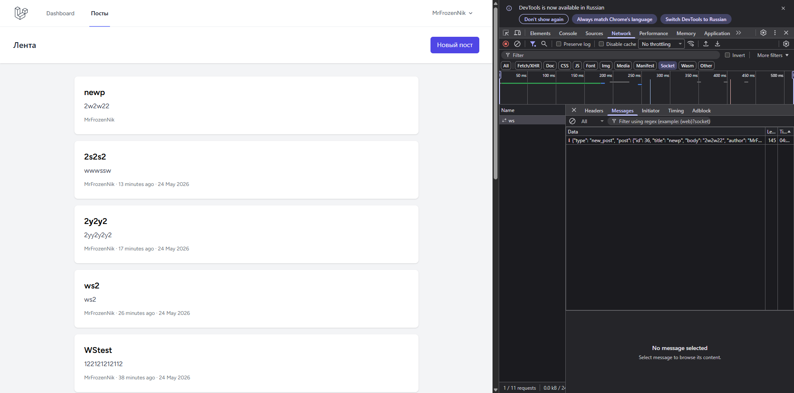

09-xss.png:
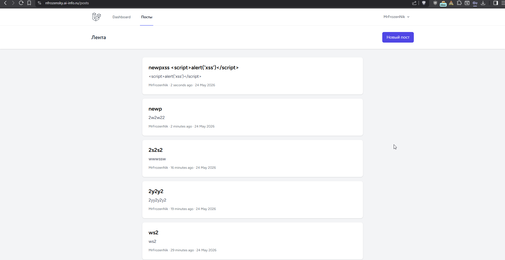

- Что делает escapeHtml()? Создаёт временный 
, присваивает строку через .textContent (браузер автоматически экранирует спецсимволы как текст, не как HTML), затем читает .innerHTML — в нём уже безопасная HTML-строка. Например  исполнится — злоумышленник может красть cookies, делать запросы от имени пользователя, подменять контент страницы.

10-reconnect.png:
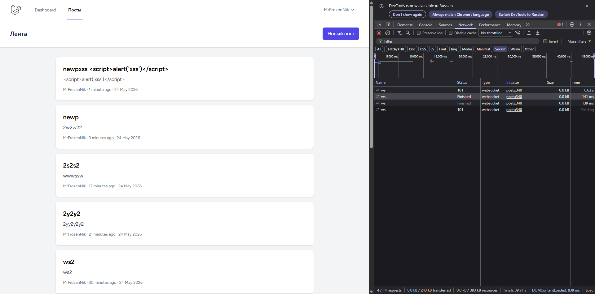

11-nginx-ws.png:
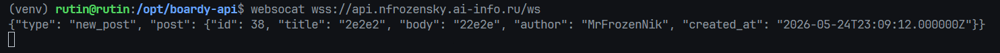

- что сломается если убрать:

1) proxy_http_version 1.1 — Nginx по умолчанию использует HTTP/1.0 для upstream. HTTP/1.0 не поддерживает постоянные соединения и заголовки Upgrade. WebSocket не установится, клиент получит ошибку подключения.
2) proxy_set_header Upgrade $http_upgrade — заголовок Upgrade: websocket не дойдёт до FastAPI. FastAPI не поймёт что клиент хочет перейти на WebSocket-протокол и вернёт обычный HTTP-ответ (400 или 426). Статус 101 не будет получен.
3) proxy_read_timeout — по умолчанию таймаут Nginx 60 секунд. Если клиент не отправлял данные 60 секунд (а WS-соединения часто просто держатся открытыми, молча ожидая событий) — Nginx закроет соединение. Клиент увидит неожиданный onclose и будет постоянно переподключаться каждую минуту.

12-internal-denied.png:
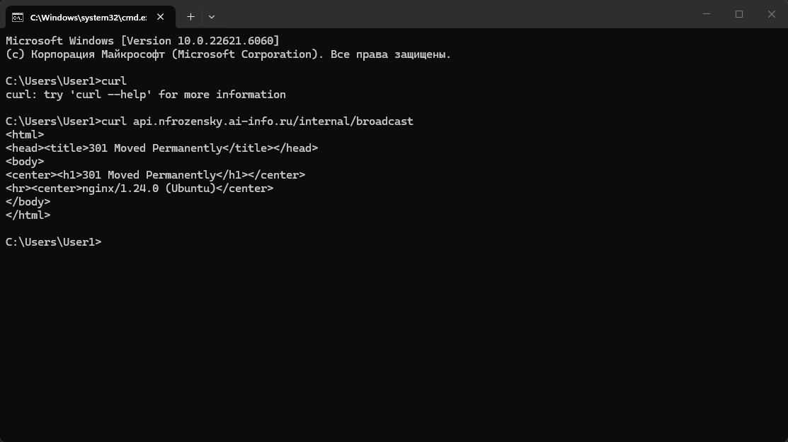

- Почему /internal/broadcast опасен без ограничения? Без защиты любой человек в интернете может отправить POST на https://api.yoursite.com/internal/broadcast с произвольным JSON. FastAPI примет это как легитимное событие и разошлёт всем подключённым пользователям. Злоумышленник может: рассылать фейковые посты от имени любого пользователя; отправлять в body XSS-нагрузку (если escapeHtml вдруг забыт); устраивать DoS — заваливать все браузеры тысячами фейковых событий. Кто мог бы вызвать: любой внешний пользователь, бот, автоматический сканер.
