01-ws-connected.png:
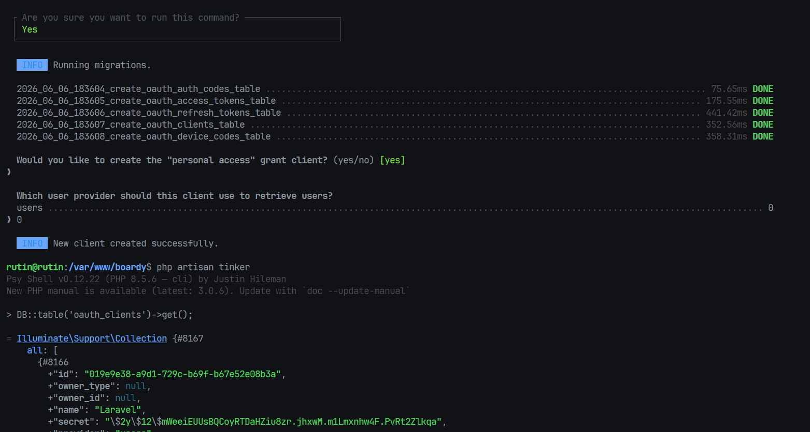

02-spa-client.png:
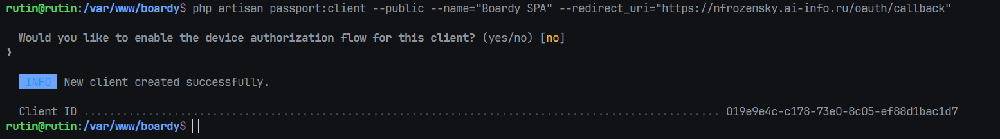

#### почему публичный клиент без secret?
- SPA работает в браузере, JavaScript-код виден пользователю. Хранить client_secret в браузере невозможно - любой сможет его прочитать. Публичный клиент не имеет секрета, поэтому его утечка ничего не даёт.
#### Чем PKCE заменяет client_secret и от какой атаки защищает? 
- PKCE заменяет секрет математикой: клиент генерирует случайный code_verifier, вычисляет code_challenge = SHA-256(verifier) и отправляет его при запросе. Сервер запоминает challenge. При обмене кода на токен клиент присылает verifier - сервер сам проверяет соответствие. Защищает от перехвата authorization code: даже если злоумышленник перехватил code, он не знает verifier и не сможет получить токен.

03-token-ttl.png:
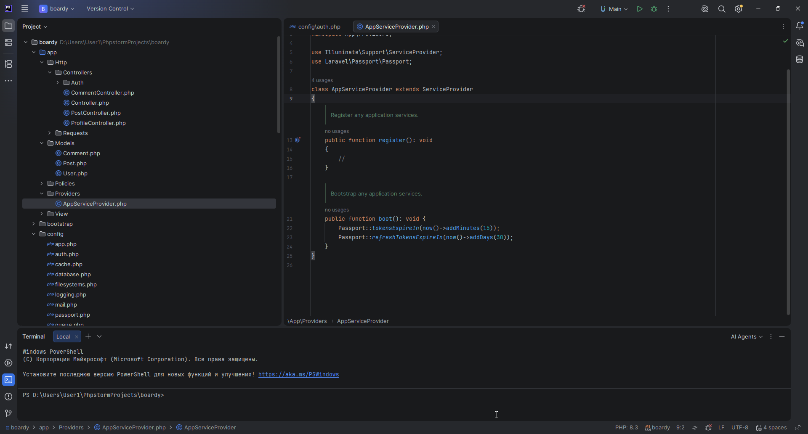

#### почему access короткий, а refresh длинный?
- access_token летит в каждом запросе к API. Если он утечёт (через логи, XSS, промежуточный прокси), злоумышленник получит доступ только на 15 минут. Refresh_token хранится в HttpOnly куках - он недоступен JS, поэтому его можно хранить дольше.
#### Что произойдёт если access будет 24 часа?
- любая утечка токена (XSS-атака, утечка логов) даёт злоумышленнику сутки полного доступа к аккаунту пользователя. За это время он успеет сделать всё что хочет, и пользователь ничего не заметит.

04-pkce-curl.png:
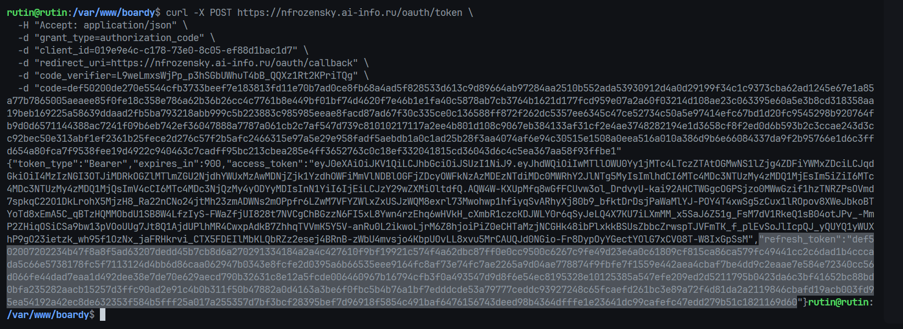

#### какие шаги OAuth flow прошёл этот curl-запрос?
- curl выполнил шаг обмена кода на токен (Authorization Code + PKCE/S256): сервер проверил code_verifier против ранее сохранённого code_challenge, погасил одноразовый code и выдал Bearer access-токен (TTL 900 с) и refresh-токен.

05-databases.png:
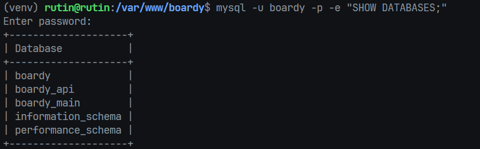

06-comments-schema.png:
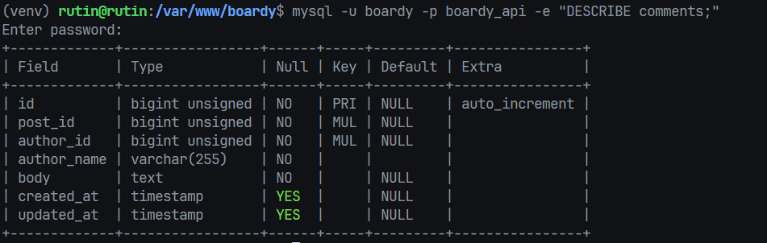

#### почему в comments нет FK на posts и users? 
- boardy_api и boardy_main - это разные базы данных, MySQL не поддерживает внешние ключи между базами разных серверов. В микросервисной архитектуре каждый сервис владеет своими данными и не знает о схеме другого.

#### Что делать с целостностью данных?
- целостность будет поддерживаться через события Redis: при удалении поста Laravel будет публиковать событие, а FastAPI - слушать и удалять комментарии

07-fastapi-db.png:
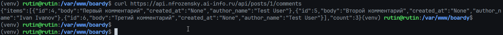


08-rs256-success.png:
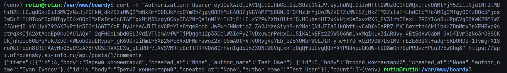

09-rs256-fail.png:
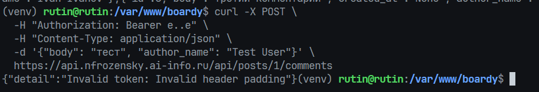

#### Почему RS256 безопаснее HS256 для распределённых систем?
- HS256 использует один симметричный ключ: чтобы FastAPI мог проверять токены, он должен знать тот же секрет, что Laravel. Если FastAPI скомпрометируют - секрет утечёт, и злоумышленник сможет подделывать токены. RS256 использует пару ключей: Laravel подписывает приватным ключом, FastAPI проверяет публичным. Публичный ключ не секретный, его можно раздавать всем сервисам - даже если его украдут, подделать токен нельзя.

10-crud-all.png:
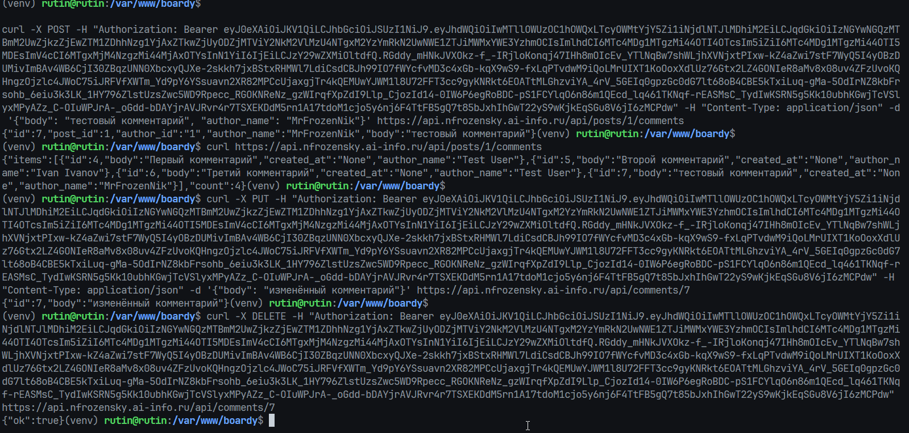

#### почему author_name передаётся в payload запроса, а не извлекается из токена?
- JWT токен содержит sub (user_id) и технические данные. Имя пользователя - бизнес-данные, которые меняются. Если зашить имя в JWT при выдаче, а пользователь потом его изменит - старые токены будут нести неактуальное имя до истечения. React знает имя из текущей сессии и передаёт актуальное значение.

#### Что было бы если зашить в JWT custom claim?
- пришлось бы либо отзывать все токены при смене имени (сложно), либо мириться с тем, что комментарий подписан старым именем до истечения токена.


11-owner-check.png:
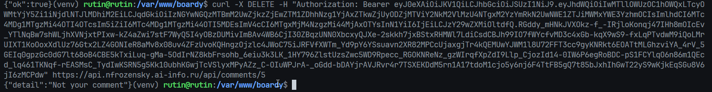
#### где в коде проверяется владелец? 

```python
if existing['author_id'] != int(user['sub']):
            conn.close()
            raise HTTPException(403, 'Not your comment')
```

#### Что произойдёт если убрать эту проверку?
- любой авторизованный пользователь сможет редактировать и удалять чужие комментарии, зная их id.

12-cors-config.png:
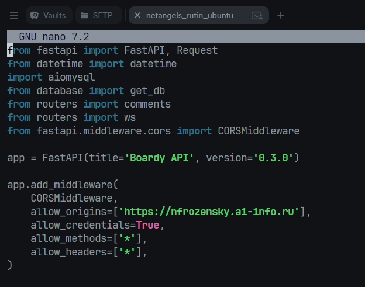

#### почему allow_origins=['*'] + credentials=true браузер блокирует? 
- требование спецификации CORS. Если разрешены все origin'ы (*), то отправлять credentials (cookies, Authorization) нельзя - иначе любой сайт мог бы делать запросы с нашими куками.


#### Что произошло бы с куками если бы пропустил?

- refresh_token в cookie не улетел бы в запросах к FastAPI, silent refresh не работал бы.

13-pkce-utils.png:
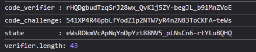

#### Почему code_challenge → в /authorize, а code_verifier → в /token?
- /authorize - запрос уходит через редирект браузера (URL в адресной строке, History, логах прокси/сервера). Это «грязный», публично наблюдаемый канал. Поэтому сюда кладут только code_challenge - необратимый SHA-256-хэш от секрета. Даже если злоумышленник перехватит challenge, восстановить из него verifier нельзя. А /token - это прямой POST бэкенд-в-бэкенд (или fetch из JS), не виден в URL и не логируется как адрес. Сюда отправляют сам code_verifier - оригинальный секрет.

#### Что будет, если перепутать?
- Положить code_verifier в /authorize - катастрофа по безопасности: секрет утечёт в URL/History/логи. Любой, кто перехватит code (а он в редиректе), сможет тут же предъявить verifier и обменять код на токен. Положить code_challenge (хэш) в /token вместо verifier - обмен просто упадёт с invalid_grant. Сервер посчитает SHA-256 от присланного значения (т.е. хэш от хэша), сравнит с сохранённым challenge - не совпадёт. Токен не выдадут.

14-login-redirect.png:
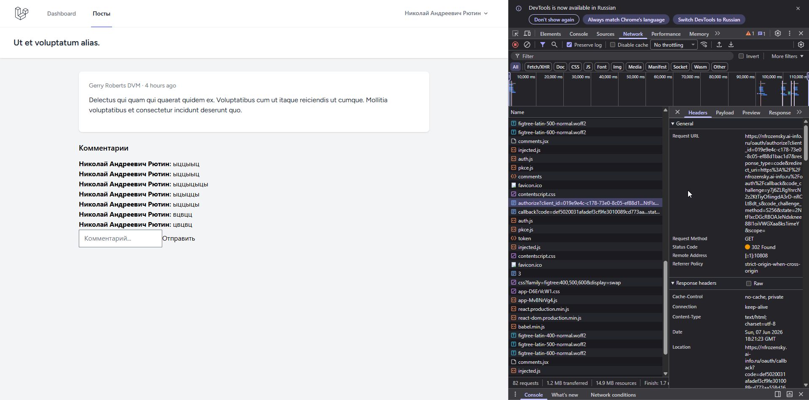

15-login-callback.png:
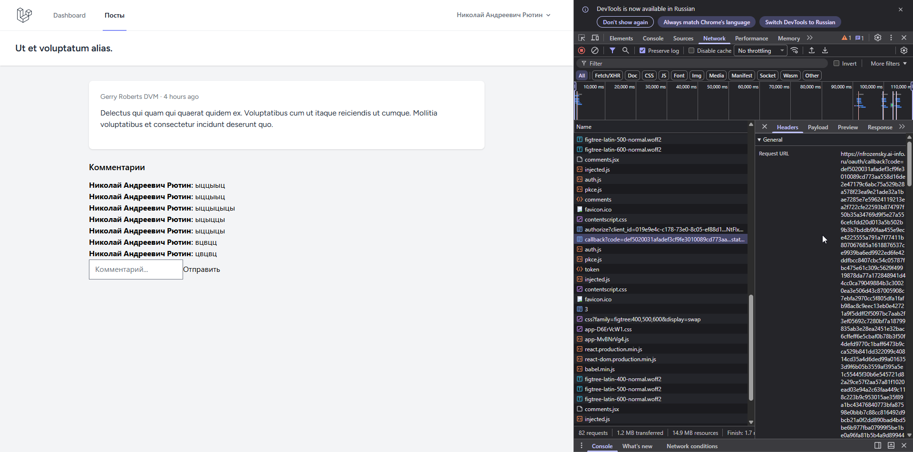


16-token-exchange.png:
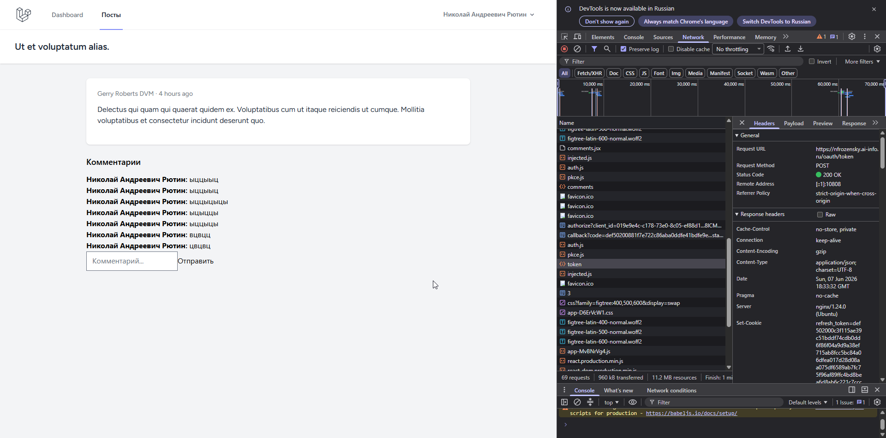

#### что произойдёт если убрать проверку state? Какая атака возможна?
- Если проверку убрать, возможна CSRF-атака на OAuth (authorization code injection): атакующий проходит свой OAuth-flow, получает свой code, а затем заставляет браузер жертвы открыть её /oauth/callback?code=<код_атакующего>. Клиент жертвы обменяет чужой код на токен - и жертва окажется залогинена в аккаунт атакующего

17-refresh-cookie.png:
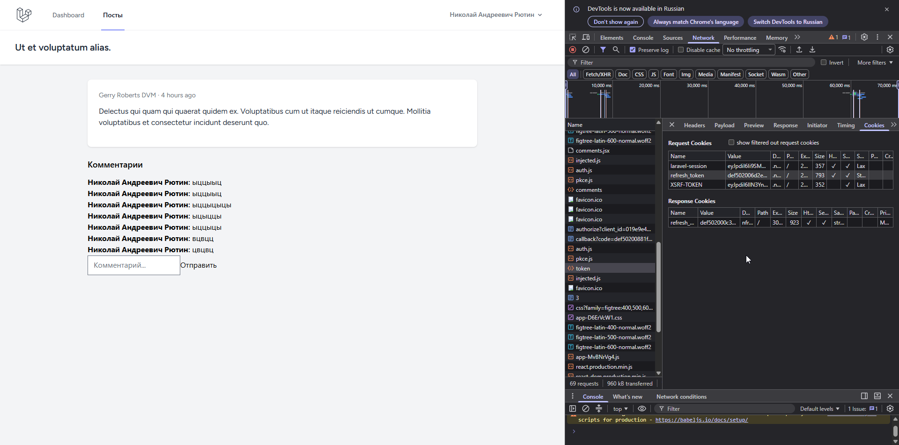

#### что случится если refresh положить в localStorage и сайт получит XSS?
- localStorage доступен любому JavaScript на странице. При XSS атакующий внедряет скрипт, который читает localStorage.getItem('refresh_token') и отправляет его себе. Refresh-токен живёт долго (30 дней) и позволяет бесконечно выпускать новые access-токены → полный и долговременный захват аккаунта, переживающий перезагрузки.

HttpOnly-кука JS недоступна — даже при XSS скрипт не сможет её прочитать и украсть. Secure гарантирует отправку только по HTTPS, SameSite=Strict ограничивает межсайтовую отправку. Поэтому refresh держат в HttpOnly-куке, а не в localStorage.


18-silent-refresh.png:
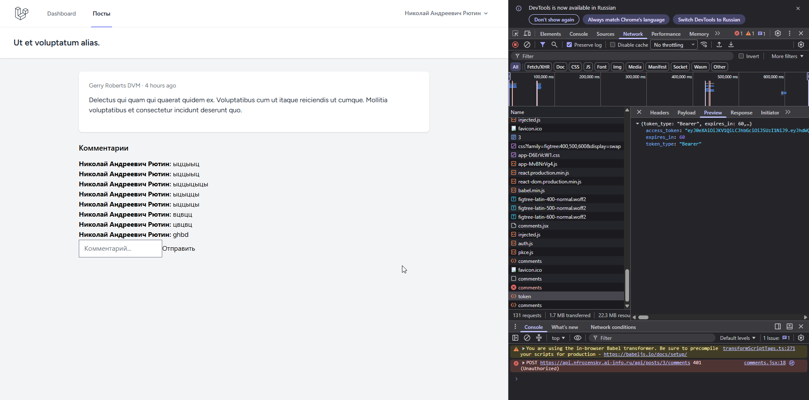

19-redis-ping.png:
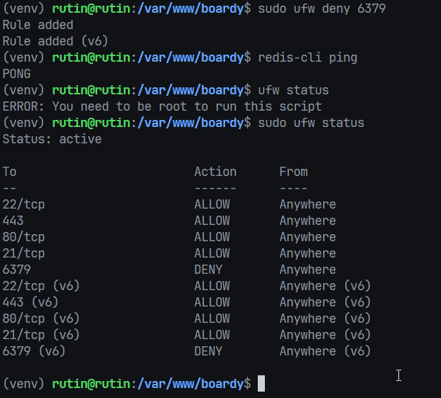

20-laravel-publish.png:


