01-laravel-build.png:
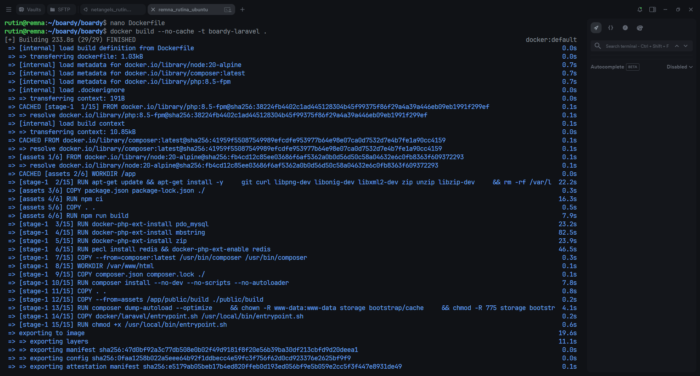

#### зачем PHP-FPM в Docker, а не Apache+PHP? Какое архитектурное преимущество? 
- В Docker один контейнер должен решать одну задачу. Связка Apache+PHP объединяет веб-сервер и обработчик кода в один «тяжелый» процесс. PHP-FPM занимается только выполнением PHP-скриптов. Роль веб-сервера (раздачу картинок, CSS и прием запросов) отдают отдельному легкому контейнеру Nginx.

02-composer-layer.png:
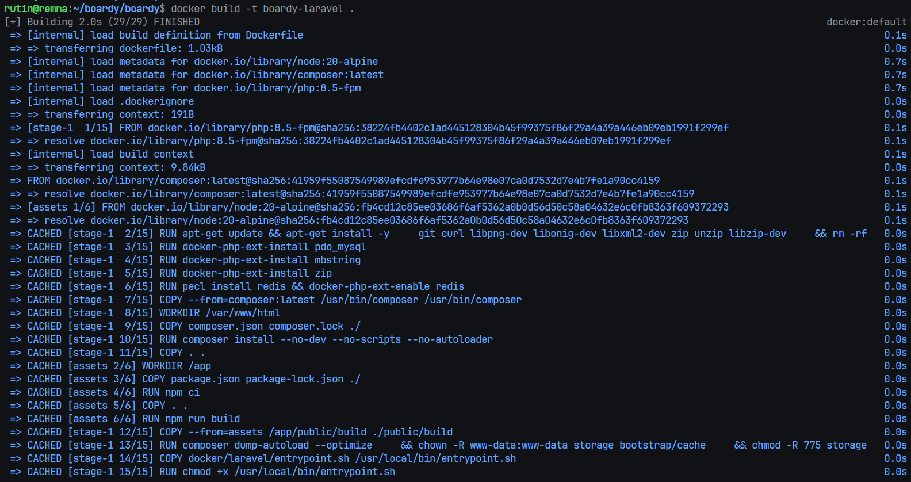

#### что произойдёт если COPY всего проекта сделать ДО composer install? Объясните механизм кеширования слоёв.
- Если `COPY . .` поставить ДО composer install, любое изменение кода инвалидирует слой → composer install выполняется при каждой сборке. Docker кеширует слои по хешу инструкции и контента: меняется ранний слой - все последующие пересобираются. Поэтому зависимости копируем и ставим раньше кода.

03-dockerignore.png:
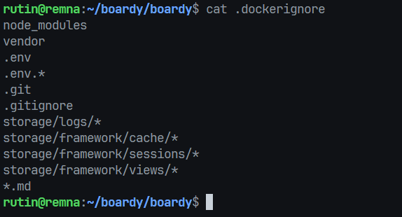

#### что произойдёт если не исключить .env из образа? Какая угроза безопасности?
- если не исключить .env из образа, то, во-первых, при публикации образа все пароли(включая пароли от БД) могут утечь в сеть, во-вторых - мы не сможем использовать образ для тестирования, ведь пароли будут "вшиты" в него, в-третьих - Каждая команда COPY в Dockerfile создает неизменяемый слой. Даже если удалим файл .env внутри контейнера или переименум его, он навсегда останется в истории слоев самого образа. Злоумышленник сможет легко извлечь этот файл из истории сборки.

04-requirements.png:
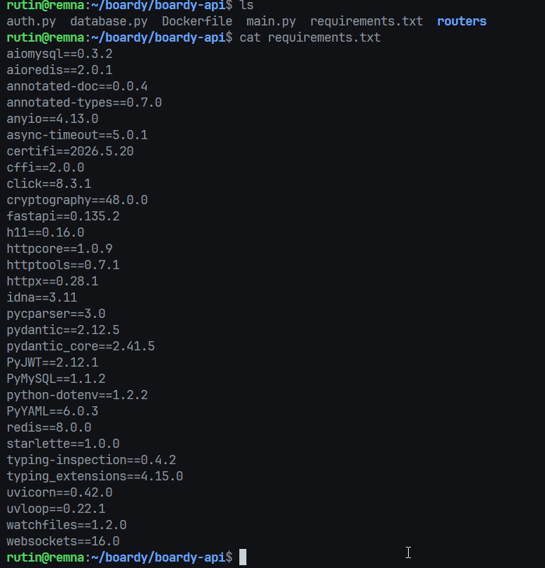

#### почему версии фиксируем, а не пишем 'latest'? Что произойдёт через год без фиксации?
-  фиксируем для воспроизводимости сборки. С latest через год подтянутся новые мажорные версии с несовместимостями → сборка сломается или поведение тихо изменится.

05-fastapi-build.png:
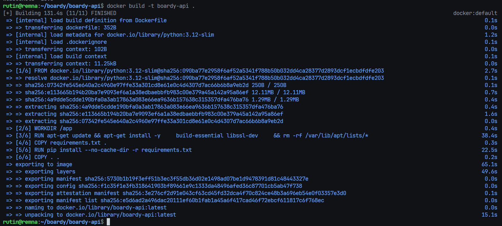

06-uvicorn-cmd.png:
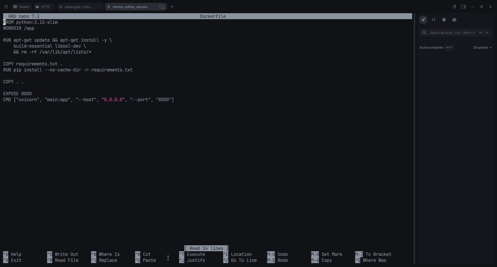

#### почему --host 0.0.0.0, а не 127.0.0.1? Что сломается с 127.0.0.1?
- 127.0.0.1 слушает только loopback внутри контейнера — другие контейнеры (nginx) не достучатся. 0.0.0.0 = все интерфейсы, контейнер доступен по имени сервиса в сети.

07-nginx-conf.png:
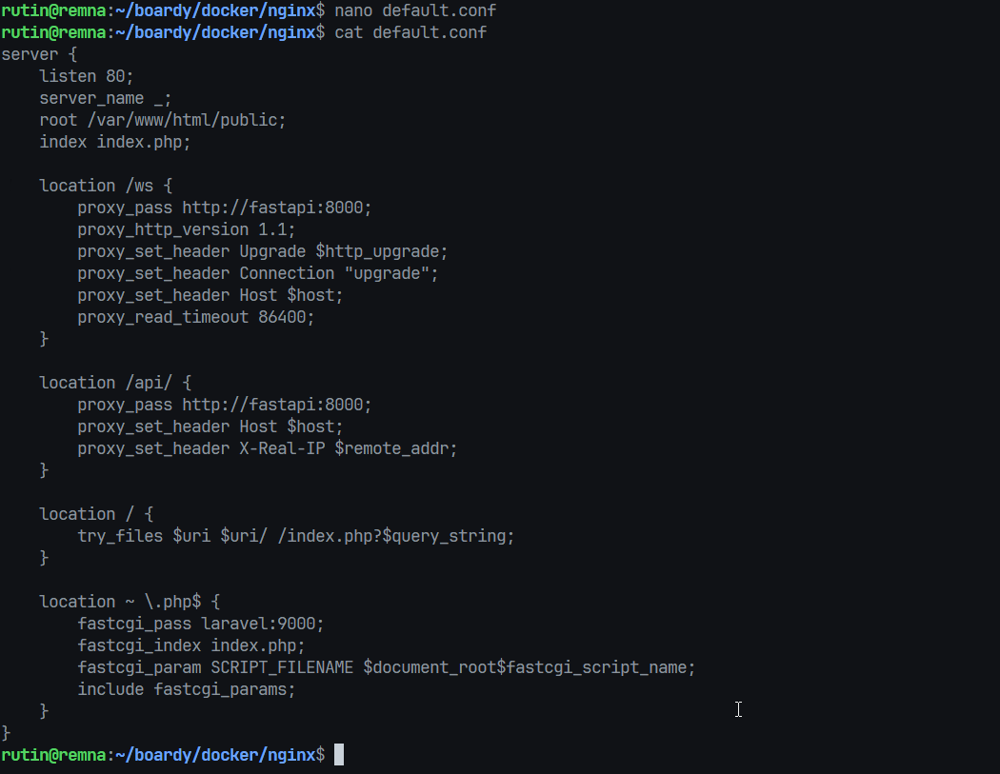
#### почему laravel:9000, а не 127.0.0.1:9000? Как Docker резолвит имена контейнеров?
- laravel:9000 вместо 127.0.0.1:9000, потому что у каждого контейнера свой сетевой namespace - 127.0.0.1 указывал бы на сам nginx. Docker держит встроенный DNS: имена сервисов из compose резолвятся в IP контейнеров внутри сети boardy_net

08-ws-config.png:
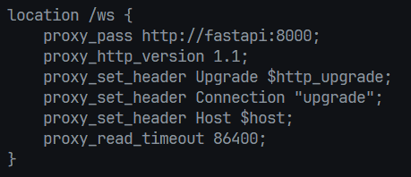

09-compose-services.png:
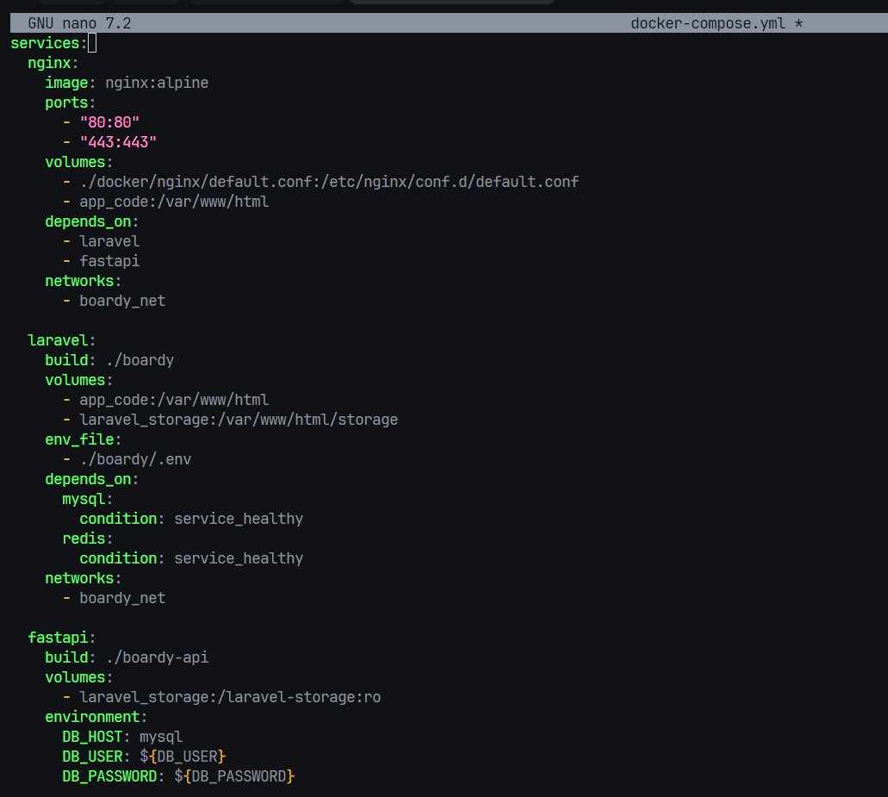

10-volumes.png:
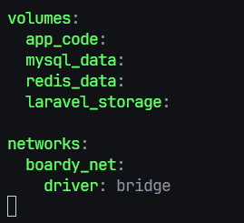

#### что произойдёт с данными MySQL если убрать mysql_data volume и сделать docker compose down? Чем именованный volume отличается от bind-mount?
- Без mysql_data данные лежат в записываемом слое контейнера; при down контейнер удаляется → данные пропадают. Named volume управляется Docker (в /var/lib/docker/volumes, переносим, переживает пересоздание контейнера); bind-mount - это конкретный путь на хосте.

11-healthcheck.png:
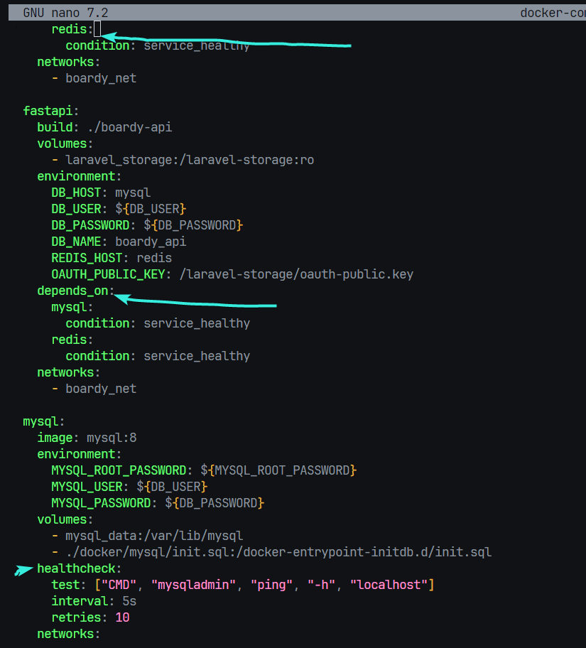
#### почему depends_on без healthcheck недостаточно? Какая race condition возникает?
- depends_on без healthcheck ждёт только старта контейнера, не готовности сервиса. Процесс MySQL запущен, но БД ещё инициализируется → Laravel подключается и ловит connection refused (race condition). service_healthy ждёт реальной готовности по healthcheck.

12-init-sql.png:
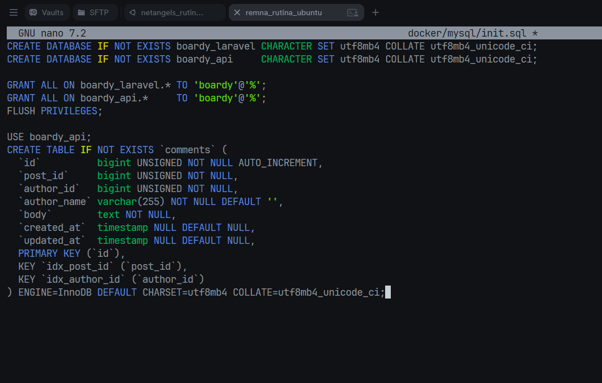

13-databases-created.png:
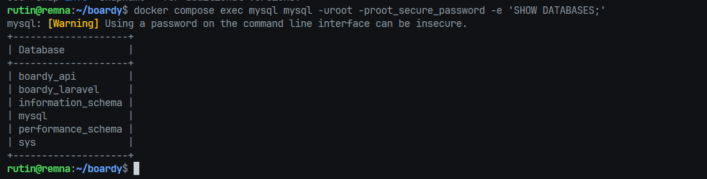

#### почему init.sql выполняется только при первом запуске? Что произойдёт если изменить файл после первого запуска?
-  Entrypoint MySQL выполняет /docker-entrypoint-initdb.d/* только при первой инициализации (когда дата-каталог пуст). Дальше volume уже инициализирован - скрипты игнорируются. Если изменить скрипт - эффекта не будет, нужно пересоздавать volume

14-env-compose.png:
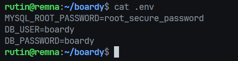

15-env-laravel.png:
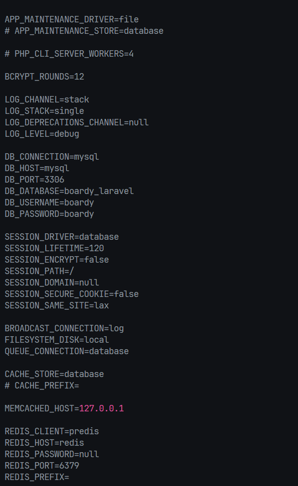

#### зачем два разных .env? Почему DB_HOST=mysql, а не 127.0.0.1?
- Корневой .env - для подстановки переменных в сам compose (пароли образа MySQL). boardy/.env - настройки Laravel-приложения. DB_HOST=mysql - имя сервиса-контейнера, резолвится Docker DNS; 127.0.0.1 указывал бы на сам laravel-контейнер.

16-compose-up.png:
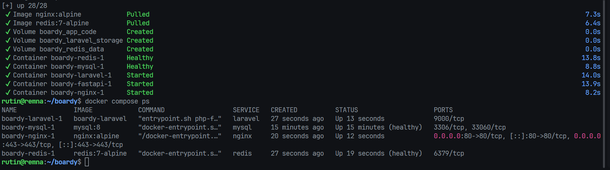

17-migrate.png:
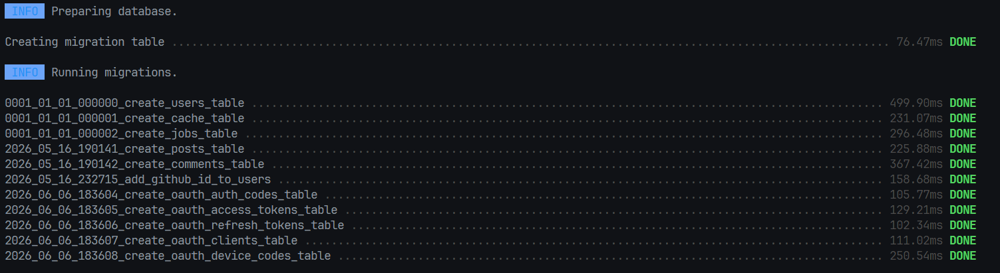

18-passport-install.png:
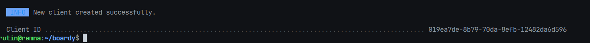

#### чем docker compose exec отличается от docker compose run?
- первый выполняет команду в уже запущенном контейнере, а второй создаёт одноразовый контейнер из образа

19-app-running.png:
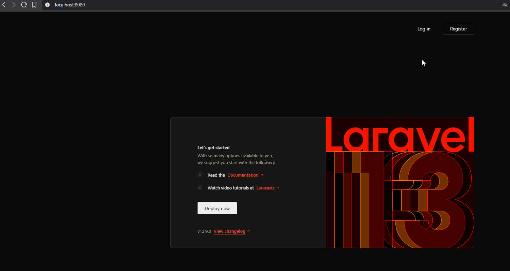
- Примечание: порт такой так как соединение было проброшено через ssh-туннель. Сам boardy был развёрнут на VPS

20-comment-works.png:
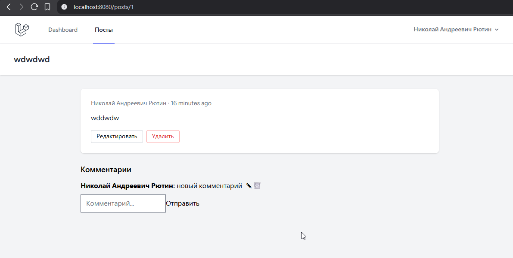

21-realtime-posts.png:
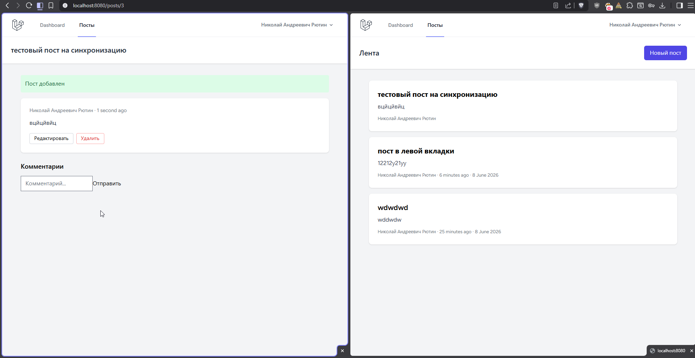

22-realtime-comments.png:
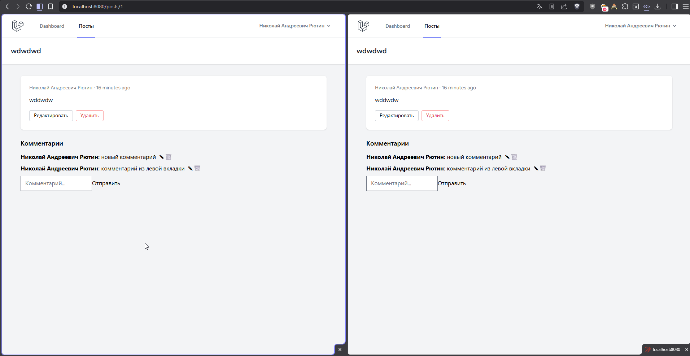

23-persist.png:
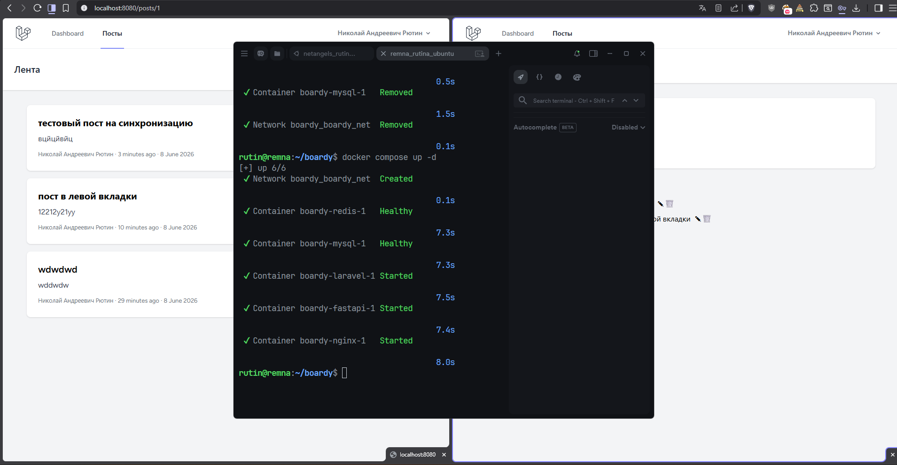

#### что произойдёт с данными при docker compose down -v? В чём опасность флага -v?
- docker compose down -v удалит volumes вместе с данными. БЕЗ -v данные сохраняются.

24-logs.png:
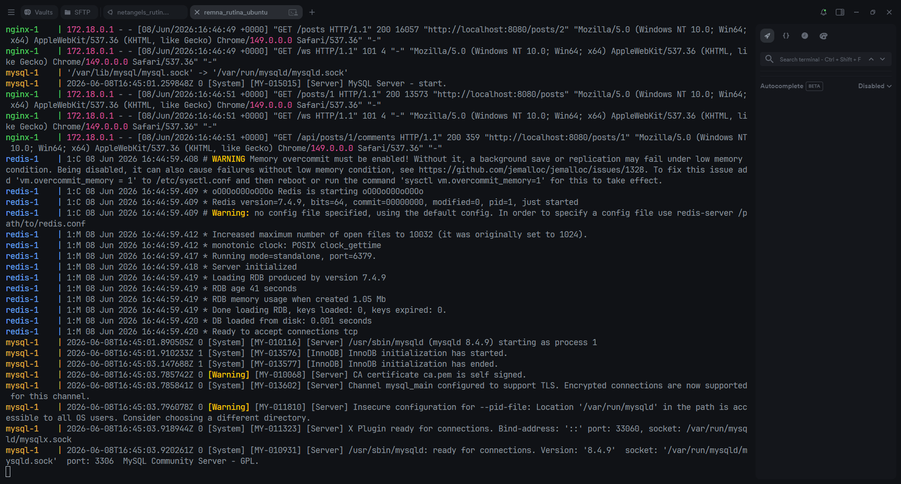

25-fresh-install.png:
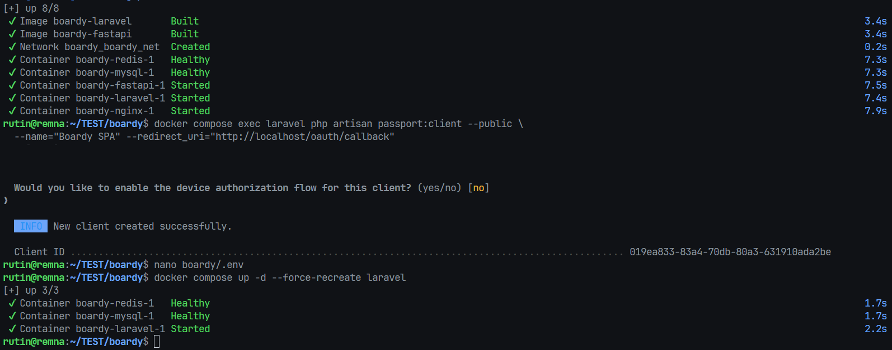

#### какие команды нужны на новой машине от клона репозитория до рабочего приложения? 
1. склонировать репозиторий `git clone https://github.com/MrFrozenNik/boardy.git`
2. заполнить файл .env для docker compose (nano .env либо скопировать .env.example, заполнить по образцу)
3. заполнить файл .env для laravel (nano boardy/.env либо скопировать .env.example, заполнить по образцу)
4. собрать и запустить контейнеры docker compose up -d
5. сгенерировать client-ключ для React docker compose exec laravel php artisan passport:client --public \
   --name="Boardy SPA" --redirect_uri="http://localhost/oauth/callback"
6. вписать его в .env файл laravel nano boardy/.env
7. пересоздать Laravel-контейнер docker compose up -d --force-recreate laravel

- последний шаг необходим, так как я выбрал named volume вместо bind-mount для laravel
