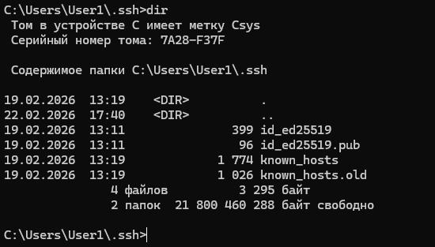
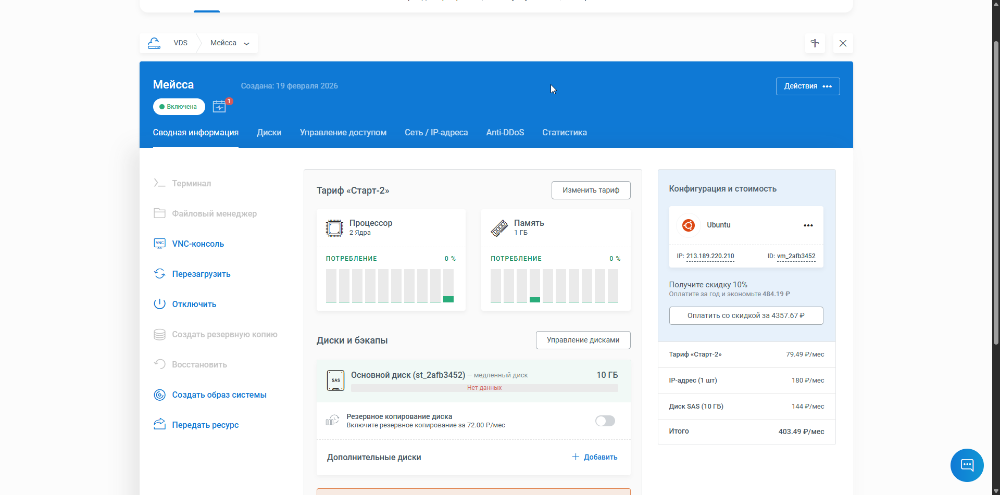
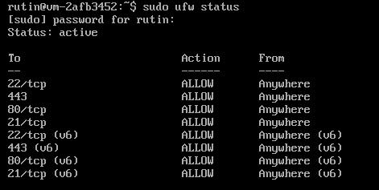
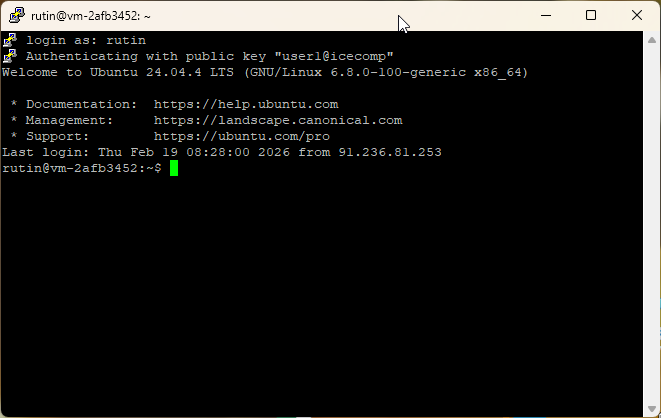
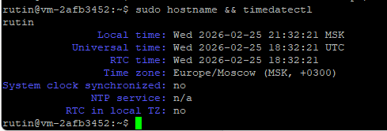
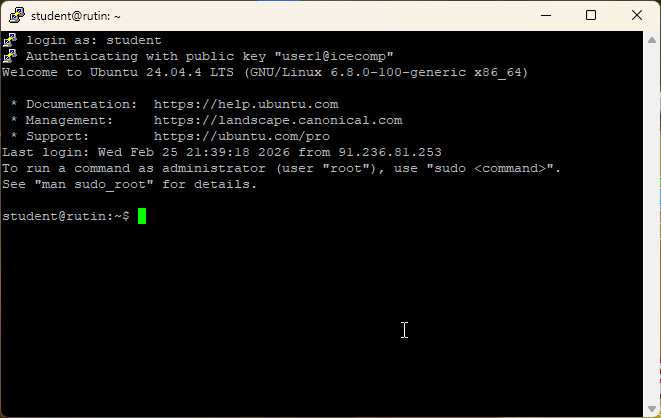
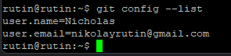
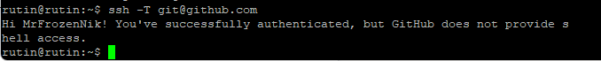
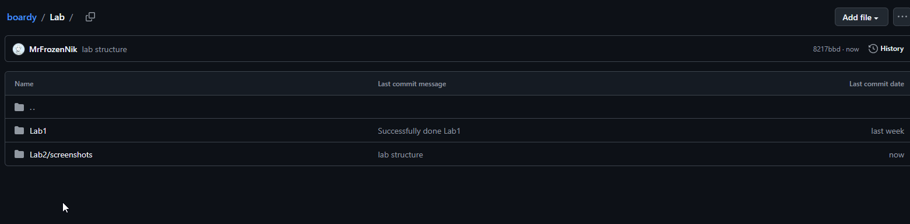
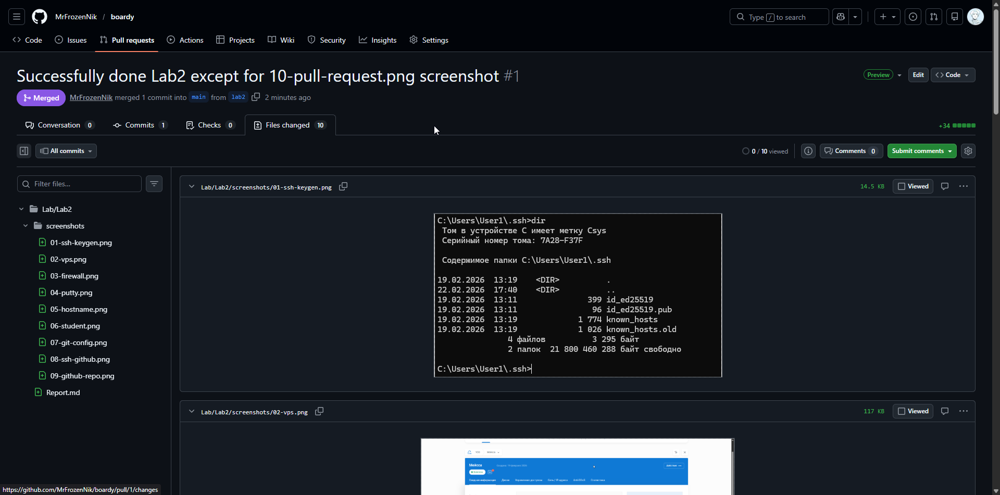

# Лабораторная работа 2
01-ssh-keygen.png:

Ключик сгенерировал ещё на паре. Он был размещён в нужной папке, как это видно.

02-vps.png:

Сделано на NetAngels. ВКшного фаервола нет, показываю установленный UFW

03-firewall.png:

04-putty.png:

05-hostname.png:

06-student.png:

07-git-config.png:

08-ssh-github.png:

09-github-repo.png:

10-pull-request.png:

