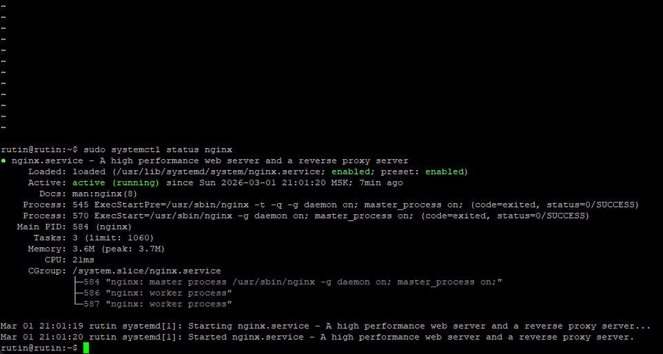
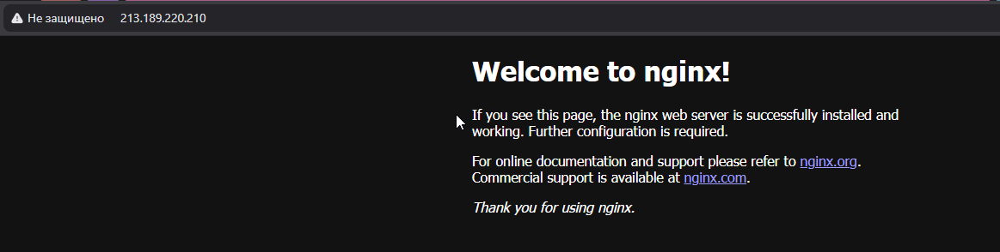
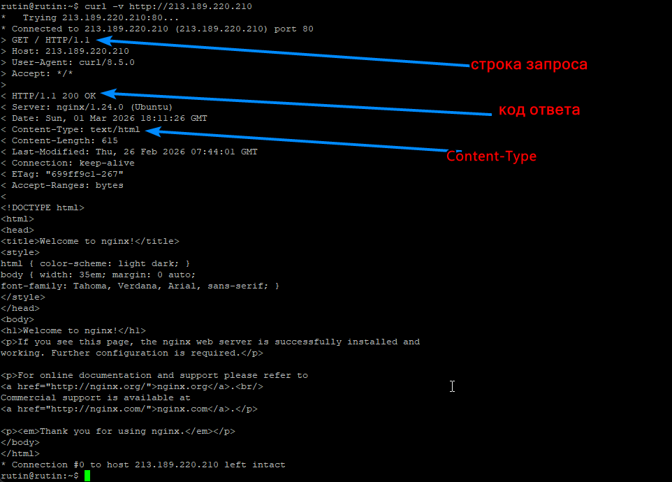
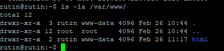
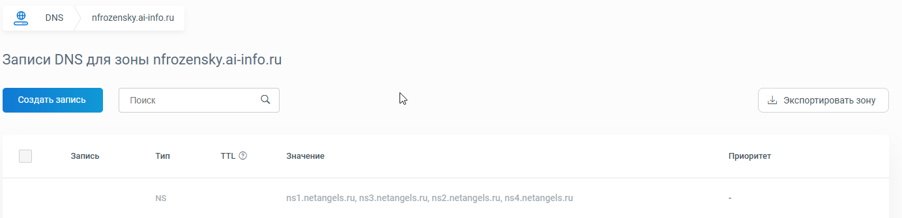
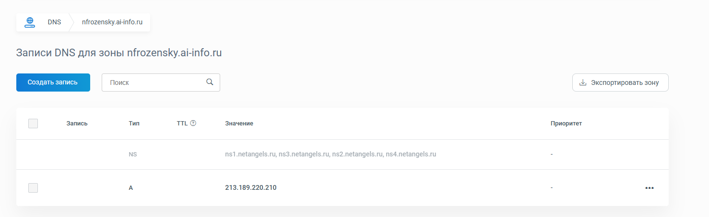
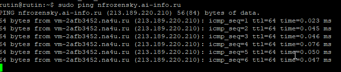
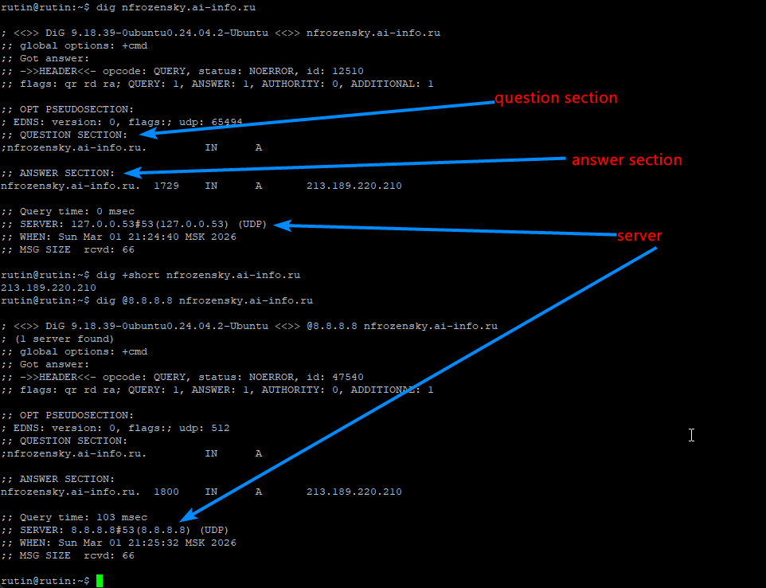
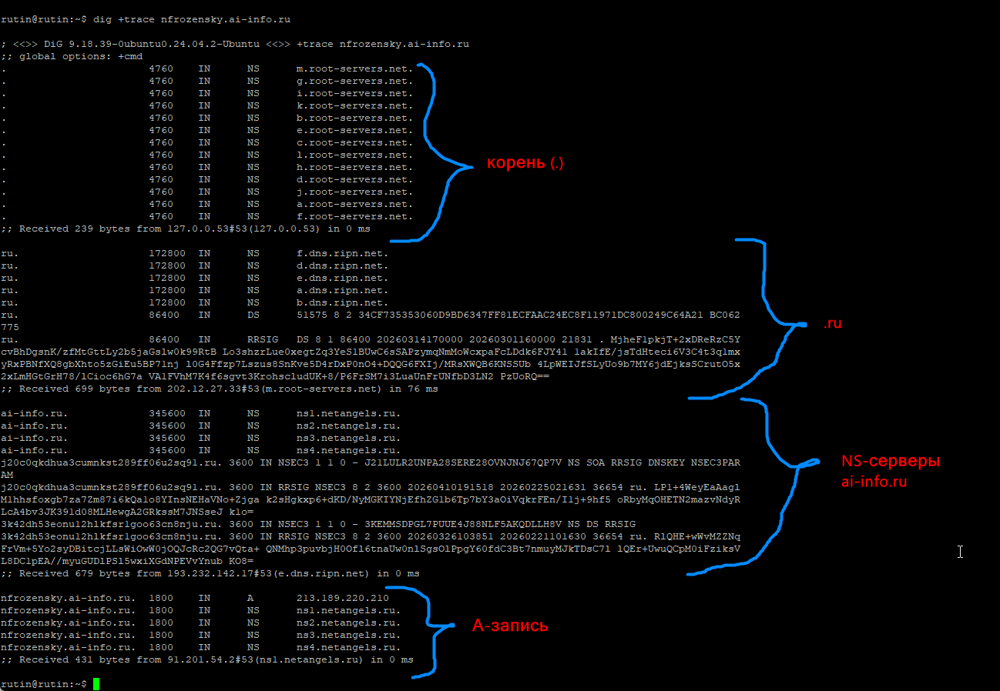
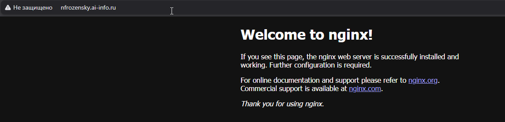

# Лабораторная работа 3
01-nginx-status.png:

02-browser-ip.png:

03-curl.png:

04-permissions.png:

Задание 5:
- listen 80 default_server; - Nginx слушает входящие соединения на порту 80, и если ни один другой блок server не подходит под запрос, то благодаря default_server запрос будет попадать именно в текущий блок server.
- root /var/www/html; - Устанавливает корневую директорию для файлов сайта(блока server), когда приходит запрос, Nginx будет искать файлы именно здесь.
- server_name _; - Задаёт имя сайта(блока server), _ обозначает специальную заглушку, в паре с default_server из первой директивы, позволяющую серверу отвечать на запросы с любым Host заголовком.
- index index.html index.htm index.nginx-debian.html; - Определяет список файлов, которые nginx будет искать при обращении к директории (без указания конкретного файла), 
файлы проверяются слева направо — будет отдан первый найденный.

05-dns-zone.png:

06-a-record.png:

07-ping.png:

08-dig.png:

09-dig-trace.png:

05-dns-zone.png:

