01-directory.png:
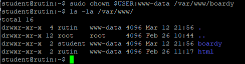

02-vhost-config.png:
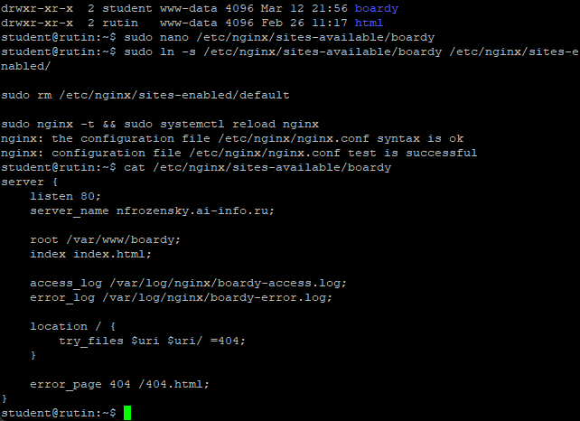

- root /var/www/boardy; — Устанавливает корневую директорию для файлов сайта, когда приходит запрос, nginx будет искать файлы именно здесь.
- server_name nfrozensky.ai-info.ru; — Задаёт имя сайта (блока server), nginx будет направлять в этот блок только те запросы, у которых Host заголовок совпадает с указанным доменом.
- access_log /var/log/nginx/boardy-access.log; — Указывает файл, в который nginx будет записывать каждый входящий запрос к сайту (IP, время, URL, статус ответа).
- error_log /var/log/nginx/boardy-error.log; — Указывает файл, в который nginx будет записывать ошибки, возникающие при обработке запросов.
- try_files \$uri $uri/ =404; — При запросе nginx сначала ищет файл по точному пути, затем как директорию, и если ничего не найдено — возвращает 404.
- error_page 404 /404.html; — Указывает, какой файл отдавать пользователю при возникновении ошибки 404 (страница не найдена).


03-landing.png:
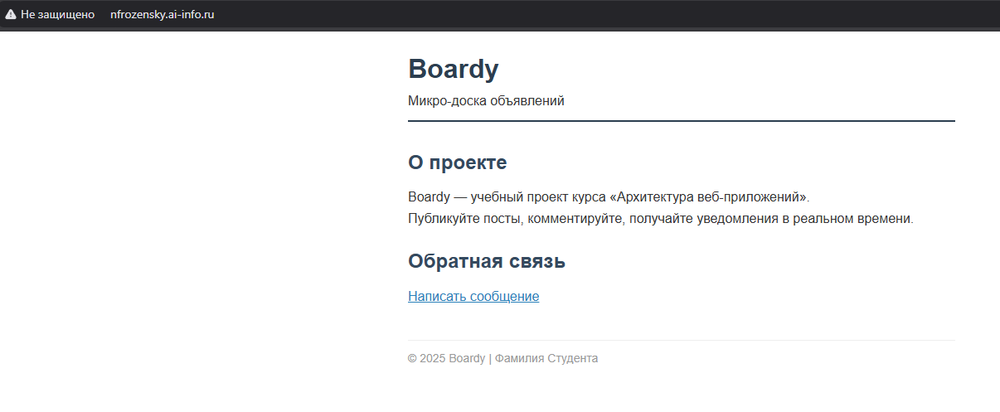

04-form.png:
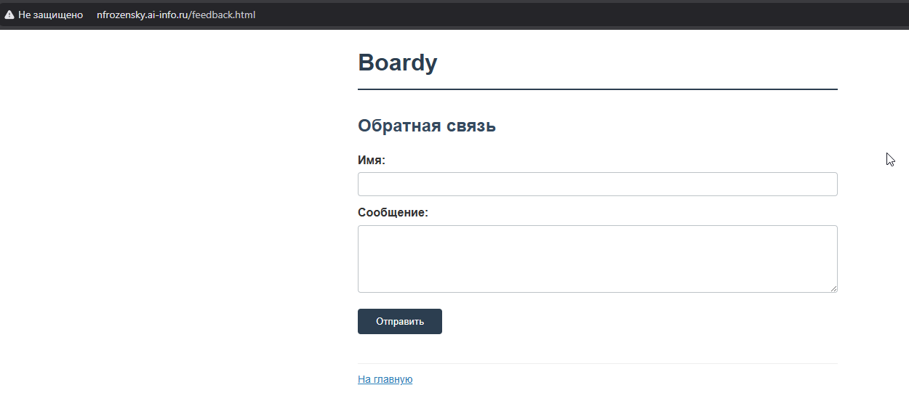

05-404.png:
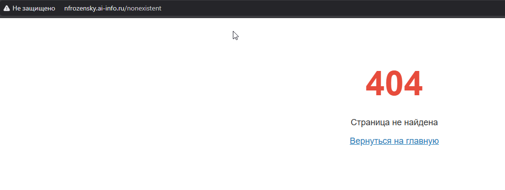

06-dns-api.png:
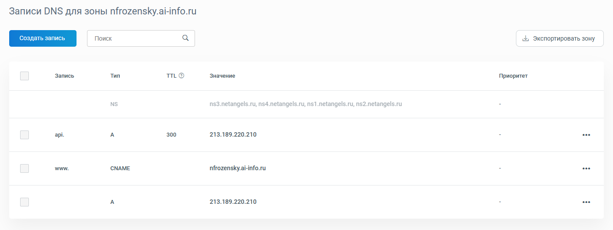

07-dig-api.png:
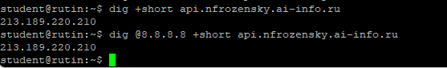

08-api-config.png:
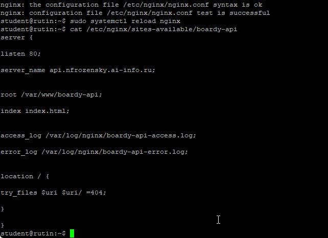

09-api-browser.png:
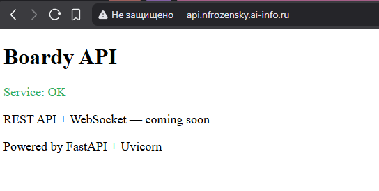

10-curl-v.png:
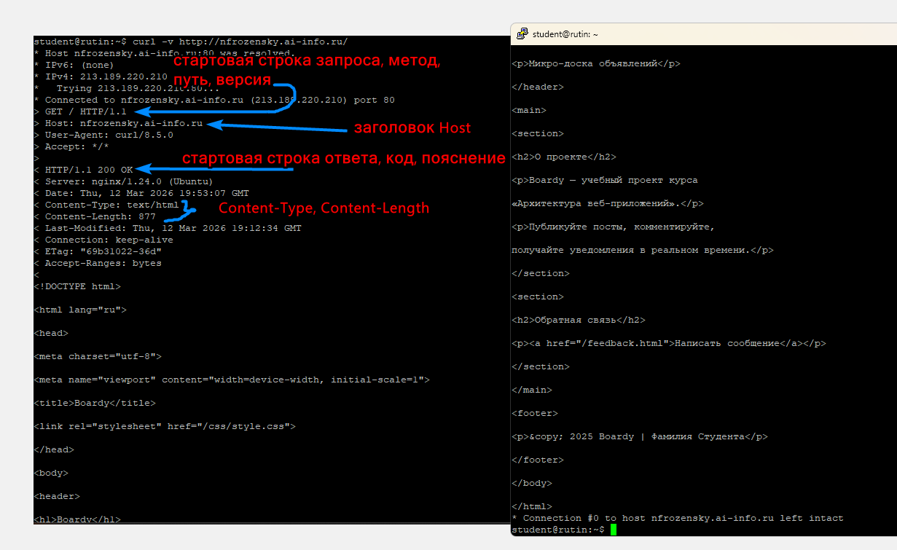

11-vhosts.png:
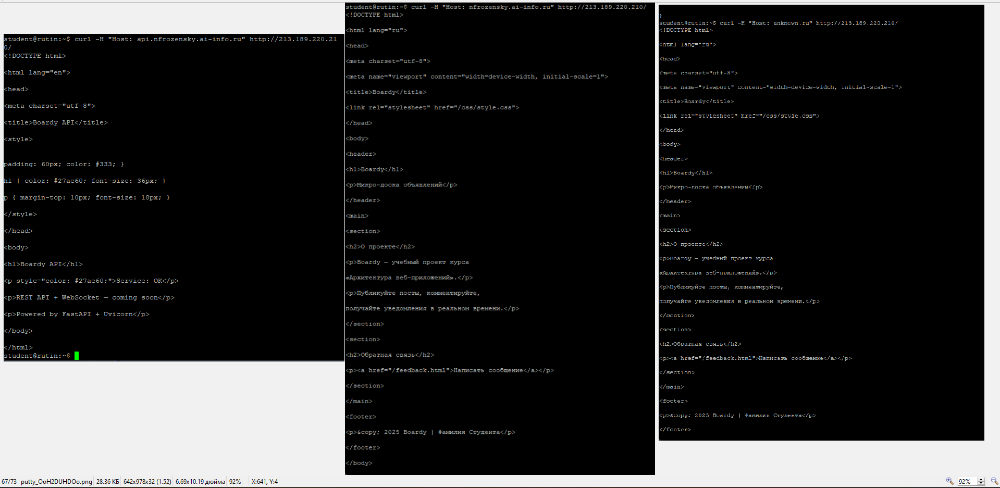

- Один IP возвращает разные страницы, т.к. Nginx читает Host, ищет server с подходящим server_name. nfrozensky.ai-info.ru -> конфиг boardy, корень /var/www/boardy. api.nfrozensky.ai-info.ru -> конфиг boardy-api, корень /var/www/boardy-api.
- Третий запрос выдал то же, что и запрос на nfrozensky.ai-info.ru , т.к. дефолтного сервера в конфигах нет, поэтому Nginx сам выбирает первый блок в алфавитном порядке по имени файла в папке sites-enabled.

12-post-405.png:
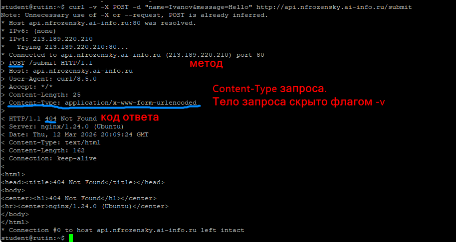

- Nginx вернул 404, а не 405, потому что статический сервер не проверяет HTTP-методы — он ищет файл /submit и не находит его. 405 вернул бы FastAPI, когда будет реализован.


## Задание 13
```bash
student@rutin:~$ curl -I http://nfrozensky.ai-info.ru/
HTTP/1.1 200 OK
Server: nginx/1.24.0 (Ubuntu)
Date: Thu, 12 Mar 2026 20:16:16 GMT
Content-Type: text/html
Content-Length: 877
Last-Modified: Thu, 12 Mar 2026 19:12:34 GMT
Connection: keep-alive
ETag: "69b31022-36d"
Accept-Ranges: bytes
student@rutin:~$ curl -v http://nfrozensky.ai-info.ru/
* Host nfrozensky.ai-info.ru:80 was resolved.
* IPv6: (none)
* IPv4: 213.189.220.210
*   Trying 213.189.220.210:80...
* Connected to nfrozensky.ai-info.ru (213.189.220.210) port 80
> GET / HTTP/1.1
> Host: nfrozensky.ai-info.ru
> User-Agent: curl/8.5.0
> Accept: */*
>
< HTTP/1.1 200 OK
< Server: nginx/1.24.0 (Ubuntu)
< Date: Thu, 12 Mar 2026 20:16:18 GMT
< Content-Type: text/html
< Content-Length: 877
< Last-Modified: Thu, 12 Mar 2026 19:12:34 GMT
< Connection: keep-alive
< ETag: "69b31022-36d"
< Accept-Ranges: bytes

<!DOCTYPE html>
```
- HEAD возвращает только заголовки, без тела ответа. GET возвращает и заголовки, и тело (HTML-страницу). Заголовки при этом одинаковые — тот же Content-Type, Content-Length, ETag. HEAD нужен, чтобы получить ответ без тела. Быстрая проверка: существует ли, какой размер, какой тип.


13-logs.png:
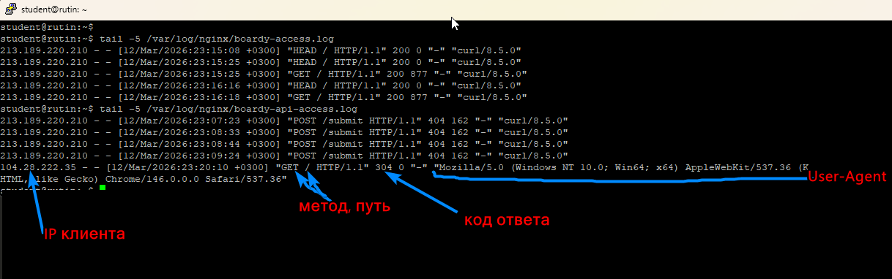

14-log-stats.png:
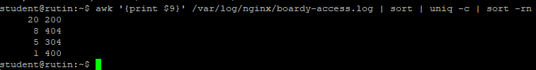

15-pull-request.png:
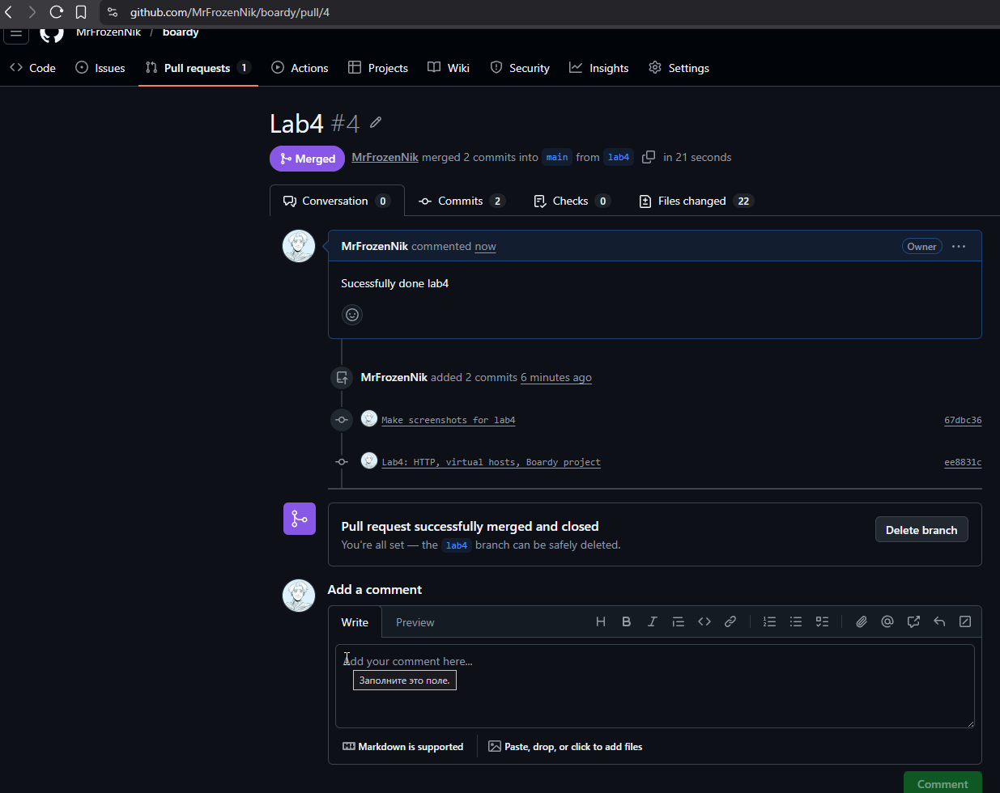
