01-certbot-installed.png:
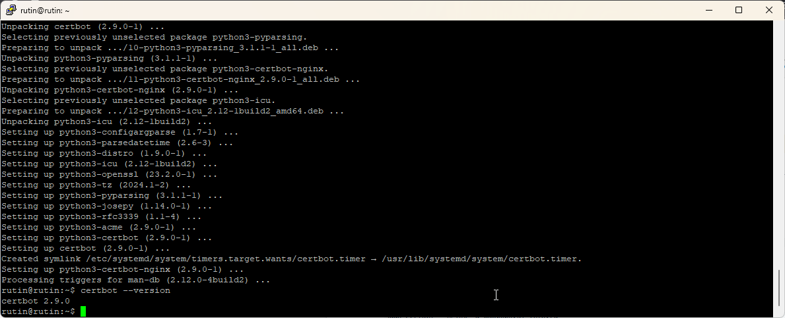

02-certbot-success.png:
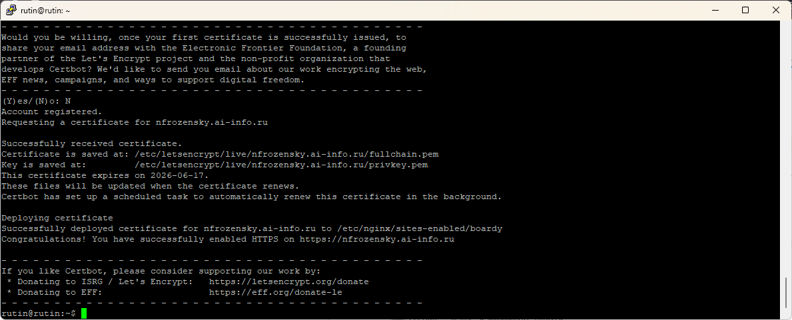

03-browser-lock.png:
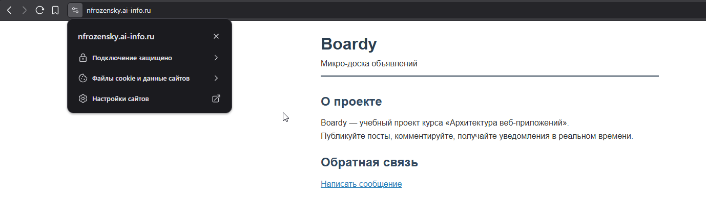

04-certificate-info.png:
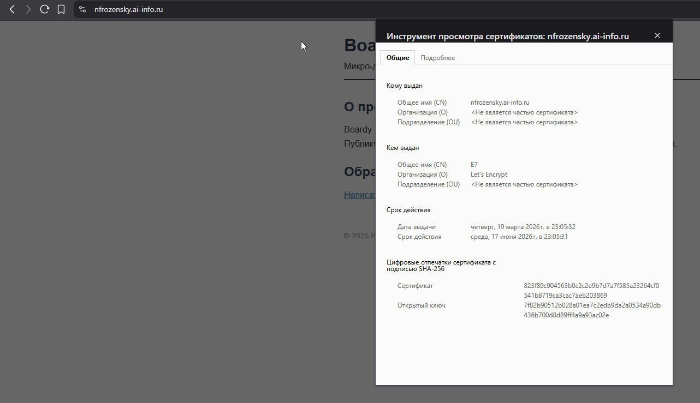

05-redirect.png:
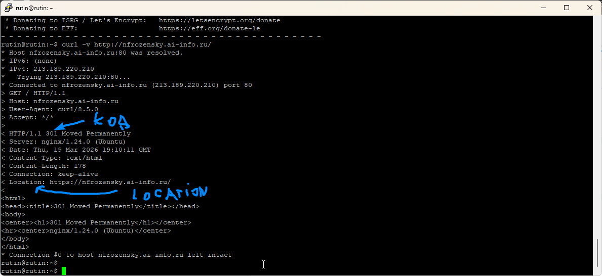

06-nginx-ssl-config.png:
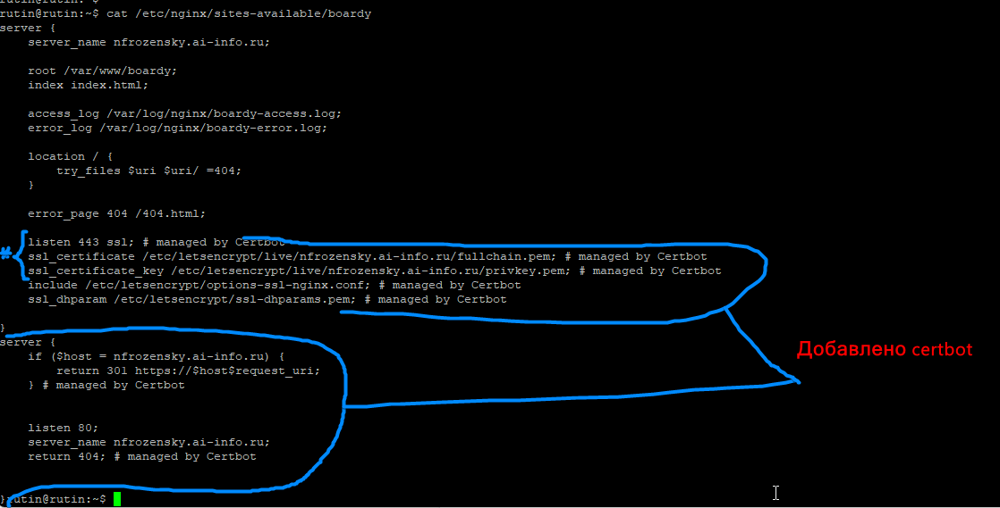

07-api-certbot.png:
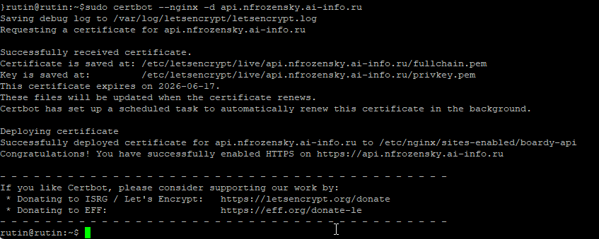

08-both-https.png:
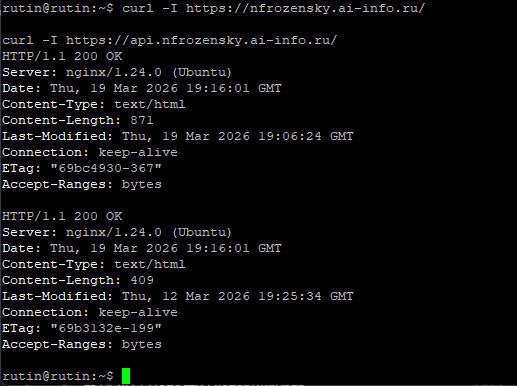

09-tls-handshake.png:
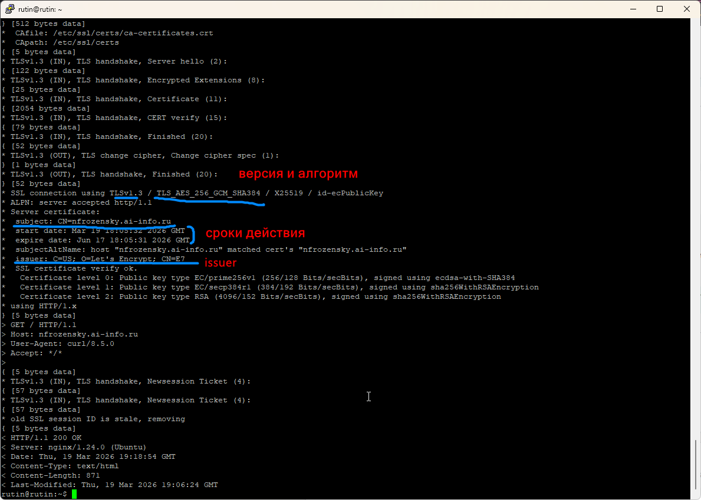

10-chain.png:
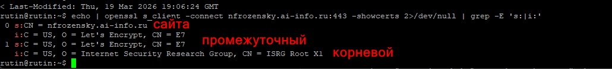

- Сервер присылает свой сертификат(nfrozensky.ai-info.ru), промежуточный(lets encrypt). идёт проверка подписи сертификата сайта - она должна быть сделана промежуточным CA. далее идёт проверка подписи промежуточного - она должна быть сделана корневым CA. корневой ISRG Root X1 ищется во встроенном хранилище доверенных сертификатов. если он там есть, цепочка замкнута

11-compare-certs.png:
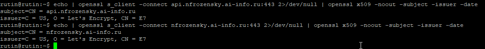

- Два разных сертификата, один issuer (Let's Encrypt), разные subject.

12-hsts.png:
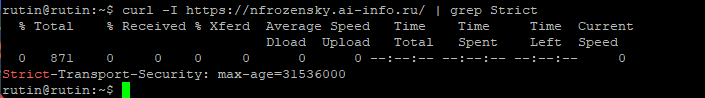

- Зачем нужен HSTS? Чтобы сказать браузеру: этот сайт — только HTTPS. Даже если пользователь наберёт http:// — браузер сам заменит на https:// ДО отправки запроса. Это защита от даунгрейд-атак.

13-cache-gzip.png:
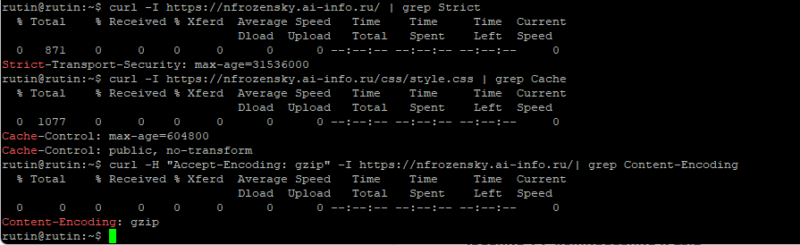

14-renew.png:
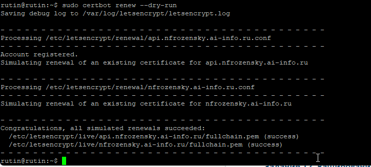

15-pull-request.png:
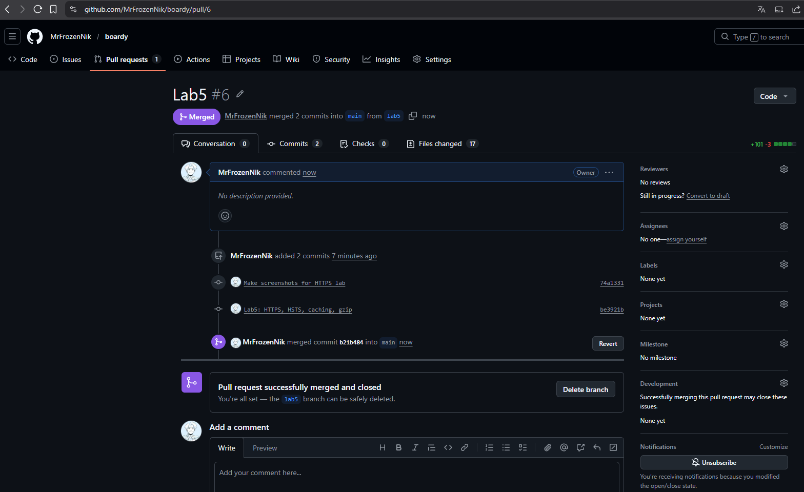
