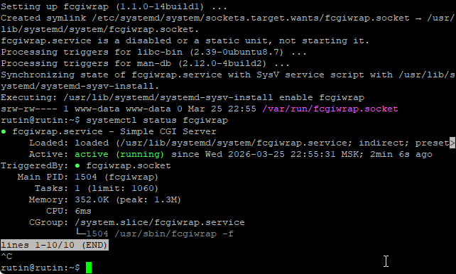
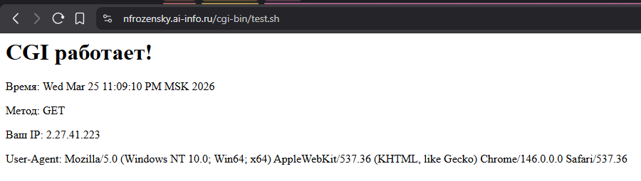
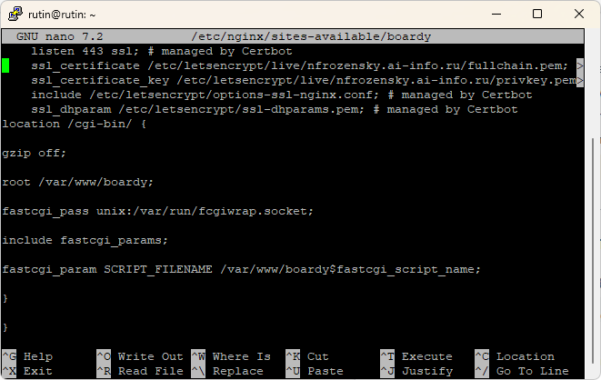
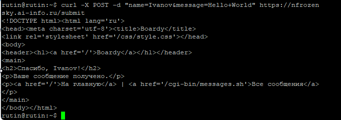
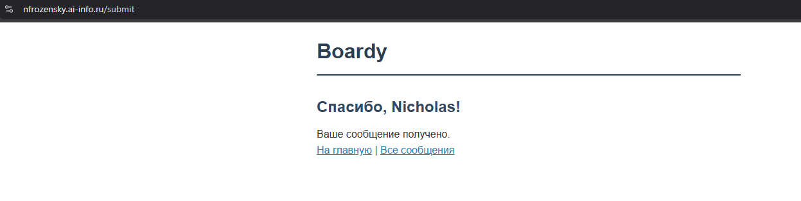
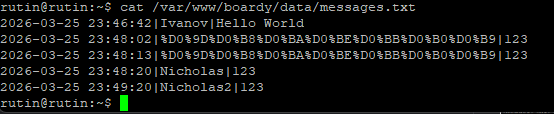
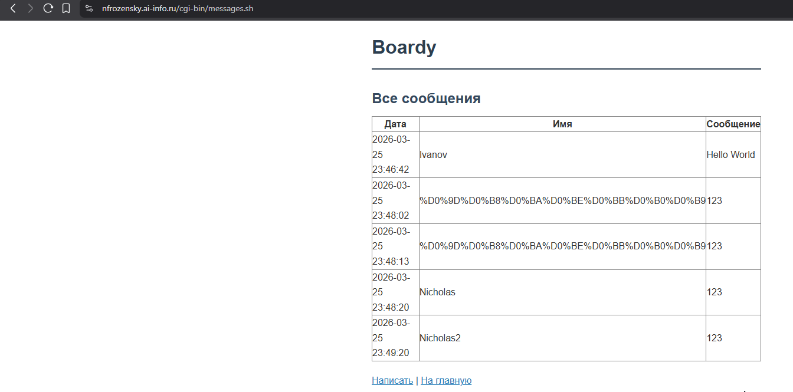
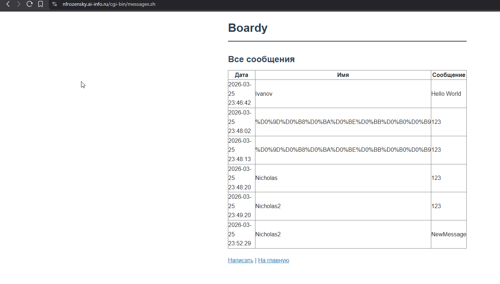
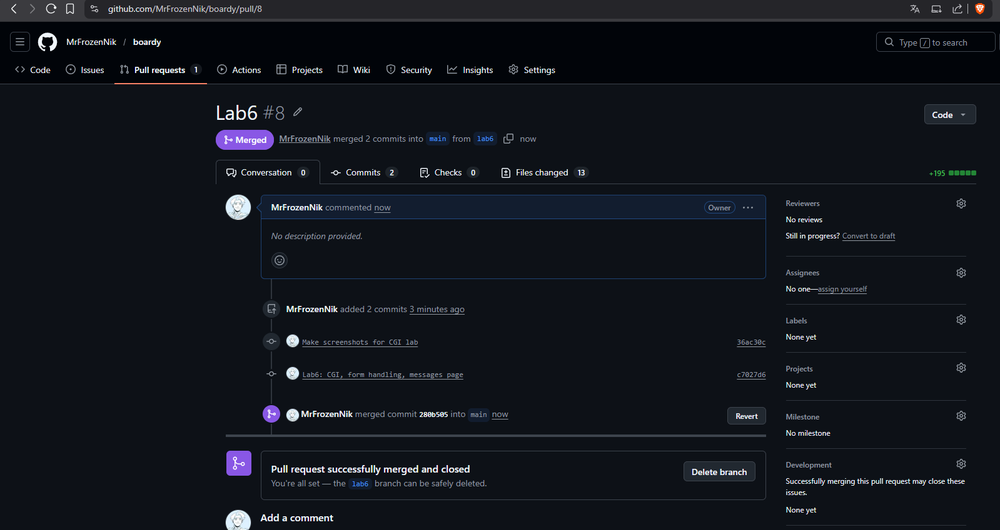

01-fcgiwrap.png:

02-test-cgi.png:

03-nginx-cgi.png:

- fastcgi_pass unix:/var/run/fcgiwrap.socket; Сообщает nginx, что запросы он передаёт процессу fcgiwrap через Unix-сокет, который и запускает CGI-скрипт
- include fastcgi_params; Подключает файл с env переменными для CGI (QUERY_STRING, REQUEST_METHOD, REMOTE_ADDR и др.)
- fastcgi_param SCRIPT_FILENAME /var/www/boardy$fastcgi_script_name; Говорит fcgiwrap запускать файл fastcgi_script_name, имя которого берётся из URL

04-curl-submit.png:

05-form-submit.png:

06-messages-file.png:

07-messages-page.png:

08-full-cycle.png:

## Схема пути POST-запроса от отправки до записи в файл
1. Браузер: пользователь заполнил форму, нажал «Отправить»

2. Браузер -> HTTPS (TLS) -> Nginx (:443)

3. Nginx: POST /submit -> fastcgi_pass -> fcgiwrap -> submit.sh

4. submit.sh: stdin -> парсинг -> messages.txt -> stdout

5. fcgiwrap -> Nginx -> TLS -> браузер: «Спасибо!»

---

1. Что такое CGI и какую проблему он решил в 1993 году?
    Common Gateway Interface, позволяет привязать любой скрипт к веб-серверу через stdout, stdin. До CGI веб-сервера умели только отдавать статику, с появлением - CGI позволил запускать скрипты и возвращать пользователю результат их работы, например данные из базы
2. Как CGI-скрипт получает данные POST-запроса? Тело POST-запроса сервер передаёт скрипту через stdin, а длину тела - через переменную окружения CONTENT_LENGTH. Скрипт читает нужное количество байт из stdin и сам парсит данные.

3. Почему CGI создаёт проблемы при высокой нагрузке? На каждый запрос сервер запускает отдельный процесс. При большой нагрузке это создаёт сотни процессов, и ресурсы сервера заканчиваются.

4. Чем отличается fastcgi_pass от proxy_pass? proxy_pass передаёт запрос другому HTTP-серверу как есть по протоколу HTTP. fastcgi_pass использует бинарный протокол FastCGI - он легче, быстрее и предназначен именно для взаимодействия с долгоживущими процессами-обработчиками, а не с полноценным HTTP-сервером

5. Зачем нужен fcgiwrap, если Apache запускает CGI напрямую? Nginx не умеет запускать CGI-скрипты напрямую, в отличие от апача, он только проксирует запросы. fcgiswap - посредник, который принимает запросы от nginx по протоколу FastCGI, запускает скрипт, передаёт скрипту нужное окружение(env)

---

09-pull-request.png:

