01-php-version.png:
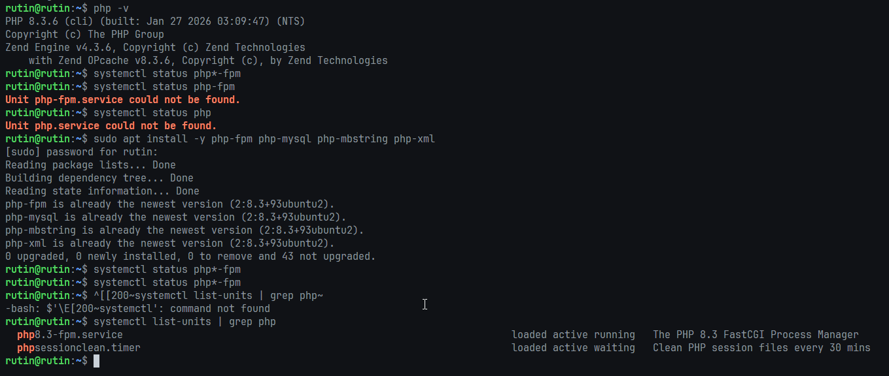

02-php-form.png:
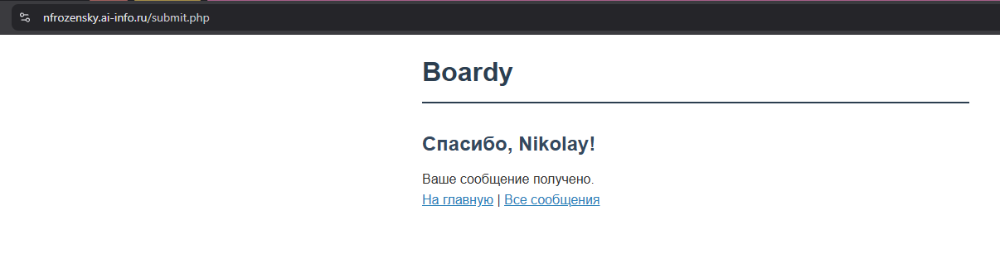

03-php-messages.png:
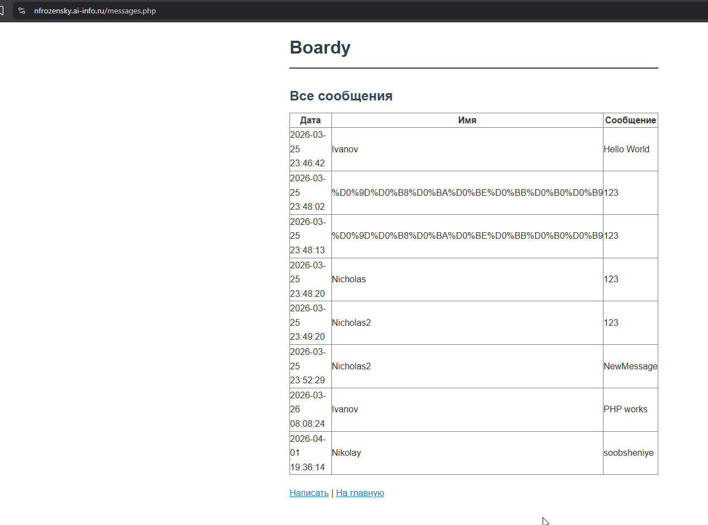

04-nginx-php.png:
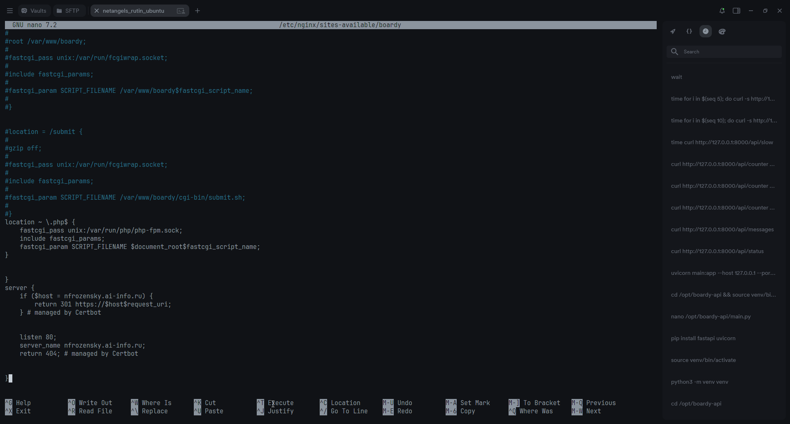
чем fastcgi_pass отличается от CGI через fcgiwrap? Почему PHP-FPM быстрее?
- CGI через fcgiwrap - создаётся новый процесс на каждый новый запрос. PHP-FPM - пул процессов уже запущен, fcgiwrap передаёт запрос по протоколу FastCGI напрямую, нет затрат на инициализацию процесса.

05-shared-nothing.png:
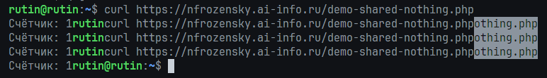
- счётчик не увеличивается, так как переменные не живут между запросами. Shared Nothing - архитектурный принцип php, при котором каждый запрос имеет выделенное окружение без доступа к памяти других запросов. чтобы запомнить что-то между запросами нужен или Redis, или наш messages.txt

06-php-slow.png:
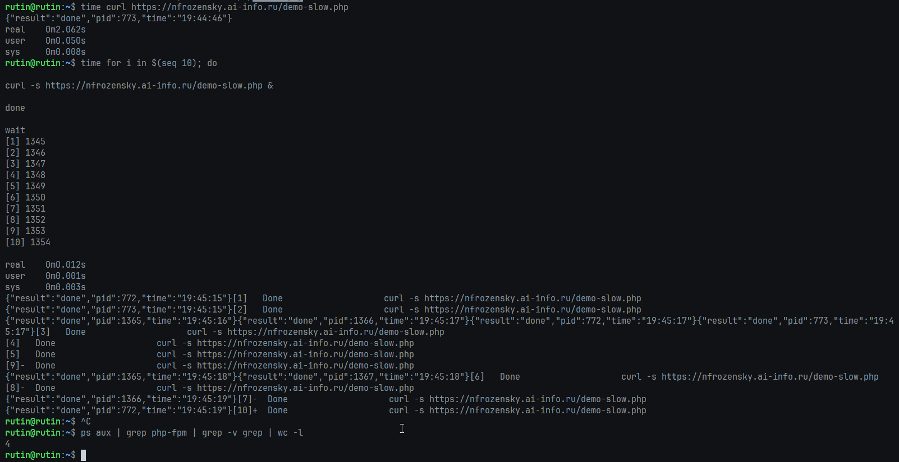
- заняло 4 секунды, 19:45:19 - 19:45:15, воркеров 5 штук. php-fpm нарастил пул воркеров, запросов 10, один выполняется две секунды, итого 20 секунд на все запросы, если бы это выполнялось последовательным образом. так как воркеров 5, можно выполнить по 5 запросов за 2 секунды, итого - 4 секунды на 10 запросов

07-api-status.png:
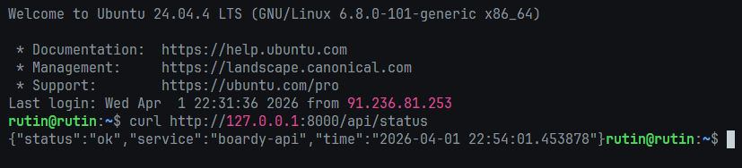

08-api-messages.png:
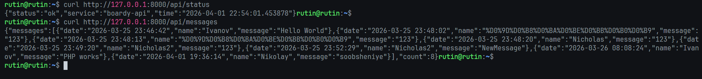

09-counter.png:
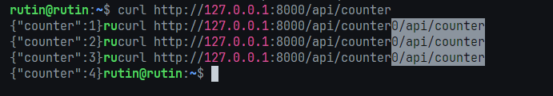

- счётчик растёт в отличие от php, так как uvicorn не уничтожает состояние после запроса

10-async-slow.png:
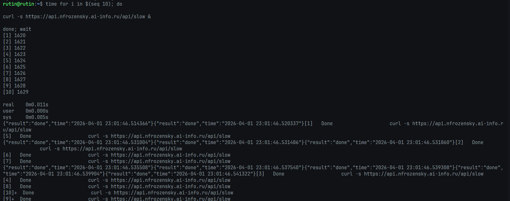
- у FastAPI нет понятия воркеров, так как это асинхронный сервер. Пока один запрос ждал своего завершения, FastAPI обрабатывал второй. Поэтому всё случилось очень быстро

11-blocking.png:
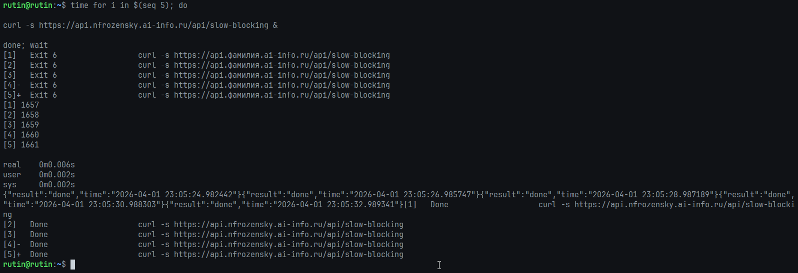
- /slow использует asyncio.sleep и блокирует только текущий запрос, а /slow-blocking использует time.sleep и блокирует весь event-loop целиком.

12-swagger.png:
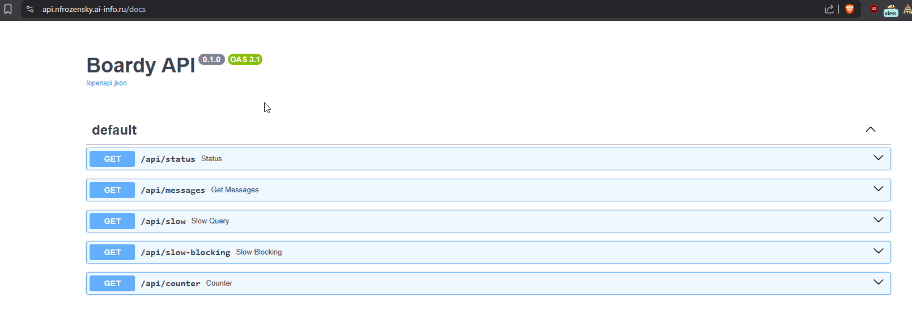

13-systemd.png:
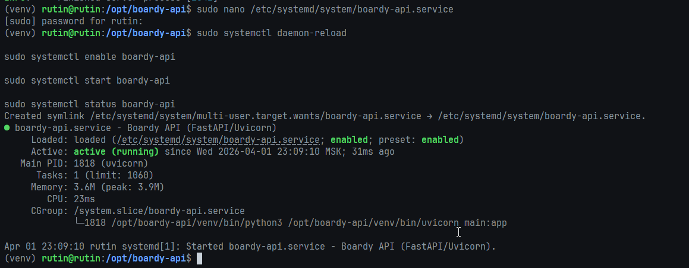

14-nginx-api.png:
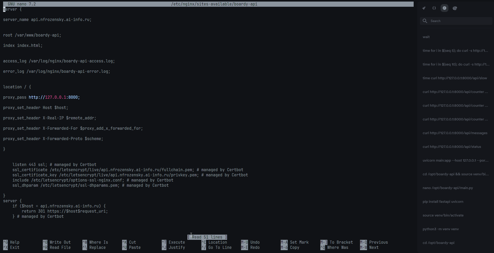
- fastcgi_pass общается с php-fpm по протоколу fastcgi, а proxy_pass передаёт запрос как обычный http к другому серверу - Unicorn. Unicorn - сервер, PHP-FPM - fastCGI процесс. Отсюда и разные директивы

15-compare.png:
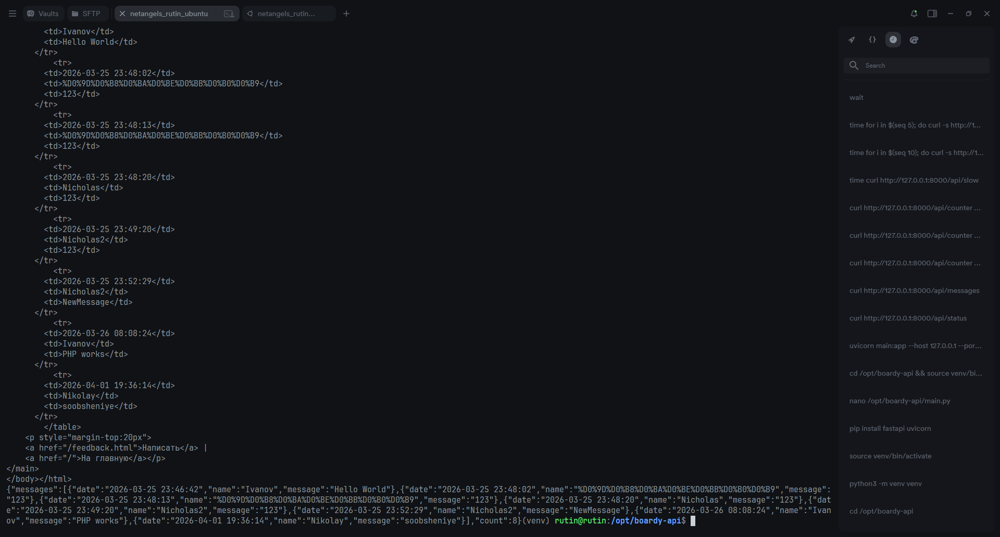
- одни данные, два формата. html - для отображения на клиенте, json - для дальшейней обработки каким-нибудь приложением. несёт в себе меньше данных и представляет собой легкоконвертируемое в структуры данных.

16-processes.png:
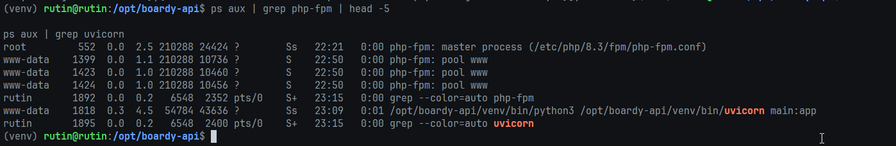

17-pull-request.png:
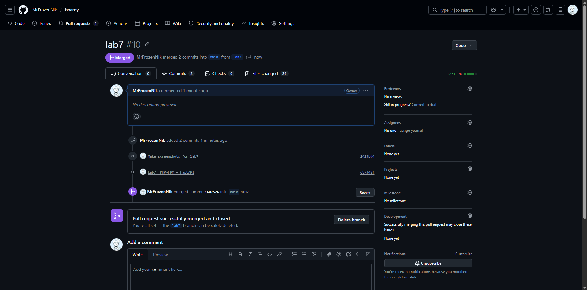
