01-mysql-status.png:
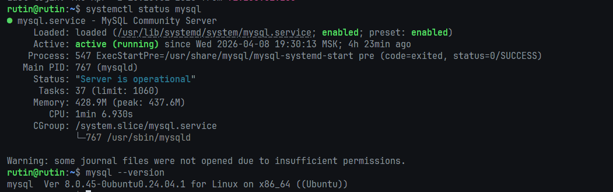

02-db-charset.png:
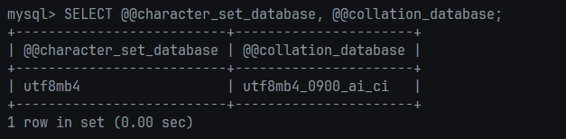

- utf8mb4, а не utf8, т.к. utf8 в MySQL — исторический костыль, поддерживает только 3 байта (нет эмодзи). utf8mb4 — настоящий UTF-8.
- Collation - как хранить и сортировать символы, доступные в данной кодировке

03-phpmyadmin.png:
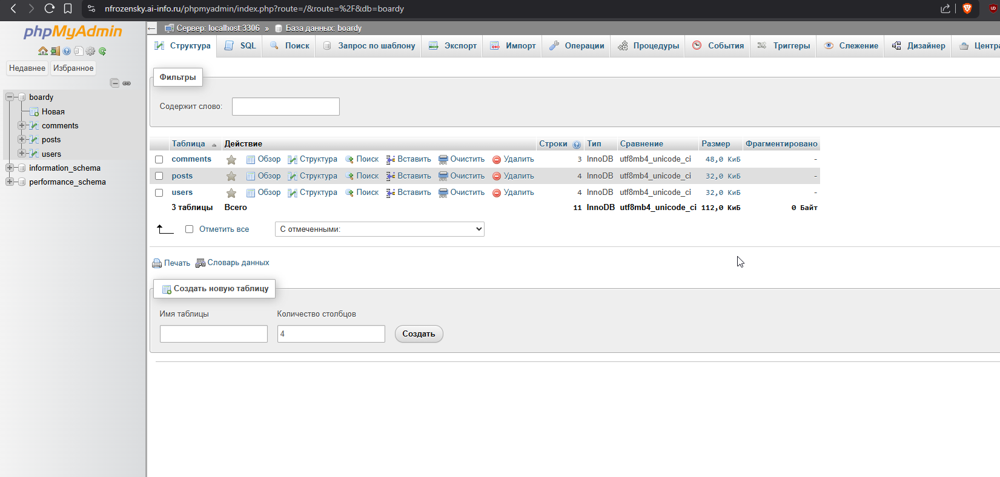

04-tables-cli.png:
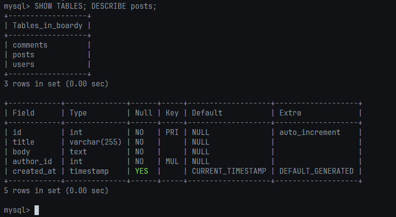

05-tables-pma.png:
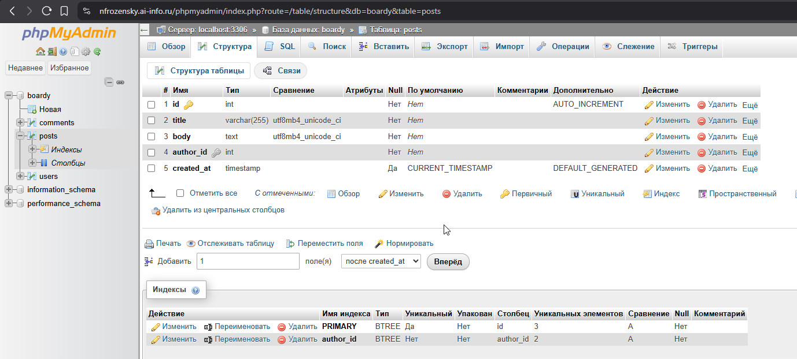

- foreign key - ограничение в БД, которое говорит о том, что значение в одной таблице должно существовать в другой. ON DELETE CASCADE задаёт поведение при удалении родительской записи - удалив id пользователя из таблицы users, все связанные с ним сущности так же автоматически удалятся.
- в базе данных используется InnoDB движок, так как он поддерживает транзакции, Foreign Key и строковые блокировки, что подходит для нашего будущего приложения.

06-schema-sql.png:
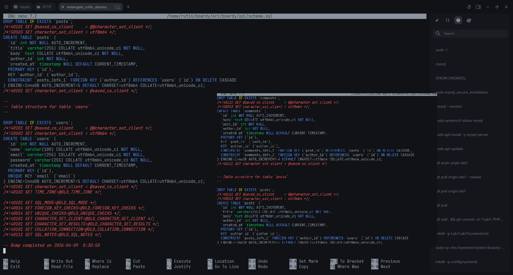

07-data-cli.png:
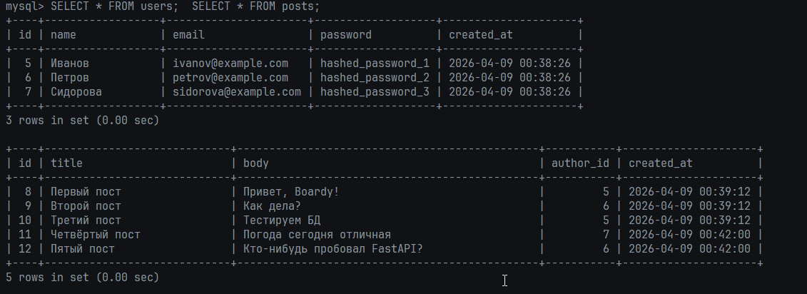

08-data-pma.png:
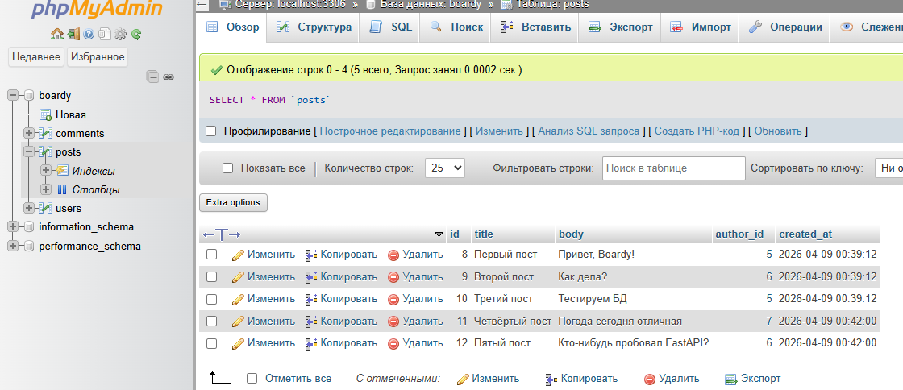

09-join.png:
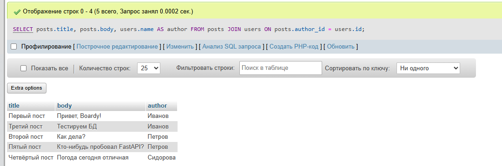

- данные намеренно разделены по таблицам — в posts хранится только author_id, а имя в users. JOIN соединяет их по совпадающему полю на лету.
- без него пришлось бы делать два отдельных запроса: сначала получить author_id из posts, потом для каждого id отдельно запрашивать имя из users

10-fk-error.png:
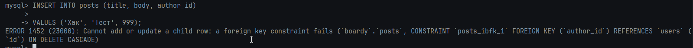

11-cascade.png:
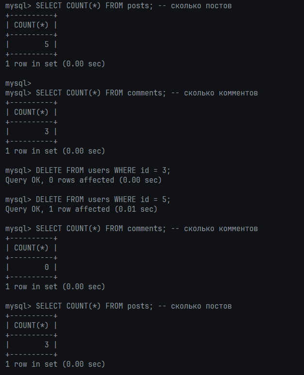

12-injection.png:
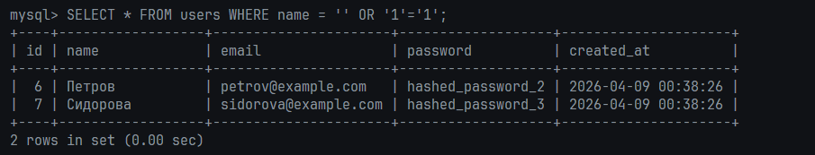

- если запрос строится конкатенацией строк, пользователь может ввести ' OR '1'='1, закрыв тем самым кавычки, обеспечит выполнение всегда истинного условия '1'='1'.
- при prepared statements запрос и данные отправляются в MySQL раздельно. MySQL сначала компилирует шаблон запроса, потом подставляет данные как чистые данные — они никогда не интерпретируются как SQL-код.

13-db-php.png:
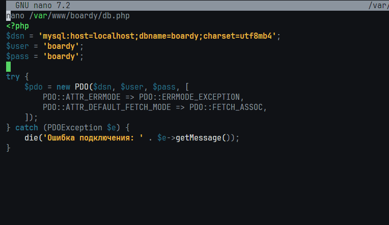

14-submit.png:

15-submit-pma.png:
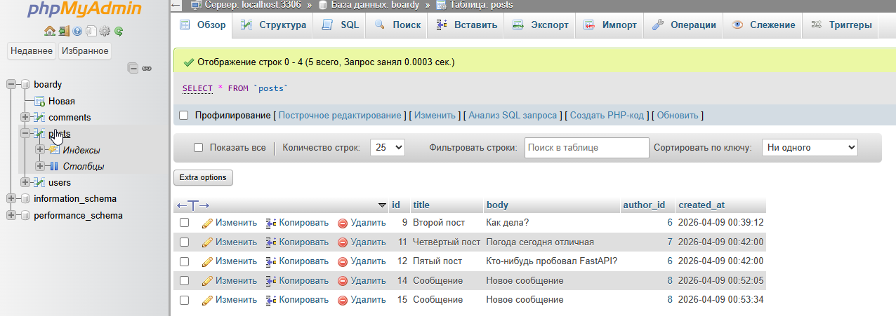

16-messages.png:
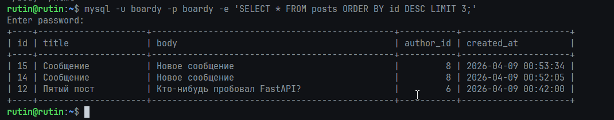

17-api-messages.png:
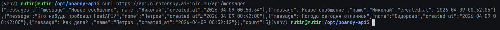

18-api-users.png:
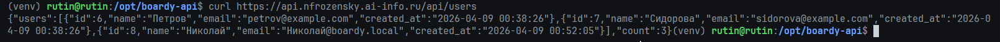

- мы используем aiomysql, так как он асинхронный, что подходит под FastAPI. Если бы использовали не асинхронный, это бы заблокировало весь event loop на время выполнения запроса.

01-mysql-status.png:

