01-tree.png:
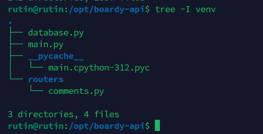

02-get.png:
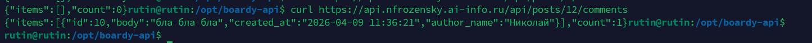

- SQL-запрос: ```sql
  SELECT c.id, c.body, c.created_at, u.name AS author_name
  FROM comments c
  JOIN users u ON c.author_id = u.id
  WHERE c.post_id = %s
  ORDER BY c.created_at```  в котором JOIN используется используется для объединения данных из двух таблиц. В данном случае он позволяет подтянуть человекочитаемое имя автора (u.name) из таблицы users, используя связь по ID (author_id)

03-create.png:
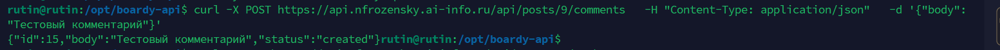

- Код 200 OK — это общий ответ об успехе. Код 201 Created более специфичен: он официально подтверждает, что запрос был выполнен успешно и в результате в базе данных был создан новый ресурс
- Кодов мы не видим - нет флагов. Content-Type: application/json: Этот заголовок сообщает серверу, что данные в теле запроса передаются в формате JSON

04-update.png:
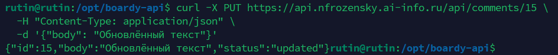

- POST используется для создания новой записи (ресурс создается «под» родителем), а PUT — для полного обновления (замены) уже существующей записи по её конкретному адресу
- Для создания комментария (POST) нам нужно знать, к какому посту он относится (/posts/{id}/comments). Но когда комментарий уже существует, у него есть свой уникальный ID. Чтобы его изменить, нам достаточно обратиться к нему напрямую (/comments/{id}), так как он уже является самостоятельной сущностью в системе.


05-delete.png:
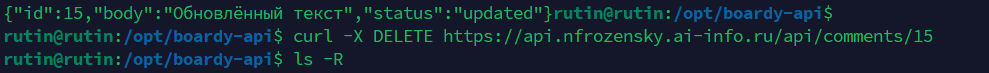

- 4 HTTP-глагола и их коды:
1. GET (200 OK) — получение данных. Успешно вернули список или объект.
2. POST (201 Created) — создание данных. Ресурс успешно добавлен в БД.
3. PUT (200 OK) — обновление данных. Запись успешно изменена.
4. DELETE (204 No Content) — удаление. Код 204 означает, что действие выполнено успешно, но отвечать в теле письма нечем, так как ресурса больше не существует.

06-errors.png:
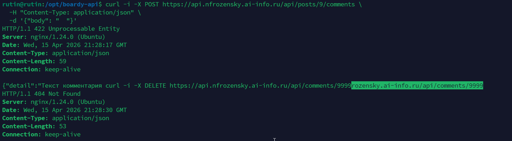

- 404 Not Found означает, что путь верный, но ресурс не найден (например, мы пытаемся удалить комментарий с ID, которого нет в базе).
- 422 Unprocessable Entity означает, что запрос дошел до сервера, но содержит некорректные данные (например, мы отправили пустую строку вместо текста комментария, что нарушает правила валидации)


07-swagger.png:
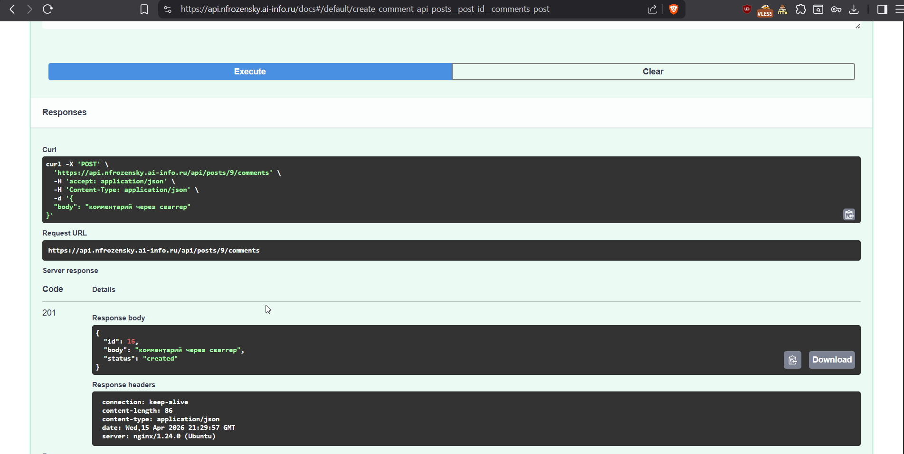

08-vanilla.png:
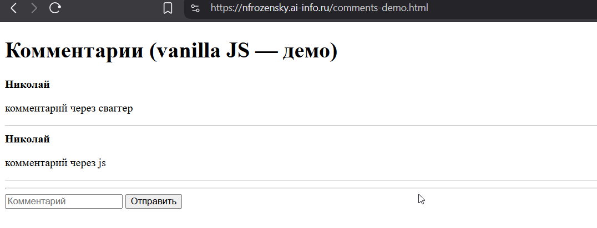

- Функция esc() выполняет экранирование (escaping) HTML-спецсимволов (например, превращает < в &lt;). Если её не вызвать, приложение будет уязвимо к XSS-атакам: злоумышленник сможет написать в комментарии <script>alert('Hacked')</script>, и этот скрипт выполнится в браузере у всех пользователей, открывших страницу.


09-react-list.png:
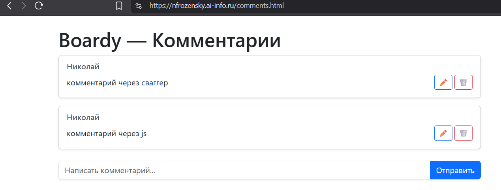

10-react-edit.png:
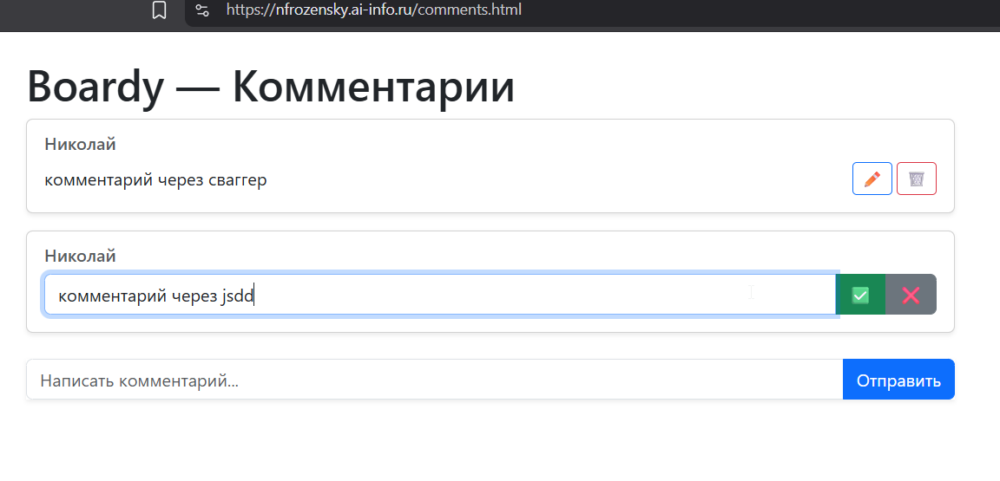

11-react-delete.png:
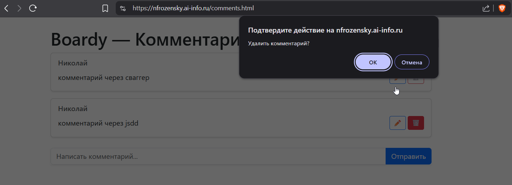
---
# Сравнение vanilla js | react по трём пунктам
1. нигде(в DOM) | в useState
2. Вручную вызываем loadItems(), который через innerHTML полностью перестраивает кусок страницы. | Вызываем setItems(), React сам находит отличия и точечно обновляет только нужные элементы.
3. Сложно: нужно вручную найти нужный div, заменить его содержимое на input, навесить новые обработчики. | Просто: используем условный рендер `{editId === id ? <Input/> : <Text/>}`.
4. Нужно вручную писать и вызывать функцию esc(). Забыл вызвать — проект взломан. | Автоматически: всё, что выводится в {} (кроме специальных команд), React экранирует по умолчанию.
---

12-network.png:
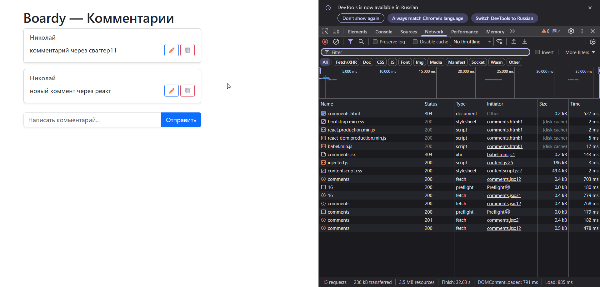
- 12 запросов, 5 из них - к API

13-source-ssr.png:
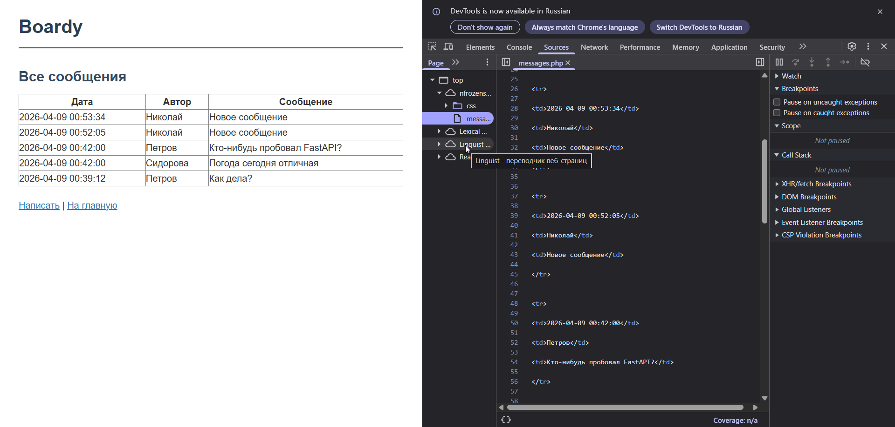

14-source-csr.png:
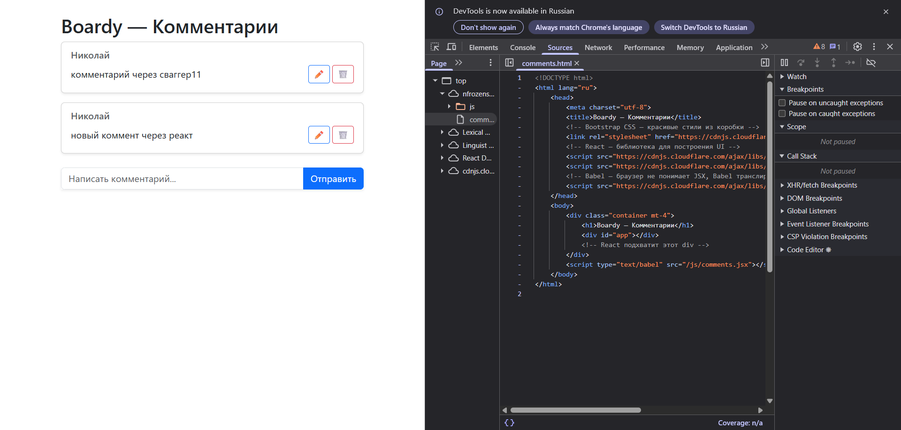

- При подходе CSR (Client-Side Rendering — рендеринг на стороне клиента) сервер отправляет браузеру пустой «каркас» страницы и JavaScript-код. Данные (комментарии) скачиваются отдельным запросом (fetch) уже после того, как страница загрузилась и скрипт начал выполняться.
- При подходе SSR (Server-Side Rendering - рендеринг на стороне сервера) сервер отправляет браузеру уже готовый, заранее отрендеренный HTML-файл с данными внутри
- Поисковой бот в первом примере увидит пустую страницу с пустыми div'ами, если это старый бот, либо отрендеренную, если это новый(он подождёт, пока страница сгенерируется)

15-xss.png:
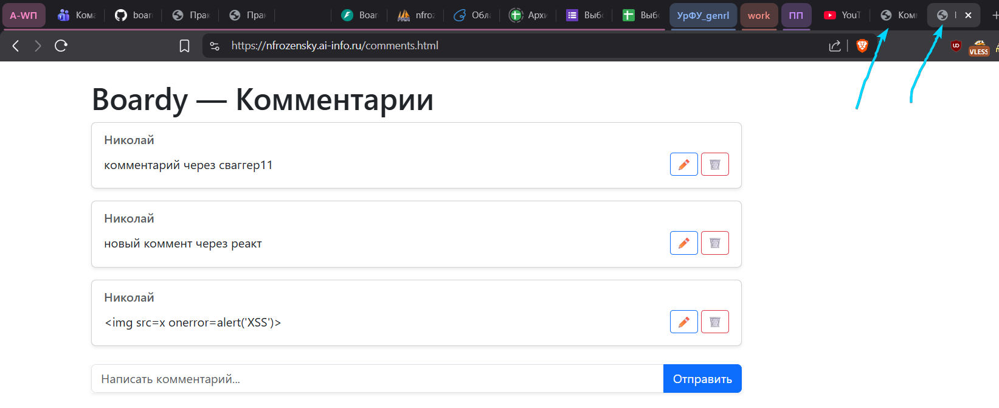

- в ванильном JS мы реализуем защиту через функцию esc, а в React она используется по умолчанию, потому надежнее именно реакт, ведь программист может забыть написать эту функцию.


| Характеристика                 | SSR (PHP)                    | vanilla JS                      | React                      |
|:-------------------------------|:-----------------------------|:--------------------------------|:---------------------------|
| **Кто рендерит HTML**          | Сервер (PHP-интерпретатор)   | Браузер (через JS и DOM)        | Браузер (Virtual DOM)      |
| **Формат ответа сервера**      | Готовый HTML-код             | JSON-данные                     | JSON-данные                |
| **View Source: данные видны?** | Да (сразу в исходнике)       | Нет (только пустой каркас)      | Нет (только пустой каркас) |
| **Перезагрузка при отправке**  | Да (традиционная форма)      | Нет (fetch / AJAX)              | Нет (fetch / AJAX)         |
| **Защита от XSS**              | Вручную (`htmlspecialchars`) | Вручную (через `esc()`)         | Автоматически (встроено)   |
| **Сложность кода**             | Низкая (монолит)             | Высокая (ручное управление DOM) | Средняя (компоненты)       |


---
